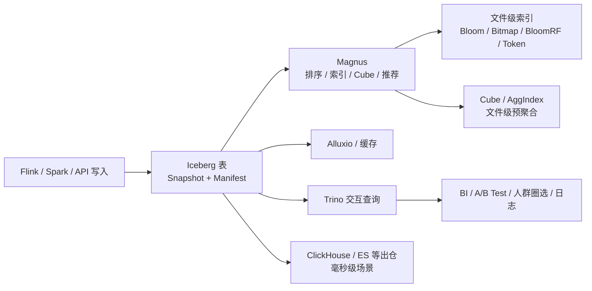

# Iceberg 查询加速与平台化边界

## 原文锚点

- 本地文件：[秒级响应！B站基于 Iceberg 的湖仓一体平台构建实践](../文章/秒级响应！B站基于 Iceberg 的湖仓一体平台构建实践.md)
- 原文链接：`http://mp.weixin.qq.com/s?__biz=MzU1NTMyOTI4Mw==&mid=2247650711&idx=1&sn=19dfcc7927251abad4b21636464e6272`
- 关键段落：背景中 Hive 痛点；Iceberg 表结构；查询加速的多维排序、Boundary Index、Bloom/Bitmap/BloomRF/Token/Ngram 索引、Cube/AggIndex、Magnus 自动优化、落地规模。
- 关键图：正文提到湖仓架构图、索引/Cube/Star-Tree 示例图，但 Markdown 无图片链接。

## 图片处理

| 图片 | 类型 | 是否保留 | 理由 | 处理方式 |
|---|---|---|---|---|
| 湖仓一体架构图 | 架构图 | 原图缺失 | 能说明 Iceberg、Magnus、Alluxio、Trino、下游 OLAP 的位置 | 原图缺失，需要回原文查看 |
| Cube / Star-Tree 示例图 | 说明图 | 原图缺失 | 解释预计算和索引改写 | 基于正文描述重建简图 |

## 一句话结论

这篇文章值得精读，关键是把“基于 Iceberg 秒级查询”校准为“表格式 + 排序索引 + 预计算 + 缓存 + 优化服务 + Trino”的平台能力，而不是 Iceberg 单独替代 OLAP。

## 用户相关性判断

| 项 | 内容 |
|---|---|
| 用户当前认知层级 | Iceberg L1-L2 draft；OLAP/数据平台 L2-L3 draft |
| 认知成熟度 | draft |
| 阅读投入建议 | 精读 |
| 阅读投入理由 | 能补 Iceberg 和 OLAP 引擎/平台优化的边界，避免把表格式误认为查询引擎 |
| 对用户的新信息 | Iceberg 的 Manifest/统计信息只是加速入口，秒级体验来自平台侧排序、索引、Cube、缓存和自动优化 |
| 问题指纹 | Iceberg + Manifest/统计/索引/Cube/平台优化 + 秒级查询 + 不替代 OLAP 出口 |
| 排重判断 | 新建 |
| 置信度 | 中 |

## 认知校准点

| 校准点 | 文章观点/信息 | 与用户认知或价值观的关系 | 处理建议 |
|---|---|---|---|
| Iceberg 不是查询引擎 | 平台用 Trino 对外查询，用 Magnus 做优化，用 Alluxio 缓存 | 明确纵向位置 | 写入 Iceberg 横向边界 |
| 秒级查询来自平台工程 | 多维排序、索引、Cube、Star-Tree、查询明细推荐共同作用 | 补工程落地边界 | 不把收益归因到表格式本身 |
| 仍有出仓到 ClickHouse/ES 的场景 | 原文承认毫秒级响应仍可能出仓 | 纠偏“湖仓统一一切” | 保留 OLAP 出口边界 |
| 索引不是越多越好 | 排序字段一般不超过四个，Bitmap 对高基数可能负收益 | 补失败场景 | 作为查询加速实践门槛 |

## 冲突点

| 冲突类型 | 具体表现 | 影响 | 处理 |
|---|---|---|---|
| 原目录冲突 | 原文在 `09_其他` | 容易漏归 | 重路由到湖仓表格式 / Iceberg |
| 图片缺失 | 多处“如上图/下图”但 Markdown 无图 | 架构和索引流程缺失 | 标原图缺失，重建简图 |
| 证据不足 | P95、PB、日增、查询量来自分享，缺环境细节 | 不能当通用性能承诺 | 只保留场景化证据 |

## 待吸收点

| 分级 | 内容 | 为什么值得吸收 | 后续动作 |
|---|---|---|---|
| 理解 | Iceberg 通过文件级元数据和统计信息先做文件裁剪 | 是查询优化入口 | 与 Paimon Bloom/LSM 对比 |
| 理解 | 多维排序用 Hilbert/Z-order 提升过滤字段聚集度，Boundary Index 处理非整型字段 | 说明表布局对查询性能的影响 | 后续查官方/论文证据 |
| 理解 | 文件级索引和 Cube/AggIndex 是平台扩展，不是 Iceberg 基础规范本身 | 防止本体和平台能力混淆 | 写入 Iceberg index |
| 记住 | 秒级湖仓查询要同时看表格式、查询引擎、缓存、文件布局、索引、预计算和优化调度 | 可复用选型准则 | 与 Doris/StarRocks/ClickHouse 边界对标 |
| 实践 | 用查询日志提取过滤字段，验证排序/索引字段推荐是否减少扫描文件 | 可迁移到湖仓平台优化 | 后续实验 |

## 已知可跳过

| 内容 | 跳过理由 |
|---|---|
| 分享嘉宾和大会背景 | 不影响技术判断 |
| Hive 查询慢的泛泛痛点 | 用户已知，保留为背景即可 |
| 规模数字单独记忆 | 缺上下文，不作为通用结论 |

## 实践门槛

| 门槛 | 判断 | 证据 |
|---|---|---|
| 可运行 | 否 | 没有完整部署和配置 |
| 可验证 | 部分 | 有优化思路和指标，但缺可复现基线 |
| 可排障 | 部分 | Magnus 展示表状态、文件排序和索引情况，有排查方向 |
| 可迁移 | 是 | 可迁移到湖表查询加速和优化推荐 |
| 结论 | 降为精读 | 平台化工程量大，需单独实验 |

## 归类判断

| 项 | 内容 |
|---|---|
| 技术本体 | Apache Iceberg 表格式及其平台优化生态 |
| 文章主问题 | 如何基于 Iceberg 构建秒级湖仓查询平台 |
| 使用场景 | BI 报表、指标服务、A/B Test、人群圈选、日志分析 |
| 关键词干扰 | Trino、Alluxio、Magnus、Cube、OLAP |
| 最终归类 | 数据工程与数仓 / 湖仓表格式 / Iceberg |
| 归类理由 | Iceberg 是数据底座，平台优化围绕 Iceberg 表文件和元数据展开 |

## 技术定位

| 项 | 内容 |
|---|---|
| 技术类型 | 平台实践案例 |
| 所属领域 | 数据工程与数仓 |
| 二级类目 | 湖仓表格式 |
| 全局架构位置 | Iceberg 表格式之上的查询优化与平台服务层 |
| 涉及模块 | Snapshot、Manifest、统计信息、排序、索引、Cube、缓存、Trino |
| 解决问题 | 减少 Hive 出仓链路和数据孤岛，同时提升交互式查询体验 |
| 原文局限 | 图片缺失，平台内部组件细节不可复现 |
| 我的结论 | 以后关注，作为 Iceberg 平台化边界案例 |

## 纵向理解

| 维度 | 判断 |
|---|---|
| 全局架构 | Flink/Spark/API 写入 -> Iceberg/HDFS -> Magnus 优化 -> Alluxio 缓存 -> Trino 查询 -> BI/实验/人群 |
| 本文位置 | 查询加速和平台服务，不覆盖 Iceberg v3 行级能力 |
| 核心机制 | 文件裁剪、数据聚集、文件级索引、文件级预聚合、查询日志驱动推荐 |
| 使用链路 | 建表 -> 写入 -> 后台排序/建索引/Cube -> 查询改写/文件过滤 -> 监控推荐 |
| 前置条件 | 查询日志、稳定过滤字段、后台 Spark 资源、缓存、Trino 改写能力 |
| 边界 | 毫秒级服务化查询仍可能需要 ClickHouse/ES 等 OLAP/搜索系统 |

## 横向对标

| 对标技术 | 实现方式 | 优势 | 劣势 | 适合场景 |
|---|---|---|---|---|
| Hive | 批 SQL + 分区裁剪 | 存量生态强 | 交互查询弱，出仓链路多 | 离线 ETL 和历史批分析 |
| Iceberg + Trino + 优化服务 | 表格式 + 文件布局 + 索引/Cube | 减少数据孤岛，跨引擎 | 平台工程复杂 | 秒级到 10 秒级湖仓分析 |
| Doris/StarRocks/ClickHouse | OLAP 存储和执行引擎 | 低延迟高并发强 | 需要出仓或外表链路 | 报表、服务化分析、点查 |
| Elasticsearch | 倒排索引和搜索引擎 | 文本检索强 | 分析表语义和湖仓互操作弱 | 日志搜索、检索类场景 |

## 后续追查

- 关键词：Iceberg Manifest statistics、Z-order、Hilbert Curve、BloomFilter、Bitmap、Cube、AggIndex、Star-Tree、Trino Iceberg。
- 相关技术：Trino、Alluxio、Doris、StarRocks、ClickHouse、Paimon Bloom。
- 需要补读的文章：Iceberg 查询规划、Trino Iceberg connector、文件级索引和湖表排序优化资料。
