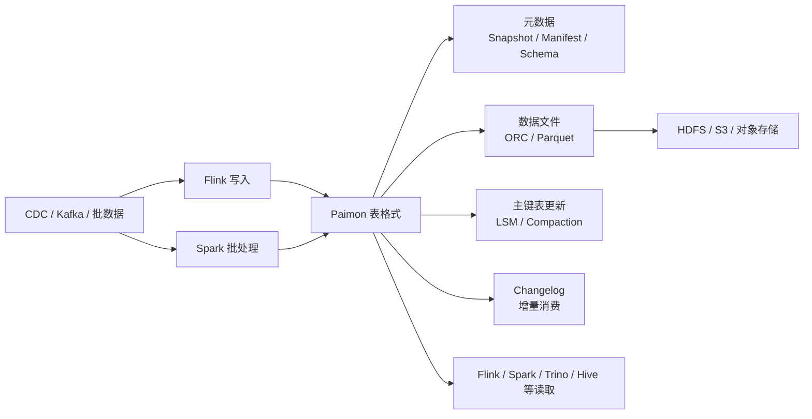

# Paimon
## 知识点入口

- 本模块先看宏观流程，再看文章：[流程化知识点总览](knowledge/03_数据工程与数仓/0305_湖仓表格式/Paimon/核心知识点/流程化知识点总览.md)。
- 新文章必须先归入流程节点，再判断是补充、冲突、不同层次还是降权。
- `文章/` 只保留原文锚点，长期知识必须沉淀到 `核心知识点/`。

## 技术定位

| 项 | 内容 |
|---|---|
| 技术名 | Apache Paimon |
| 一级类目 | 数据工程与数仓 |
| 二级类目 | 湖仓表格式 |
| 技术本体 | 面向流批一体湖仓的表格式，重点解决数据湖上的更新、快照、增量消费和多引擎读写 |
| 全局架构位置 | 位于对象存储/HDFS 之上、Flink/Spark/查询引擎之下，承担湖仓表的元数据、文件组织、更新和增量语义 |
| 主要使用者 | 数据平台工程师、实时数仓工程师、数据开发 |
| 主要产出 | Paimon 表、快照、变更日志、Manifest、数据文件、实时/离线可读的湖仓数据 |

## 官方锚点

- 官网：[Apache Paimon](https://paimon.apache.org/)
- GitHub：[apache/paimon](https://github.com/apache/paimon)
- 官方文档：[Paimon Docs](https://paimon.apache.org/docs/master/)

## 架构图

## 核心模块

| 模块 | 职责 | 重点问题 |
|---|---|---|
| 文件存储 | 将数据落到 HDFS、S3、对象存储等底层存储 | 文件格式、小文件、Compaction、读写放大 |
| LSM 与主键表 | 支撑高频更新和主键合并 | 更新语义、桶、排序、Compaction 成本 |
| Append 表 | 支撑无主键追加写入、流式读取和批读 | 顺序保证、Bucketed Append、准实时队列式读取边界 |
| 元数据与快照 | 记录 Schema、Snapshot、Manifest、文件列表 | 快照保留、时间旅行、提交冲突、元数据规模 |
| Changelog | 支撑增量读取和流式消费 | 变更语义、乱序、下游一致性 |
| 文件级索引 | 支撑查询时文件裁剪 | Bloom 适用列、误判率、查询引擎下推、索引重建 |
| 生命周期治理 | 控制快照、分区、Changelog 和孤儿文件保留 | 逻辑过期、物理删除、Tag、清理参数联动 |
| 多引擎集成 | 对接 Flink、Spark、Hive、Trino 等 | 读写一致性、功能差异、生态成熟度 |

## 横向对标

| 对标技术 | 对标点 | Paimon 优势 | Paimon 劣势 | 使用判断 |
|---|---|---|---|---|
| Iceberg | 湖仓表格式、快照、Schema 演进 | Paimon 更强调 Flink 实时更新和流式消费 | Iceberg 生态更广，跨引擎成熟度通常更强 | 实时更新和 Flink 链路优先看 Paimon；开放湖仓生态优先看 Iceberg |
| Hudi | 更新、增量、湖仓表 | Paimon 和 Flink 结合紧密，主键表语义清晰 | Hudi 在历史湖仓更新场景积累较多 | 已有 Hudi 生态不必轻易迁移，Flink 实时新链路可评估 Paimon |
| Kafka | 流式数据缓冲和消费 | Paimon 可长期保存表状态并支持批读 | Kafka 更适合事件流和低延迟消息传递 | Kafka 做流，Paimon 做湖仓状态和长期存储 |
| Hive 表 | 离线数仓表 | Paimon 补足更新、快照、增量和流批一体能力 | Hive 存量生态和使用门槛更低 | 存量离线表继续 Hive，新实时湖仓表评估 Paimon |
| Doris / StarRocks | 查询服务出口 | Paimon 更偏湖仓存储和更新底座 | 不直接替代高并发服务化查询 | Paimon 做数据底座，OLAP 引擎做查询加速 |

## 已沉淀核心知识点

| 主题 | 文件 | 问题指纹 | 解决什么问题 | 认知增量 |
|---|---|---|---|---|
| Paimon 实时数仓定位 | [实时数仓的地基Paimon：是怎样建成的](核心知识点/实时数仓的地基Paimon：是怎样建成的.md) | Paimon + 湖仓表格式 + LSM/快照/Changelog + 实时状态表 + 不替代 Kafka/OLAP | Paimon 的 LSM、快照、Changelog 在实时数仓中的位置 | 把“实时数仓地基”校准为“实时湖仓表格式候选” |
| Flink SQL 与 Paimon 实践 | [Flink SQL 与 Paimon 流式湖仓实践](核心知识点/Flink%20SQL%20与%20Paimon%20流式湖仓实践.md) | Paimon + Flink 集成 + 流式写入/读取 + 实时状态表 + 不替代 OLAP 查询出口 | Flink SQL 如何和 Paimon 组成流式湖仓链路 | 把 Paimon 从概念校准到写入、状态、快照、下游读取链路 |
| Paimon CDC 接入选型 | [PaimonCDC同步方案选型](核心知识点/PaimonCDC同步方案选型.md) | Paimon + CDC Ingestion + Flink SQL/Paimon Action/Flink CDC Pipeline + Schema Evolution/整库同步 + 接入方式选型边界 | MySQL/Flink CDC 写入 Paimon 时如何选择接入方式 | 把三种 CDC 接入方式校准为三种治理模型 |
| 主键表合并引擎与 Changelog Producer | [Paimon主键表合并引擎与ChangelogProducer](核心知识点/Paimon主键表合并引擎与ChangelogProducer.md) | Paimon + 主键表 + Merge Engine/Changelog Producer + 状态表/宽表/指标表/增量同步 + 建模语义边界 | 同主键多条数据如何形成最终表状态，以及下游如何消费变更 | 把 Merge Engine 校准为建模语义，把 Changelog Producer 校准为下游增量语义 |
| Append 表与外部状态边界 | [Paimon追加表与外部状态边界](核心知识点/Paimon追加表与外部状态边界.md) | Paimon + Append/Lookup/External State + 流式读写/分桶/水印 + Kafka/Fluss/Flink State 边界 | Paimon 能承担哪些准实时队列式读取和外部状态场景 | 把“替代 Kafka/替代 Flink State”校准为特定分析链路边界 |
| LSM、Bloom 与生命周期治理 | [Paimon LSM、Bloom 与生命周期治理](核心知识点/Paimon%20LSM、Bloom%20与生命周期治理.md) | Paimon + LSM/Bloom/Snapshot/Partition/Changelog + Compaction/清理/查询裁剪 + 生产运维边界 | 如何控制 Paimon 读写放大、文件裁剪和物理生命周期 | 把 Paimon 生产边界从“能写入”推进到索引、Compaction 和清理联动 |

## 后续追查

- Paimon 主键表、Append 表、Changelog Producer 的官方版本差异和限制。
- Paimon 与 Iceberg、Hudi 在 Flink 写入、Compaction、查询引擎兼容上的差异。
- Paimon 表进入 Doris/StarRocks/Trino 查询出口的链路边界。
- Paimon Bloom、Incremental Clustering、Row Tracking、Data Evolution 的当前版本支持与引擎兼容。
- Paimon 快照清理、分区清理、Changelog 保留、Tag 的联动规则和故障边界。
