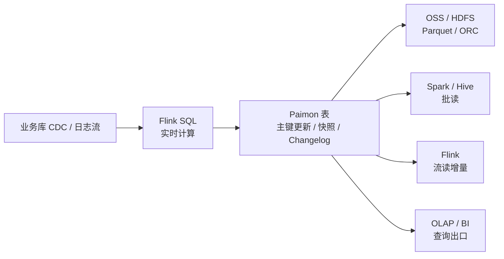

# Flink SQL 与 Paimon 流式湖仓实践

## 原文锚点

- 本地文件：[Paimon 实践 _ 基于 Flink SQL 和 Paimon 构建流式湖仓新方案.md](../文章/Paimon 实践 _ 基于 Flink SQL 和 Paimon 构建流式湖仓新方案.md)
- 原文链接：https://mp.weixin.qq.com/s?__biz=MzkyNDYzMTY2NA==&mid=2247488993&idx=1&sn=5f4412d6175940d7303eee3b5b0ea22c&chksm=c1d3423428758dcfe5e57637f9e28827a6f527c084011309d8af694602b0be6a95da08f9e7d0&mpshare=1&scene=24&srcid=0829pnKAuaRKMLy3Kg7dL9PR&sharer_shareinfo=4f07c62221b064deba7d185803c6d8d1&sharer_shareinfo_first=4f07c62221b064deba7d185803c6d8d1#rd
- 关键段落：文章从数据分析架构演进、Apache Paimon、Flink + Paimon 流式湖仓、Demo 演示四部分展开。

## 图片处理

| 图片 | 类型 | 是否保留 | 理由 | 处理方式 |
|---|---|---|---|---|
| 文中提到架构演进和流式湖仓图，但 Markdown 无图片链接 | 架构图 | 原图缺失 | 这类图能说明 Hive 到 Lakehouse、Flink 到 Paimon 的链路 | 标记“原图缺失，需要回原文查看”；下方用 Mermaid 重建简图 |

基于原文描述重建：

## 一句话结论

这篇文章适合实践，核心价值是把 Paimon 从“实时湖仓概念”落到“Flink SQL 写入、Paimon 承接表状态、下游批流读取”的链路。

## 用户相关性判断

| 项 | 内容 |
|---|---|
| 用户当前认知层级 | 数据工程与数仓 L2 到 L3，湖仓表格式 L1 到 L2 |
| 阅读投入建议 | 实践 |
| 对用户的新信息 | Paimon 的价值不是单点存储格式，而是与 Flink SQL 组成流式湖仓表状态链路 |
| 问题指纹 | Paimon + Flink 集成 + 流式湖仓写入/读取 + 实时状态表 + 不替代 OLAP 查询出口 |
| 排重判断 | 新建。与“实时数仓地基 Paimon”同属 Paimon，但本文新增 Flink SQL 实践链路 |

## 认知校准点

| 校准点 | 文章观点/信息 | 与用户认知或价值观的关系 | 处理建议 |
|---|---|---|---|
| 湖仓升级不只是“Hive 老了” | 文章提到 Hive 仍能再战，湖仓升级需要能打动决策人的收益 | 符合用户重工程落地和成本边界 | 不把湖仓当口号，要写清楚痛点和迁移收益 |
| Paimon 的实践价值依赖 Flink 链路 | 文章主线是 Flink SQL + Paimon 构建流式湖仓 | 补足 Paimon 的纵向使用链路 | 后续追查 Flink 写入语义、Catalog、主键表和 Changelog |
| 湖格式能力不等同查询加速 | 文章提到 ACID、Time Travel、Schema Evolution，也提到查询更快 | 需要防止把表格式能力和 OLAP 能力混淆 | 查询出口仍需和 Doris/StarRocks/Trino 对标 |
| Demo 不能直接等同生产方案 | 文章含 Demo 演示 | 用户重工程风险 | 生产落地还要看小文件、Compaction、延迟、故障恢复 |

## 待吸收点

| 分级 | 内容 | 为什么值得吸收 | 后续动作 |
|---|---|---|---|
| 理解 | Flink SQL 负责流式计算，Paimon 负责湖仓表状态和增量语义 | 这是流式湖仓纵向定位 | 补到 Paimon index 的使用链路 |
| 理解 | Paimon 要与 Delta、Hudi、Iceberg 对标，而不是和 Flink、Doris 混比 | 有助于分类边界 | 后续补一张湖仓表格式对比表 |
| 记住 | 流式湖仓选型要同时看写入、更新、快照、增量消费、下游查询和运维成本 | 可复用选型准则 | 进入湖仓表格式二级类目排重规则 |
| 实践 | 用 Flink SQL 写入 Paimon 主键表，再用批读和流读验证一致性 | 能验证文章价值 | 后续设计最小实验 |

## 已知可跳过

| 内容 | 跳过理由 |
|---|---|
| Lakehouse 的泛泛趋势描述 | 用户需要的是 Paimon 相对 Hive/Iceberg/Hudi 的机制和边界 |
| 会议分享背景 | 不进入核心知识点 |

## 归类判断

| 项 | 内容 |
|---|---|
| 技术本体 | Apache Paimon 湖仓表格式 |
| 文章主问题 | 如何用 Flink SQL 和 Paimon 构建流式湖仓链路 |
| 使用场景 | 实时数仓、流批一体、湖仓表状态管理 |
| 关键词干扰 | 标题有 Flink SQL，容易归到实时计算；但主角是 Paimon 表格式落地 |
| 最终归类 | 数据工程与数仓 / 湖仓表格式 / Paimon |
| 归类理由 | Flink 是计算入口，Paimon 是本文要沉淀的表格式和状态承载层 |

## 纵向理解

| 维度 | 判断 |
|---|---|
| 全局架构 | 数据源 -> Flink SQL -> Paimon 表 -> 对象存储/HDFS -> 批读/流读/查询出口 |
| 本文位置 | 主要覆盖 Flink + Paimon 实践链路，不完整覆盖 Compaction 和生产治理 |
| 核心机制 | Flink 写入、Paimon 主键表、快照、增量读取 |
| 使用链路 | 建 Catalog/表 -> Flink SQL 写入 -> Paimon 管理文件和快照 -> 下游读取 |
| 前置条件 | Flink SQL 能力、Paimon Catalog、对象存储或 HDFS、运维 Compaction |
| 边界 | 不直接解决高并发查询、复杂 BI 语义层和全链路调度治理 |

## 横向对标

| 对标技术 | 实现方式 | 优势 | 劣势 | 适合场景 |
|---|---|---|---|---|
| Hive 表 | 批表和分区管理 | 存量生态成熟 | 更新、快照、增量弱 | 传统离线数仓 |
| Iceberg | 开放湖仓表格式 | 跨引擎生态强 | Flink 实时更新体验需具体评估 | 通用开放湖仓 |
| Hudi | 湖上更新和增量 | 更新场景成熟 | 复杂度较高 | 存量湖上更新链路 |
| Paimon | 面向 Flink 的流批表格式 | 实时更新和流式消费定位清晰 | 生态边界需验证 | Flink 实时湖仓 |
| Doris / StarRocks | OLAP 查询出口 | 高并发查询强 | 不承担湖仓表格式底座 | BI 和服务化分析 |

## 后续追查

- Flink SQL 写 Paimon 主键表的最小实验。
- Paimon Changelog Producer 的模式和代价。
- Paimon Compaction 对延迟和查询的影响。
