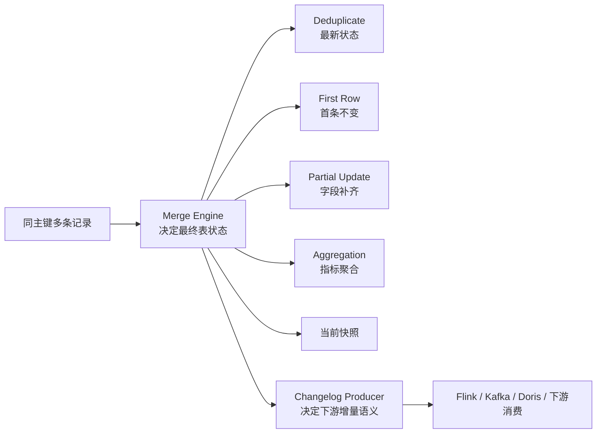

# Paimon 主键表合并引擎与 Changelog Producer

## 原文锚点

- 本地文件 1：[Paimon 合并引擎与 Changelog Producer 最优搭配指南](../文章/Paimon 合并引擎与 Changelog Producer 最优搭配指南.md)
- 本地文件 2：[Paimon 合并引擎到底怎么选？一文讲透 Deduplicate、Partial Update、Aggregation](../文章/Paimon 合并引擎到底怎么选？一文讲透 Deduplicate、Partial Update、Aggregation.md)
- 原文链接 1：`https://mp.weixin.qq.com/s?__biz=Mzg5Mzg3MzkwNA==&mid=2247492158&idx=1&sn=e5d195f9fdcb274aaa31bf22370635d6`
- 原文链接 2：`https://mp.weixin.qq.com/s?__biz=MzUyNjc2MjYzNA==&mid=2247487343&idx=1&sn=4832bc28762425c6d2b1311f4ff178d5`
- 关键段落：两篇文章分别解释 Deduplicate、First Row、Partial Update、Aggregation，以及 None、Input、Full-Compaction、Lookup。
- 关键图：无技术图。

## 图片处理

| 图片 | 类型 | 是否保留 | 理由 | 处理方式 |
|---|---|---|---|---|
| 无 | 无 | 不适用 | 文章用表格和 SQL 说明机制 | 用 Mermaid 重建主键表语义图 |

## 一句话结论

Paimon 合并引擎不是一个普通存储参数，而是主键表建模语义；Changelog Producer 不是查询当前状态的问题，而是下游能否正确消费变更的问题。

## 用户相关性判断

| 项 | 内容 |
|---|---|
| 用户当前认知层级 | Paimon / 湖仓表格式：L2 |
| 认知成熟度 | draft |
| 阅读投入建议 | 精读 |
| 阅读投入理由 | 能补 Paimon 主键表语义和下游变更边界，但参数需要以官方文档和版本为准 |
| 对用户的新信息 | 合并引擎决定同主键多条数据如何形成表状态，Changelog Producer 决定变更如何给下游 |
| 问题指纹 | Paimon + 主键表 + Merge Engine/Changelog Producer + 状态表/宽表/指标表/增量同步 + 建模语义边界 |
| 排重判断 | 新建 |
| 置信度 | 高 |

## 认知校准点

| 校准点 | 文章观点/信息 | 与用户认知或价值观的关系 | 处理建议 |
|---|---|---|---|
| 合并引擎要按建模语义选 | Deduplicate、Partial Update、Aggregation 分别对应状态表、宽表、指标表 | 补足用户在 Paimon L2 -> L3 的关键边界 | 作为 Paimon 建表前置判断 |
| First Row 不能被三分类遗漏 | 第二篇文章只讲三种常见引擎，第一篇补了 First Row | 防止知识不完整 | 在 index 中保留四类 |
| Changelog Producer 和 Merge Engine 是两层 | Merge Engine 决定表内最终状态，Changelog Producer 决定下游变更输出 | 这是纵向模块边界 | 不把“当前表查询正确”误认为“下游增量正确” |
| 职业目录放 Paimon 是原目录冲突 | 一篇 Paimon 文章在职业与管理目录 | 原目录不可信 | 重路由到数据工程与数仓 / 湖仓表格式 |

## 冲突点

| 冲突类型 | 具体表现 | 影响 | 处理 |
|---|---|---|---|
| 原目录冲突 | Paimon 合并引擎文章出现在职业与管理目录 | 会漏掉湖仓核心知识 | 重路由 |
| 证据不足 | 文章参数多，但未标明 Paimon 版本和官方依据 | 不能直接用于生产配置 | 参数作为候选，实践前查官方文档 |
| 实践门槛不足 | 有 SQL 配置，但缺少数据输入、输出和验证指标 | 不能直接判实践 | 降为精读 |

## 待吸收点

| 分级 | 内容 | 为什么值得吸收 | 后续动作 |
|---|---|---|---|
| 理解 | Deduplicate 适合只保留最新状态的主键表 | 对应订单当前状态、用户最新档案、CDC 最新值 | 与 Hive 快照表、Hudi/Iceberg 更新语义对比 |
| 理解 | First Row 适合首条记录不可变、后续重复丢弃 | 对应事件日志、审计、幂等消息 | 后续查官方对 delete/update before 的限制 |
| 理解 | Partial Update 适合多源字段补齐宽表 | 对应用户画像、商品画像、风控标签宽表 | 与 Flink 维表宽表构建对比 |
| 理解 | Aggregation 适合同 key 指标累加或聚合 | 对应实时指标、DWS 汇总表 | 与 Flink 聚合后写 Paimon 的边界对比 |
| 记住 | None 只保留快照性能最好，但不能支撑流式增量消费 | 防止把快照表误用于下游订阅 | 建表前问是否需要 changelog |
| 记住 | Input 低延迟但依赖上游 CDC 语义正确 | 上游质量直接决定下游正确性 | 需要验证 Debezium/Flink CDC 事件类型 |
| 记住 | Full-Compaction 准确但延迟高 | 一致性和延迟的取舍 | 用于高一致性、分钟级可接受场景 |
| 记住 | Lookup 在延迟和准确性之间折中，但会增加查找开销 | 影响写入吞吐和缓存设计 | 实践前压测 lookup cache |

## 已知可跳过

| 内容 | 跳过理由 |
|---|---|
| Paimon 是湖仓表格式 | 已在 Paimon index 覆盖 |
| 订单状态表、用户画像表、销售汇总表的业务样例 | 只保留建模语义，不需要复述全部示例 |
| 文末课程和资料推广 | 不进入知识点 |

## 实践门槛

| 门槛 | 判断 | 证据 |
|---|---|---|
| 可运行 | 部分 | 有建表 SQL 配置 |
| 可验证 | 否 | 缺少输入数据、期望输出、版本和执行结果 |
| 可排障 | 否 | 没有失败模式、日志和指标 |
| 可迁移 | 是 | 可迁移到实时湖仓状态表、宽表、指标表建模 |
| 结论 | 降为精读 | 先沉淀语义准则，实践前补官方版本和最小实验 |

## 归类判断

| 项 | 内容 |
|---|---|
| 技术本体 | Apache Paimon 主键表 |
| 文章主问题 | 合并引擎和 Changelog Producer 如何选择 |
| 使用场景 | 实时湖仓、CDC 同步、宽表构建、实时指标沉淀 |
| 关键词干扰 | 职业目录、DWS、CDC、Kafka、Doris 等词可能误导 |
| 最终归类 | 数据工程与数仓 / 湖仓表格式 |
| 归类理由 | 主问题是湖仓表格式内部状态与变更语义 |

## 技术定位

| 项 | 内容 |
|---|---|
| 技术类型 | 湖仓表格式核心模块 |
| 所属领域 | 数据工程与数仓 |
| 二级类目 | 湖仓表格式 |
| 全局架构位置 | Flink/Spark 写入 Paimon 主键表时的表状态合并与变更输出层 |
| 涉及模块 | 主键表、Merge Engine、Changelog Producer、Compaction、Lookup Cache |
| 解决问题 | 同主键多条记录如何形成最终状态，以及下游如何消费变更 |
| 原文局限 | 缺少官方版本、完整实验和故障边界 |
| 我的结论 | 以后关注，作为 Paimon 建表语义准则 |

## 跨域判断

| 问题 | 判断 |
|---|---|
| 它本体属于哪里 | 数据工程与数仓 / 湖仓表格式 |
| 这篇文章为什么可能跨域 | 提到 Flink CDC、Kafka、Doris、指标表 |
| 当前文章主问题是否改变分类 | 不改变，核心是 Paimon 表语义 |
| 应避免的误归类 | 不因指标表归数据分析，不因 CDC 归实时计算 |

## 纵向理解

| 维度 | 判断 |
|---|---|
| 全局架构 | Source/CDC -> Flink/Spark -> Paimon 主键表 -> 快照/Changelog -> 下游查询或消费 |
| 本文位置 | Paimon 主键表的 Merge Engine 与 Changelog Producer |
| 核心机制 | Merge Engine 处理同主键合并，Changelog Producer 生成下游变更 |
| 使用链路 | 先判断表语义，再选 Merge Engine，再判断下游是否需要 changelog |
| 前置条件 | 主键、序列字段、上游变更语义、下游延迟和一致性要求 |
| 边界 | 不解决 OLAP 查询加速，也不替代 Flink 计算逻辑 |

## 横向对标

| 对标技术 | 实现方式 | 优势 | 劣势 | 适合场景 |
|---|---|---|---|---|
| Hive 分区表 | 批量覆盖或追加文件 | 简单稳定，生态成熟 | 更新、增量、快照能力弱 | 离线批数仓 |
| Hudi | Copy-on-write / Merge-on-read 等更新语义 | 更新和增量生态成熟 | Flink 新链路需评估适配 | 湖上更新、CDC 湖仓 |
| Iceberg | 快照、事务、Schema 演进 | 跨引擎生态强 | 实时更新语义需看具体实现 | 开放湖仓、多引擎 |
| Kafka compacted topic | 按 key 保留最新消息 | 消息链路简单、低延迟 | 不提供完整表格式和批查询语义 | 事件流和状态流 |
| Doris Primary Key 表 | OLAP 内部主键更新 | 查询服务化能力强 | 不替代湖仓底座 | 下游查询出口和服务化分析 |

## 后续追查

- 关键词：Paimon merge-engine、changelog-producer、deduplicate、first-row、partial-update、aggregation、lookup。
- 相关技术：Flink CDC、Paimon Compaction、Iceberg、Hudi、Doris Primary Key 表。
- 需要补读的文章：Paimon 官方主键表文档、Paimon Changelog Producer 官方文档、Paimon Compaction 参数。
