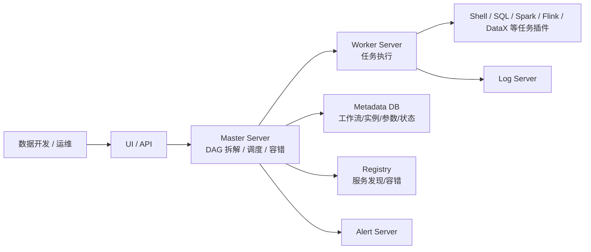

# DolphinScheduler
## 知识点入口

- 本模块先看宏观流程，再看文章：[知识地图](030601_核心知识点/知识地图.md)。
- 新文章必须先归入流程节点，再判断是补充、冲突、不同层次还是降权。
- `文章/` 只保留原文锚点，长期知识必须沉淀到 `030601_核心知识点/`。

## 技术定位

| 项 | 内容 |
|---|---|
| 技术名 | Apache DolphinScheduler |
| 一级类目 | 数据工程与数仓 |
| 二级类目 | 调度编排 |
| 技术本体 | 面向数据任务的分布式工作流调度平台，用 DAG 管理任务依赖、调度实例、执行状态和告警恢复 |
| 全局架构位置 | 位于数据开发任务和计算/同步引擎之间，承担任务编排、调度触发、实例运行、依赖管理和运维治理 |
| 主要使用者 | 数据平台工程师、数据开发、运维、数仓负责人 |
| 主要产出 | 工作流、任务节点、调度实例、参数、告警、运行日志、补数/重跑记录 |

## 官方锚点

- 官网：[Apache DolphinScheduler](https://dolphinscheduler.apache.org/)
- GitHub：[apache/dolphinscheduler](https://github.com/apache/dolphinscheduler)
- 官方文档：[DolphinScheduler Documentation](https://dolphinscheduler.apache.org/en-us/docs/latest/user_doc/about/introduction.html)

## 架构图

## 核心模块

| 模块 | 职责 | 重点问题 |
|---|---|---|
| 工作流 DAG | 定义任务节点、依赖和触发关系 | 依赖表达、补数、重跑、失败恢复 |
| Master Server | 拆解 DAG、分发任务、管理实例状态 | 高可用、调度延迟、容错 |
| Worker Server | 执行具体任务插件 | 资源隔离、日志、失败重试 |
| 参数体系 | 支持内置参数、全局参数、局部参数、上下游传参 | 时间参数、传参方向、优先级、版本差异 |
| 任务插件 | 对接 Shell、SQL、Spark、Flink、DataX 等 | 插件语义与外部引擎边界 |
| 告警与日志 | 记录运行和通知异常 | 告警抑制、日志追踪、复盘 |

## 上下游

| 方向 | 对象 | 关系 |
|---|---|---|
| 上游 | 数据开发脚本、SQL、同步任务、业务调度需求 | 被编排为任务节点 |
| 下游 | Hive、Spark、Flink、DataX、Doris、Shell、Python | 由 Worker 触发执行 |
| 依赖 | Metadata DB、Registry、资源队列、告警系统 | 决定高可用和运维稳定性 |

## 横向对标

| 对标技术 | 对标点 | DolphinScheduler 优势 | DolphinScheduler 劣势 | 使用判断 |
|---|---|---|---|---|
| Airflow | DAG 工作流调度 | UI 和数据平台任务治理更贴近国内大数据平台 | Python 生态和可编程灵活性不如 Airflow | 数据团队平台化调度可评估 DolphinScheduler |
| Azkaban | 批任务依赖调度 | DolphinScheduler 功能更完整，任务类型和可视化更强 | 运维复杂度更高 | 老 Hadoop 批任务可用 Azkaban，新平台更适合 DolphinScheduler |
| Oozie | Hadoop 生态调度 | DolphinScheduler 更现代，UI 和插件生态更友好 | 历史 Hadoop 兼容场景需评估 | 新建平台不优先 Oozie |
| 自研调度 | 内部任务编排 | DolphinScheduler 有成熟平台能力 | 定制能力受框架约束 | 通用数据调度优先成熟平台，强业务特化再自研 |

## 已沉淀核心知识点

| 主题 | 文件 | 问题指纹 | 解决什么问题 | 认知增量 |
|---|---|---|---|---|
| 参数语义与传参边界 | [DolphinScheduler参数语义与传参边界](030601_核心知识点/DolphinScheduler参数语义与传参边界.md) | DolphinScheduler + 参数体系 + 内置参数/衍生函数/全局参数/上下游传参 + 任务复用 + 版本边界 | 避免把调度参数当普通字符串替换 | 参数是调度实例语义的一部分，要按时间基准、作用域、方向和优先级理解 |
| 开源数据平台中的编排边界 | [DolphinScheduler在开源数据平台中的编排边界](030601_核心知识点/DolphinScheduler在开源数据平台中的编排边界.md) | DolphinScheduler + 数据平台编排层 + DAG/任务实例/监控联动 + 多组件任务串联 + 不替代计算和查询引擎 | 区分 DolphinScheduler、Dinky、Flink、Doris 在平台中的职责 | DolphinScheduler 是工作流编排层，不是 Flink 开发运维平台、CDC 引擎或 OLAP 服务 |

## 后续追查

- 关键词：DAG、Master、Worker、task plugin、parameter、global parameter、OUT parameter、failure strategy。
- 待读资料：DolphinScheduler 补数、失败策略、资源中心、租户/队列、告警和 Airflow 迁移。
- 待补实验：构造 Shell -> SQL -> Python 三节点工作流，验证全局参数、OUT 参数和本地参数优先级。
