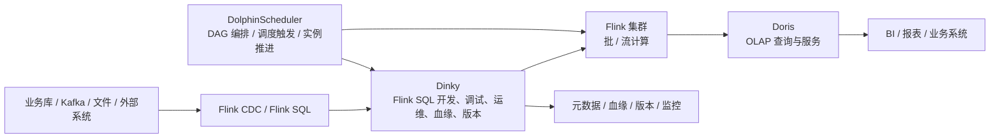

# DolphinScheduler 在开源数据平台中的编排边界

## 原文锚点

- 本地文件：[Doris + Flink + DolphinScheduler + Dinky 构建开源数据平台](../文章/Doris + Flink + DolphinScheduler + Dinky 构建开源数据平台.md)
- 原文链接：http://mp.weixin.qq.com/s?__biz=Mzg3ODYxOTQxMA==&mid=2247486025&idx=1&sn=b3d5e1f5edb1ad8b9114964367561dca
- 关键段落：开源数据平台思路、构建 DolphinScheduler 工作流任务、任务监控、离线数据分析平台、实时数据分析平台。
- 关键图：原文多处提到“如图”“下图”，本地 Markdown 未保留图片。

## 图片处理

| 图片 | 类型 | 是否保留 | 理由 | 处理方式 |
|---|---|---|---|---|
| 开源数据平台架构图 | 架构图 | 重建 | 文章核心是 Doris、Flink、Dinky、DolphinScheduler 的职责边界 | 基于原文描述用 Mermaid 重建 |
| Dinky 开发页面、FlinkSQL 调试、血缘分析截图 | 说明图 | 原图缺失 | 对复现实操有帮助，但不是调度边界的核心 | 标记原图缺失，需要回原文查看 |

## 一句话结论

这篇文章值得精读但不适合当成 DolphinScheduler 全貌；它真正补充的是：在开源数据平台里，DolphinScheduler 是工作流编排层，负责任务依赖和实例推进，不应该被误解为 Flink 开发平台、CDC 引擎或 OLAP 服务。

## 用户相关性判断

| 项 | 内容 |
|---|---|
| 用户当前认知层级 | 调度编排 L2 draft |
| 认知成熟度 | draft |
| 阅读投入建议 | 精读 |
| 阅读投入理由 | 能校准调度编排在数据平台中的位置，但文章是方案分享，缺少可复现实验、配置和故障证据 |
| 对用户的新信息 | DolphinScheduler 与 Dinky 的边界：Dinky 更偏 Flink SQL 开发运维，DolphinScheduler 更偏跨任务 DAG 编排 |
| 问题指纹 | DolphinScheduler + 数据平台编排层 + DAG/任务实例/监控联动 + 解决多组件任务串联 + 不替代计算和查询引擎 |
| 排重判断 | 新建 |
| 置信度 | 中 |

## 认知校准点

| 校准点 | 文章观点/信息 | 与用户认知或价值观的关系 | 处理建议 |
|---|---|---|---|
| 调度只是一层，不是整个平台 | 文章用 Doris + Flink + DolphinScheduler + Dinky 组合搭平台 | 补充：不能因平台方案里出现 DolphinScheduler 就把所有内容归为调度 | 只沉淀 DolphinScheduler 的编排边界 |
| Dinky 和 DolphinScheduler 分工不同 | Dinky 负责 FlinkSQL 开发、调试、运维、血缘和版本；DolphinScheduler 负责工作流调度 | 纠偏：Dinky 不是调度器，DolphinScheduler 不是开发运维平台 | 写入横向边界 |
| 实时任务和离线任务在调度里语义不同 | 实时任务需要手动停止才进入下一个节点，离线任务 Finished 后推进 | 补充：调度状态机要理解任务类型差异 | 后续补 DolphinScheduler 任务类型和实例状态 |
| 平台方案不等于选型结论 | 文章把 Doris 作为核心数仓能力，但没有给出和 Hive/StarRocks/ClickHouse 的严肃对标 | 降权：不能直接采信“统一数仓”结论 | Doris 相关内容只作为相邻锚点，不写进调度结论 |

## 冲突点

| 冲突类型 | 具体表现 | 影响 | 处理 |
|---|---|---|---|
| 关键词误导 | Doris、Flink、Flink CDC、Dinky、DolphinScheduler 同时出现 | 容易误归为 OLAP、实时计算或数据集成 | 当前笔记只处理 DolphinScheduler 编排边界 |
| 图片缺失 | 多处“如图”但本地无图 | 影响 UI 和架构复现 | Mermaid 重建主架构，截图标记缺失 |
| 证据不足 | 缺少生产规模、调度延迟、失败恢复、资源隔离数据 | 不能直接形成生产选型结论 | 标为待验证 |
| 实践判定偏宽 | 有方案描述和配置片段，但没有完整可运行环境 | 不能判为实践 | 降为精读 |

## 待吸收点

| 分级 | 内容 | 为什么值得吸收 | 后续动作 |
|---|---|---|---|
| 理解 | DolphinScheduler 位于开发平台和执行引擎之上，负责 DAG 和调度实例 | 帮助把调度从计算、开发、查询中拆出来 | 更新 DolphinScheduler index |
| 理解 | Dinky 可以通过扩展作业类型被 DolphinScheduler 编排 | 说明平台集成的接口边界 | 后续追查任务插件和 API 集成 |
| 记住 | 调度系统不负责 Flink SQL 的开发、血缘计算、Savepoint 托管和 Doris 查询服务 | 防止读平台方案时混淆职责 | 作为后续排重准则 |
| 记住 | 实时任务进入 DAG 后，完成语义不同于离线任务 | 影响工作流推进和告警判断 | 后续补实时任务调度状态机 |
| 实践 | 构造 Dinky/FlinkSQL 任务被 DolphinScheduler 调度的最小链路 | 可验证调度边界和日志追踪 | 等补证阶段再做本地或文档实验 |

## 已知可跳过

| 内容 | 跳过理由 |
|---|---|
| Doris 高性能、Flink 高吞吐、DolphinScheduler 可视化 DAG 等产品优点 | 多为项目介绍，不能直接变成选型准则 |
| 开源项目地址和社区宣传 | 初始化阶段不联网补证，且不影响调度边界 |
| Dinky 全量功能列表 | 与 DolphinScheduler 编排边界相关性有限 |

## 实践门槛

| 门槛 | 判断 | 证据 |
|---|---|---|
| 可运行 | 否 | 没有完整部署、连接器版本和工作流导出 |
| 可验证 | 部分 | 有 Flink/Doris 配置片段，但缺输入、输出和验收标准 |
| 可排障 | 部分 | 有任务监控描述，但缺日志信号和失败恢复路径 |
| 可迁移 | 是 | 可迁移到数据平台多组件编排场景 |
| 结论 | 降为精读 | 缺最小可运行链路和故障验证 |

## 归类判断

| 项 | 内容 |
|---|---|
| 技术本体 | DolphinScheduler 是数据任务工作流调度平台 |
| 文章主问题 | 如何用开源组件拼出离线、实时、OLAP 数据平台 |
| 使用场景 | Flink SQL 开发、Doris 查询服务、Dinky 运维平台、DolphinScheduler 工作流编排 |
| 关键词干扰 | Doris、Flink、Flink CDC、Dinky、实时数仓、OLAP |
| 最终归类 | 数据工程与数仓 / 调度编排 / DolphinScheduler |
| 归类理由 | 当前沉淀对象是 DolphinScheduler 在平台里的编排职责，不是 Doris 查询优化、Flink 流计算或 CDC 同步 |

## 技术定位

| 项 | 内容 |
|---|---|
| 技术类型 | 数据工作流调度平台 |
| 所属领域 | 数据工程与数仓 |
| 二级类目 | 调度编排 |
| 全局架构位置 | 位于数据开发平台和执行引擎之上，负责工作流定义、调度触发、实例推进和任务监控联动 |
| 涉及模块 | DAG、任务插件、调度实例、监控、告警、外部平台集成 |
| 解决问题 | 多组件数据平台中任务依赖和运行顺序如何稳定推进 |
| 原文局限 | 多项目介绍较多，调度内部机制、失败恢复、资源隔离讲得不足 |
| 我的结论 | 以后关注；适合用于校准调度层边界，不适合作为生产选型结论 |

## 纵向理解

| 维度 | 判断 |
|---|---|
| 全局架构 | 数据源 -> Flink CDC/Flink SQL -> Dinky 开发运维 -> Flink 执行 -> Doris 服务，下方由 DolphinScheduler 编排任务关系 |
| 本文位置 | 文章只涉及 DolphinScheduler 的平台集成位置，没有展开 Master/Worker、实例状态和失败策略 |
| 核心机制 | 通过 DAG 工作流把 Dinky/Flink/Doris 相关任务串联起来，并用任务状态推动后续节点 |
| 使用链路 | 开发 Flink SQL/Doris SQL -> 平台发布任务 -> DolphinScheduler 编排工作流 -> 触发执行 -> 监控状态 |
| 前置条件 | 各组件版本、连接器兼容、任务插件、元数据和运行日志可追踪 |
| 边界 | 调度系统不能替代计算引擎优化、CDC 一致性、Doris 存储模型和数据质量验收 |

## 横向对标

| 对标技术 | 实现方式 | 优势 | 劣势 | 适合场景 |
|---|---|---|---|---|
| DolphinScheduler | 可视化 DAG + 多任务插件 + Master/Worker 调度 | 数据平台任务编排友好 | 复杂逻辑可编程性不如代码化 DAG | 数据团队平台化调度 |
| Airflow | Python DAG + Scheduler/Executor | 可编程强，生态丰富 | 对非 Python 数据开发门槛更高 | 代码化工作流和跨系统编排 |
| Dinky | Flink SQL 开发、调试、运维平台 | 贴近 Flink 作业生命周期 | 不负责通用 DAG 调度 | Flink SQL 平台化开发 |
| Flink 原生提交 | Client/API 提交作业 | 贴近计算引擎 | 不负责跨任务依赖和补跑治理 | 单作业提交和运行 |

## 后续追查

- 关键词：DolphinScheduler Dinky task plugin、Dinky DolphinScheduler、FlinkSQL 任务调度、实时任务 DAG 状态。
- 相关技术：Dinky、Flink、Flink CDC、Doris、Airflow、DataX。
- 需要补读的文章：DolphinScheduler 任务类型扩展、实时任务调度语义、DolphinScheduler 补数与失败策略。
