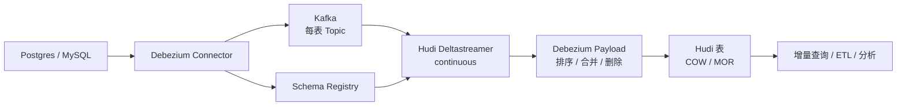

# Debezium 低延迟 CDC 入湖管道

## 原文锚点

- 本地文件：[基于Debezium的低延迟CDC入湖管道](../文章/基于Debezium的低延迟CDC入湖管道.md)
- 原文链接：http://mp.weixin.qq.com/s?__biz=MzI0NTIxNzE1Ng==&mid=2651224692&idx=2&sn=37291ec60ce7826e7102515cb785423b
- 关键段落：Debezium -> Kafka -> Schema Registry -> Hudi Deltastreamer，总体设计；初始快照和 JDBC bootstrap；Hudi 记录键、源排序字段、分区字段；Postgres publication、slot、Deltastreamer 参数。
- 关键图：正文说“上面显示了端到端 CDC 摄取流架构”，本地 Markdown 无图片。

## 图片处理

| 图片 | 类型 | 是否保留 | 理由 | 处理方式 |
|---|---|---|---|---|
| 端到端 CDC 入湖架构图 | 架构图 | 原图缺失 | 这是文章主链路 | Mermaid 重建 |

## 一句话结论

这篇文章适合精读：Debezium 入湖的核心不是单个 CDC 工具，而是用 Kafka/Schema Registry 承接变更事件，再由 Hudi Deltastreamer 依据主键、源排序字段和删除语义合并到湖表。

## 用户相关性判断

| 项 | 内容 |
|---|---|
| 用户当前认知层级 | 数据集成 L2 draft；湖仓表格式 L2 draft |
| 认知成熟度 | draft |
| 阅读投入建议 | 精读 |
| 阅读投入理由 | 能补 Debezium 与 Flink CDC 的横向边界，也补 CDC 入湖时快照、位点、Schema 和删除语义的端到端链路 |
| 对用户的新信息 | 初始快照可以由 Debezium 做，也可以用 JDBC bootstrap 后再用 checkpoint 接上变更日志；source ordering field 是入湖去重和排序的关键 |
| 问题指纹 | Debezium + Kafka/Schema Registry + Hudi Deltastreamer + source ordering/checkpoint + 低延迟 CDC 入湖 + 端到端一致性边界 |
| 排重判断 | 新建 Debezium 技术节点；与 Flink CDC 概览中的 Debezium 事件格式不重复 |
| 置信度 | 中 |

## 认知校准点

| 校准点 | 文章观点/信息 | 与用户认知或价值观的关系 | 处理建议 |
|---|---|---|---|
| CDC 入湖不是只读日志 | Debezium 负责事件捕获，Hudi Deltastreamer 负责消费和写湖 | 补纵向链路边界 | 拆分源端 CDC 和下游表格式 |
| 初始快照有两条路线 | Debezium `snapshot.mode` 可做初始一致快照；大表也可先 JDBC bootstrap，再用 checkpoint 接变更日志 | 补全量/增量切换 | 写入待实验 |
| 排序字段决定最终写入正确性 | MySQL 用 FILEID/POS，Postgres 用 LSN 作为源排序字段 | 补一致性关键点 | 作为 CDC 入湖短规则 |
| 删除不是普通更新 | `op=d` 需要下游 Payload 确保硬删除 | 补删除语义边界 | 后续验证目标表行为 |
| 分区字段不要照搬源库 | Hudi 分区应按分析和湖表设计，不必等同于上游数据库分区 | 纠偏“源端结构照搬目标端” | 写入横向对标 |

## 冲突点

| 冲突类型 | 具体表现 | 影响 | 处理 |
|---|---|---|---|
| 图片缺失 | 关键架构图未落到本地 Markdown | 影响链路理解 | Mermaid 重建 |
| 版本时效 | 文中涉及 Hudi 0.10.0、Debezium 1.6.1 等旧版本上下文 | 不能直接复制命令 | 官方和当前版本后续补证 |
| 证据不足 | 低延迟和成本优势缺统一环境、基线和恢复验证 | 不能直接作为选型结论 | 只沉淀机制和验证点 |
| 归类边界 | 文章同时涉及 Debezium、Kafka、Hudi | 容易归到湖仓表格式 | 主问题是 CDC 入湖链路，归数据集成 / Debezium |

## 待吸收点

| 分级 | 内容 | 为什么值得吸收 | 后续动作 |
|---|---|---|---|
| 理解 | Debezium Connector 将数据库变更写入每表 Kafka Topic | 明确 CDC 事件中心化路线 | 与 Flink CDC 对标 |
| 理解 | Schema Registry 让 Deltastreamer 读取最新事件模式 | 影响 Schema 演进和反序列化 | 补 Schema 兼容策略 |
| 理解 | Hudi 记录键应是上游数据库主键，源排序字段用于去重和顺序 | 决定更新和删除正确性 | 写入入湖验证清单 |
| 记住 | 大表初始化不能只看“快照能跑”，要保证 bootstrap 和变更日志 checkpoint 连续 | 防止全量/增量断点丢数 | 做最小实验 |
| 实践 | 验证 insert/update/delete、初始快照、JDBC bootstrap 后接日志、offset 恢复和 Schema 变更 | 可形成 CDC 入湖实验 | 后续补实验 |

## 已知可跳过

| 内容 | 跳过理由 |
|---|---|
| Hudi、CDC 的基础定义 | 用户大概率已知 |
| Kubernetes/Strimzi 安装命令细节 | 版本时效强，本轮不联网补证 |
| 推荐阅读和外链列表 | 不复制外部资料，只保留追查关键词 |

## 实践门槛

| 门槛 | 判断 | 证据 |
|---|---|---|
| 可运行 | 部分 | 原文给了 Postgres publication、Debezium connector、Deltastreamer 命令 |
| 可验证 | 否 | 缺输入变更、Hudi 查询结果、删除验证和恢复验收 |
| 可排障 | 否 | 缺 Kafka offset、slot lag、Schema Registry 兼容错误和 Hudi 写入失败路径 |
| 可迁移 | 是 | 可迁移到 Debezium/Kafka 中心化 CDC 入湖方案 |
| 结论 | 降为精读 | 链路完整但缺可复现验证闭环 |

## 归类判断

| 项 | 内容 |
|---|---|
| 技术本体 | Debezium 是数据库 CDC 事件捕获工具 |
| 文章主问题 | 如何用 Debezium 事件经 Kafka 写入 Hudi 数据湖 |
| 使用场景 | Postgres/MySQL 事务库到 Hudi 湖表的低延迟入湖 |
| 关键词干扰 | Hudi、Deltastreamer、Merge-On-Read、Spark |
| 最终归类 | 数据工程与数仓 / 数据集成 / Debezium |
| 归类理由 | 主职责是变更数据如何进入湖仓，Hudi 是下游落地和合并语义 |

## 技术定位

| 项 | 内容 |
|---|---|
| 技术类型 | CDC 工具与入湖链路案例 |
| 所属领域 | 数据工程与数仓 |
| 二级类目 | 数据集成 |
| 全局架构位置 | 数据库日志捕获到湖仓写入之间 |
| 涉及模块 | Debezium Connector、Kafka、Schema Registry、Hudi Deltastreamer、Payload |
| 解决问题 | 将事务数据库行级变更低延迟写入湖表，并支持更新、删除和增量消费 |
| 原文局限 | 版本较旧，缺失败恢复、Schema 冲突和性能基线 |
| 我的结论 | 以后关注；作为 Debezium 与 Flink CDC 横向对标的核心样本 |

## 纵向理解

| 维度 | 判断 |
|---|---|
| 全局架构 | 数据库日志 -> Debezium -> Kafka Topic/Schema Registry -> Deltastreamer -> Hudi 表 -> 增量查询 |
| 本文位置 | 讲 Debezium 事件如何入 Hudi，不讲 Debezium 内部实现或 Hudi 查询优化 |
| 核心机制 | 初始快照、Kafka 事件承载、Schema Registry、source ordering field、Payload 合并和硬删除 |
| 使用链路 | 配置数据库逻辑复制 -> 部署 Connector -> 创建 Topic/Schema -> 运行 Deltastreamer -> 校验湖表 |
| 前置条件 | 数据库日志开启、Kafka 可用、Schema Registry 可用、Hudi 表主键和分区设计正确 |
| 边界 | 不自动解决 Schema 兼容冲突、源端日志保留、Kafka 积压、下游 Compaction 和查询性能 |

## 横向对标

| 对标技术 | 实现方式 | 优势 | 劣势 | 适合场景 |
|---|---|---|---|---|
| Debezium + Kafka + Hudi | CDC 事件进 Kafka，再由 Deltastreamer 写湖 | 事件中心化，适合多下游消费 | 链路长，组件多，运维复杂 | Kafka 中心化 CDC 入湖 |
| Flink CDC -> Paimon/Hudi | Flink CDC Pipeline 或 Flink 作业直接写湖 | 贴近 Flink 生态，端到端编排更直接 | 依赖 Flink 运维和连接器能力 | Flink 实时链路 |
| SeaTunnel CDC -> Sink | 配置化 Source/Transform/Sink | 多源多端覆盖广 | 入湖合并语义需目标端验证 | 数据集成平台统一入口 |
| JDBC 批量入湖 | 定时全量/增量查询写湖 | 简单，低门槛 | 延迟高，删除和更新弱 | T+1 或低频更新 |

## 后续追查

- 关键词：Debezium source ordering field、LSN、FILEID POS、Hudi Deltastreamer checkpoint、Debezium Payload、Schema Registry。
- 相关技术：Flink CDC、Kafka Connect、Hudi、Paimon、SeaTunnel。
- 需要补读的文章：Debezium 当前 Postgres/MySQL Connector 文档、Hudi Deltastreamer 当前配置、CDC 入湖 Schema 演进限制。

