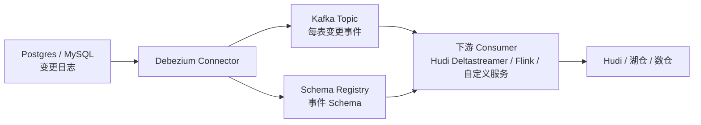

# Debezium
## 知识点入口

- 本模块先看宏观流程，再看文章：[流程化知识点总览](knowledge/03_数据工程与数仓/0307_数据集成/Debezium/核心知识点/流程化知识点总览.md)。
- 新文章必须先归入流程节点，再判断是补充、冲突、不同层次还是降权。
- `文章/` 只保留原文锚点，长期知识必须沉淀到 `核心知识点/`。

## 技术定位

| 项 | 内容 |
|---|---|
| 技术名 | Debezium |
| 一级类目 | 数据工程与数仓 |
| 二级类目 | 数据集成 |
| 技术本体 | 通过读取数据库变更日志捕获行级变更，并把变更事件发送到 Kafka 等下游的数据变更捕获工具 |
| 全局架构位置 | 位于业务数据库日志和下游消息/湖仓/数仓写入之间，承担变更事件生成、位点管理和 Schema 传递 |
| 主要使用者 | 数据集成工程师、实时数仓工程师、湖仓平台工程师 |
| 主要产出 | Kafka Topic、Debezium 变更事件、Schema、offset/checkpoint、下游写入记录 |

## 官方锚点

- 官网：后续补证
- GitHub：后续补证
- 官方文档：后续补证
- 架构文档：后续补证

## 架构图

## 核心模块

| 模块 | 职责 | 重点问题 |
|---|---|---|
| Connector | 读取数据库日志并生成变更事件 | 权限、日志保留、快照、位点 |
| Kafka / Kafka Connect | 承载变更事件和连接器运行 | Topic 设计、offset、可用性 |
| Schema Registry | 管理事件 Schema | Schema 演进、兼容性 |
| 事件 Payload | 表达 insert/update/delete 和 source 位点 | 删除语义、排序字段、重复数据删除 |
| 下游写入器 | 消费变更并写入湖仓或数仓 | 主键、合并、硬删除、幂等 |

## 上下游

| 方向 | 对象 | 关系 |
|---|---|---|
| 上游 | MySQL、PostgreSQL 等事务数据库 | 读取 binlog/WAL 等变更日志 |
| 下游 | Kafka、Hudi、Flink、湖仓和数仓写入任务 | 消费 CDC 事件并落地 |
| 依赖 | Kafka Connect、Schema Registry、数据库逻辑复制配置、下游表格式 | 决定低延迟、恢复和 Schema 兼容 |

## 横向对标

| 对标技术 | 对标点 | Debezium 优势 | Debezium 劣势 | 使用判断 |
|---|---|---|---|---|
| Flink CDC | CDC 捕获和同步 | Debezium 更偏 Kafka Connect 生态和独立 CDC | 端到端写湖写仓通常还要再接下游框架 | Kafka 中心化 CDC 选 Debezium |
| SeaTunnel | 数据集成平台 | SeaTunnel 多源多端配置化更完整 | Debezium CDC 事件语义更专注 | 多源多端同步看 SeaTunnel |
| Canal | MySQL Binlog | Debezium 多数据库和事件生态更通用 | Canal 在轻量 MySQL 场景简单 | 轻量 MySQL 增量可看 Canal |
| Hudi Deltastreamer | CDC 入湖消费端 | Deltastreamer 负责写 Hudi，不负责源端日志捕获 | 与 Debezium 组合才形成端到端链路 | Debezium 产事件，Hudi 负责湖表合并 |

## 已沉淀核心知识点

| 主题 | 文件 | 问题指纹 | 解决什么问题 | 认知增量 |
|---|---|---|---|---|
| Debezium 低延迟 CDC 入湖管道 | [Debezium低延迟CDC入湖管道](核心知识点/Debezium低延迟CDC入湖管道.md) | Debezium + Kafka/Schema Registry + Hudi Deltastreamer + source ordering/checkpoint + 低延迟入湖 | 判断 Debezium 到湖仓的端到端链路由哪些组件共同保证 | CDC 入湖的关键不是“读日志”本身，而是快照/位点、Schema、排序字段、删除语义和下游合并 |

## 后续追查

- 关键词：Debezium、Kafka Connect、Schema Registry、source ordering field、LSN、FILEID/POS、Hudi Deltastreamer。
- 待读资料：Debezium 当前官方文档、Postgres/MySQL connector 配置、Schema Registry 兼容策略。
- 待补实验：Debezium -> Kafka -> Hudi 最小链路，验证初始快照、更新、删除、Schema 演进、offset 恢复。

