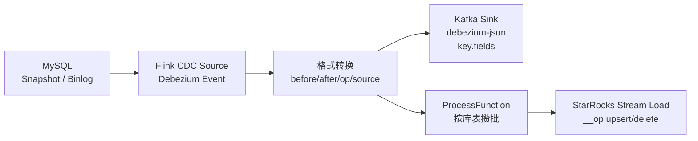

# Flink CDC 到 Kafka 与 StarRocks 下游一致性边界

## 原文锚点

- 本地文件：[Flink Cdc MySQL 整库同步到 StarRocks](../文章/Flink Cdc MySQL 整库同步到 StarRocks.md)
- 本地文件：[Flink CDC2Kafka 总结](../文章/Flink CDC2Kafka 总结.md)
- 原文链接：两篇原文 front matter 中的微信公众号链接。
- 关键段落：MySQL Source `StartupOptions.latest/initial`、Debezium 事件 `before/after/op`、StarRocks `__op` upsert/delete、目标表 Schema 缓存、无主键表异常、Kafka `key.fields`、`debezium.binary.handling.mode=base64`、`operation_ts` 元数据。
- 关键图：StarRocks 文章写“架构如下”但本地 Markdown 无图；Kafka 文章包含图片字段 base64 样例，不是技术图。

## 图片处理

| 图片 | 类型 | 是否保留 | 理由 | 处理方式 |
|---|---|---|---|---|
| MySQL -> StarRocks 架构图 | 架构图 | 原图缺失 | 文章主链路需要图示 | Mermaid 重建 |
| Blob 图片字段 base64 样例 | 数据样例 | 删除 | 只验证二进制字段编码，不是技术图 | 保留文字结论 |

## 一句话结论

这两篇文章合并精读：Flink CDC 写 Kafka 或 StarRocks 的核心不是“能写进去”，而是主键、分区有序、更新删除表达、目标 Schema、全量/增量启动位点和恢复后的重复/丢失边界。

## 用户相关性判断

| 项 | 内容 |
|---|---|
| 用户当前认知层级 | Flink CDC / 数据集成 L2-L3 draft；Kafka/StarRocks L2 draft |
| 认知成熟度 | draft |
| 阅读投入建议 | 精读 |
| 阅读投入理由 | 能补下游一致性和 Sink 语义，但两篇都缺端到端恢复、DDL、Exactly Once 和生产指标 |
| 对用户的新信息 | Kafka 需要 `key.fields` 保障同主键同分区，StarRocks 需要 `__op` 表达 upsert/delete，目标表 Schema 缓存和无主键表都会成为一致性边界 |
| 问题指纹 | Flink CDC + Kafka/StarRocks Sink + Debezium event/key.fields/__op/schema cache + 下游一致性 + 主键/DDL/恢复边界 |
| 排重判断 | 新建合并主题；与 Doris 链路边界不重复，重点转向 Kafka 事件格式和 StarRocks 自定义 Sink |
| 置信度 | 中 |

## 认知校准点

| 校准点 | 文章观点/信息 | 与用户认知或价值观的关系 | 处理建议 |
|---|---|---|---|
| StarRocks 写入正确性依赖目标表语义 | Sink 通过 `__op` 追加 0/1 表达 upsert/delete | 补下游一致性边界 | 与 Doris/Paimon 对标 |
| `latest` 与 `initial` 不能混用理解 | StarRocks 代码片段配置 `StartupOptions.latest()`，测试全量又改成 `initial` | 补全量/增量切换风险 | 上线必须明确历史数据策略 |
| Schema 演进是明确缺口 | StarRocks 文章承认未实现目标端表结构跟随源端变化 | 补用户关注的 Schema 演进边界 | 不把它当完整整库同步方案 |
| 无主键表会阻断快照 | 原文报 `Incremental snapshot for tables requires primary key` | 补失败场景 | 写入 CDC 源端准入 |
| Kafka 写 CDC 要保主键有序 | `key.fields='id'` 让相同主键进入同一分区 | 补事件流消费边界 | 作为 Kafka Sink 准则 |
| Update/Delete 事件格式会影响下游 | Debezium JSON 用 before/after/op；文章中 update 被拆为 delete+insert 的消费效果 | 补下游解析风险 | 下游必须按格式实现合并 |

## 冲突点

| 冲突类型 | 具体表现 | 影响 | 处理 |
|---|---|---|---|
| 图片缺失 | StarRocks 文章架构图缺失 | 影响链路理解 | Mermaid 重建 |
| 原目录冲突 | Kafka 文章在 raws/big-data，可能被粗分为消息队列 | 会忽略 CDC 下游语义 | 归数据集成 / Flink CDC |
| 实践门槛不足 | 有代码和 SQL，但缺重启恢复、重复写入、DDL 和对账指标 | 不能判实践 | 降为精读 |
| 证据不足 | StarRocks/Kafka 示例没有生产版本、吞吐、失败日志 | 不能指导容量选型 | 只沉淀机制和边界 |
| 排重冲突 | 与 Doris 链路同属 MySQL -> OLAP 同步 | 容易重复建笔记 | 本文只处理 Kafka/StarRocks 特有语义 |

## 待吸收点

| 分级 | 内容 | 为什么值得吸收 | 后续动作 |
|---|---|---|---|
| 理解 | Debezium 事件的 `before/after/op` 决定 insert/update/delete 如何传给下游 | 是所有 Sink 语义基础 | 写入验证清单 |
| 理解 | Kafka Sink 用 `key.format` 和 `key.fields` 控制主键分区 | 保证同主键事件有序消费 | 后续验证多分区乱序 |
| 理解 | StarRocks Stream Load 需要按目标表列顺序拼接，并追加 `__op` | 决定 Upsert/Delete 结果 | 后续查 StarRocks 当前导入语义 |
| 记住 | 没有主键的表不适合作为 Flink CDC 增量快照对象 | 会导致任务异常或阻塞 | 源表准入检查 |
| 记住 | 目标 Schema 缓存和缺失表忽略会造成静默丢数风险 | 比任务失败更难发现 | 需要告警和对账 |
| 实践 | 构造 MySQL insert/update/delete、DDL、无主键表、重启恢复，分别验证 Kafka 和 StarRocks 输出 | 能转成端到端实验 | 后续实验 |

## 已知可跳过

| 内容 | 跳过理由 |
|---|---|
| 大段 Java 样例和 HTTP 调用细节 | 版本时效强，且可由当前官方 Sink 替代 |
| Blob 图片 base64 原始长文本 | 不进入知识库，只保留二进制字段处理结论 |
| 固定 IP、用户名、端口和本地测试日志 | 不可迁移 |
| 公众号引导语 | 无技术价值 |

## 实践门槛

| 门槛 | 判断 | 证据 |
|---|---|---|
| 可运行 | 部分 | StarRocks 有 DataStream 代码片段，Kafka 有 SQL DDL |
| 可验证 | 部分 | 有 insert/update/delete 和 Blob 验证描述，但缺完整对账 SQL |
| 可排障 | 否 | 缺 Checkpoint 恢复、导入失败、重复事件、DDL 冲突定位 |
| 可迁移 | 是 | 可迁移到 MySQL -> Kafka/StarRocks 实时同步链路 |
| 结论 | 降为精读 | 可做实验素材，不直接当生产方案 |

## 归类判断

| 项 | 内容 |
|---|---|
| 技术本体 | Flink CDC 下游写入链路 |
| 文章主问题 | MySQL CDC 事件如何写到 Kafka 或 StarRocks，并保持更新删除语义 |
| 使用场景 | 实时数仓、ODS 变更事件入 Kafka、MySQL 整库同步到 StarRocks |
| 关键词干扰 | Kafka、StarRocks、Blob、Stream Load、Flink SQL |
| 最终归类 | 数据工程与数仓 / 数据集成 / Flink CDC |
| 归类理由 | 主问题是 CDC 事件传递和写入一致性，不是 Kafka 消息队列原理或 StarRocks 查询优化 |

## 技术定位

| 项 | 内容 |
|---|---|
| 技术类型 | 下游 Sink 链路案例 |
| 所属领域 | 数据工程与数仓 |
| 二级类目 | 数据集成 |
| 全局架构位置 | MySQL CDC Source 和 Kafka/StarRocks Sink 之间 |
| 涉及模块 | MySQL Source、Debezium Event、Kafka Sink、StarRocks Stream Load、ProcessFunction、Checkpoint |
| 解决问题 | 将数据库变更事件写入消息系统或 OLAP 目标，并保留更新删除语义 |
| 原文局限 | 缺 Schema 演进、Exactly Once、失败恢复、端到端对账和当前版本校准 |
| 我的结论 | 需要记住边界；后续用最小实验验证 |

## 纵向理解

| 维度 | 判断 |
|---|---|
| 全局架构 | MySQL -> Flink CDC -> Debezium event -> Kafka topic 或 StarRocks Stream Load -> 下游消费/查询 |
| 本文位置 | 只讲下游写入和事件格式，不讲 Source Enumerator、Pipeline 3.x 或生产平台化 |
| 核心机制 | 主键分区、before/after/op、`__op`、目标 Schema 缓存、全量/增量启动位点 |
| 使用链路 | 配置 Source -> 定义事件格式 -> 配置 Kafka key 或 StarRocks 写入 -> 执行变更 -> 对账目标 |
| 前置条件 | 源表主键、binlog、唯一 server-id、Checkpoint、目标表主键/Schema、Kafka 分区策略 |
| 边界 | 不覆盖 DDL 自动演进、Sink 事务保证、失败重放幂等和跨表一致性 |

## 横向对标

| 对标技术 | 实现方式 | 优势 | 劣势 | 适合场景 |
|---|---|---|---|---|
| Flink CDC -> Kafka | `debezium-json` 事件写 Kafka，主键做 key | 下游可多消费者复用 | 消费端必须处理更新删除和乱序 | CDC 事件中心层 |
| Flink CDC -> StarRocks | 自定义或连接器写入 StarRocks | 低延迟进入 OLAP 查询 | Schema/幂等/导入失败边界复杂 | 实时查询出口 |
| Flink CDC -> Doris | Pipeline/YAML 或 Doris Sink | 与整库同步能力结合 | 仍要验证 Doris 导入语义 | MySQL -> Doris 实时同步 |
| Flink CDC -> Paimon/Hudi | 写主键湖表 | 更适合 Upsert 和历史回放 | 引入湖表运维和 Compaction | 实时湖仓 ODS |
| SeaTunnel -> StarRocks/Kafka | 配置化同步 | 多源多端统一 | CDC 语义和恢复要逐链路验证 | 企业数据集成平台 |

## 后续追查

- 关键词：Flink CDC Kafka `debezium-json`、`key.fields`、StarRocks Stream Load `__op`、`StartupOptions.initial/latest`、Incremental snapshot primary key。
- 相关技术：Doris Sink、Paimon、Hudi、Kafka Compaction、StarRocks Primary Key Load。
- 需要补读的文章：Flink CDC Kafka Sink 当前文档、StarRocks 当前 Stream Load/Primary Key 写入语义、Flink CDC 无主键表处理策略。

