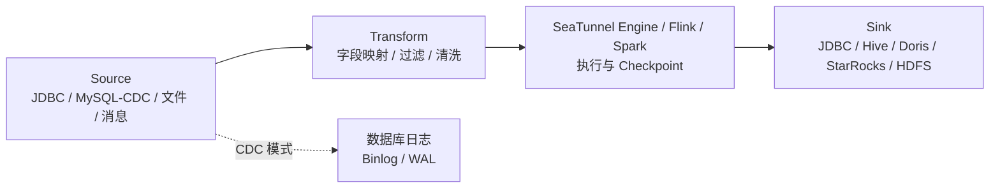

# SeaTunnel
## 知识点入口

- 本模块先看宏观流程，再看文章：[流程化知识点总览](knowledge/03_数据工程与数仓/0307_数据集成/SeaTunnel/核心知识点/流程化知识点总览.md)。
- 新文章必须先归入流程节点，再判断是补充、冲突、不同层次还是降权。
- `文章/` 只保留原文锚点，长期知识必须沉淀到 `核心知识点/`。

## 技术定位

| 项 | 内容 |
|---|---|
| 技术名 | Apache SeaTunnel |
| 一级类目 | 数据工程与数仓 |
| 二级类目 | 数据集成 |
| 技术本体 | 面向多源多端的数据集成工具，用配置化任务把数据库、文件、消息、数仓和湖仓之间的数据搬运、转换并写入下游 |
| 全局架构位置 | 位于源系统和目标系统之间，承担批式同步、流式同步、CDC 采集、字段映射和目标端写入 |
| 主要使用者 | 数据集成工程师、数仓开发、平台工程师 |
| 主要产出 | 同步作业、批/流数据流、目标表、写入日志和任务指标 |

## 官方锚点

- 官网：后续补证
- GitHub：后续补证
- 官方文档：后续补证
- 架构文档：后续补证

## 架构图

## 核心模块

| 模块 | 职责 | 重点问题 |
|---|---|---|
| Source Connector | 读取源端数据，包含批式 JDBC 和 CDC Source | 源端压力、权限、全量/增量语义、表发现 |
| Transform | 在 Source 后、Sink 前做字段映射、过滤、清洗 | CDC 不能把任意 `query` 当成源端过滤 |
| Sink Connector | 生成写入 SQL 或调用目标端导入能力 | 主键、幂等、批量写入、目标表结构 |
| Job Mode | 区分 `BATCH` 和 `STREAMING` | 批式任务会结束，CDC 任务常驻 |
| Checkpoint/状态 | 保障流式任务恢复和一致性 | Exactly Once 需要结合 Source、Engine、Sink 验证 |
| 多表路由 | 多表 CDC 写入目标端对应表 | 表流量隔离、路由规则、目标 Schema |

## 上下游

| 方向 | 对象 | 关系 |
|---|---|---|
| 上游 | MySQL、PostgreSQL、Oracle、SQL Server、MongoDB、文件、消息系统 | 提供批量数据或变更日志 |
| 下游 | JDBC、Hive、HDFS、Doris、StarRocks、ClickHouse、湖仓表 | 承接同步结果 |
| 依赖 | Java、连接器插件、执行引擎、Checkpoint、源端日志配置 | 决定任务能否运行、恢复和保持一致 |

## 横向对标

| 对标技术 | 对标点 | SeaTunnel 优势 | SeaTunnel 劣势 | 使用判断 |
|---|---|---|---|---|
| DataX | 批式同步 | SeaTunnel 覆盖批流和更多连接器场景 | DataX 更简单稳定，适合传统离线搬运 | T+1 批同步优先简单工具 |
| Flink CDC | CDC 到湖仓/OLAP | SeaTunnel 更通用多源多端 | Flink CDC 更贴近 Flink 生态和 CDC Pipeline | 专注 CDC 链路看 Flink CDC，多源多端集成看 SeaTunnel |
| Paimon + Flink CDC | 分库分表 Upsert 入湖 | Paimon 提供主键表、快照和读写隔离 | SeaTunnel + Hive 对高频更新和超大表不友好 | 更新删除多、小时级以内时效时考虑湖格式 |
| Canal | MySQL Binlog 订阅 | SeaTunnel 覆盖端到端同步 | Canal 更轻量但范围窄 | 轻量 MySQL 订阅可看 Canal |

## 已沉淀核心知识点

| 主题 | 文件 | 问题指纹 | 解决什么问题 | 认知增量 |
|---|---|---|---|---|
| SeaTunnel CDC 与批式同步边界 | [SeaTunnelCDC与批式同步边界](核心知识点/SeaTunnelCDC与批式同步边界.md) | SeaTunnel + Job Mode/Source/Transform/Sink + CDC vs JDBC + 多表路由 + SeaTunnel+Hive 边界 | 判断 SeaTunnel 适合什么同步问题，以及什么场景不该用 SeaTunnel + Hive 硬扛 | SeaTunnel 不是“更万能的 DataX”，CDC 常驻、源端过滤、目标一致性和湖仓边界要单独判断 |

## 后续追查

- 关键词：SeaTunnel CDC、MySQL-CDC、job.mode、Transform、schema_save_mode、data_save_mode、Checkpoint。
- 待读资料：SeaTunnel 当前版本官方文档、SeaTunnel Engine 架构、JDBC Sink 一致性、MySQL-CDC 连接器限制。
- 待补实验：MySQL-CDC `initial/latest` 对比、多表路由、目标表不存在处理、任务重启恢复、Sink 重复写入验证。

