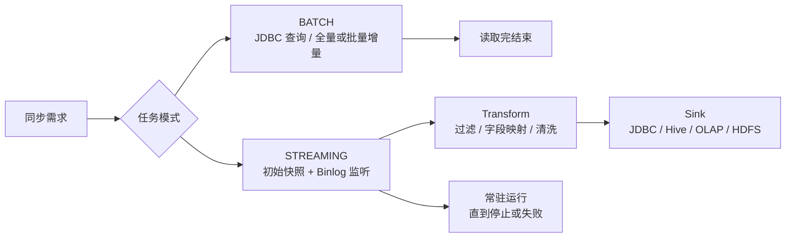

# SeaTunnel CDC 与批式同步边界

## 原文锚点

- 本地文件：[SeaTunnel 进阶指南：解锁 MySQL-CDC 实时增量采集神技](../文章/SeaTunnel 进阶指南：解锁 MySQL-CDC 实时增量采集神技.md)
- 本地文件：[一个神奇的开源大数据必备工具——SeaTunnel：快速开始](../文章/一个神奇的开源大数据必备工具——SeaTunnel：快速开始.md)
- 本地文件：[数仓实践：超大表同步，别再凭直觉选 SeaTunnel + Hive 了](../文章/数仓实践：超大表同步，别再凭直觉选 SeaTunnel + Hive 了.md)
- 原文链接：三篇原文 front matter 中的微信公众号链接。
- 关键段落：CDC 任务常驻、`job.mode` 区分 BATCH/STREAMING、CDC 不支持 source `query` 任意过滤、多表 `table-names` 和 Sink 表名变量、SeaTunnel + Hive 在超大分库分表场景的边界。
- 关键图：快速开始文中日志截图缺失；CDC 模式对比图是 ASCII 表达；超大表文章无技术图。

## 图片处理

| 图片 | 类型 | 是否保留 | 理由 | 处理方式 |
|---|---|---|---|---|
| CDC 与 JDBC 路径 ASCII 图 | 流程图 | 重建 | 能解释批式同步和 CDC 同步的根本差异 | Mermaid 重建 |
| SeaTunnel 日志截图 | 截图 | 删除 | 只证明任务运行，不解释机制 | 不进入知识点 |
| SeaTunnel + Hive vs Paimon 场景图 | 无图 | 原图缺失 | 文章用文字描述方案边界 | 用表格和 Mermaid 表达 |

## 一句话结论

这组文章值得合并精读：SeaTunnel 可以作为多源多端数据集成入口，但 CDC、离线批同步和 SeaTunnel + Hive 不是同一个问题，超大表、高频 UPDATE/DELETE 和分库分表场景要优先看主键、读写隔离、增量语义和恢复能力。

## 用户相关性判断

| 项 | 内容 |
|---|---|
| 用户当前认知层级 | 数据集成 L2 draft |
| 认知成熟度 | draft |
| 阅读投入建议 | 精读 |
| 阅读投入理由 | 能补 SeaTunnel 与 DataX/Flink CDC/Paimon 的边界，但原文混入营销、版本口径和配置片段，不能直接当生产 SOP |
| 对用户的新信息 | SeaTunnel CDC 任务是常驻订阅服务，源端不能像 JDBC 一样任意写 `query`；SeaTunnel + Hive 在大规模 Upsert 链路上存在结构性边界 |
| 问题指纹 | SeaTunnel + Job Mode/Source/Transform/Sink + CDC vs JDBC + 多表路由 + SeaTunnel+Hive 边界 + 数据集成选型准则 |
| 排重判断 | 新建 SeaTunnel 技术节点；快速开始文章只作为相关原文和已知可跳过 |
| 置信度 | 中 |

## 认知校准点

| 校准点 | 文章观点/信息 | 与用户认知或价值观的关系 | 处理建议 |
|---|---|---|---|
| SeaTunnel CDC 不是批任务 | CDC 任务 `job.mode = STREAMING`，先快照再监听 Binlog，任务不会自然结束 | 补充同步链路运行模型 | 写入 SeaTunnel index |
| CDC 源端不能随意 `query` 过滤 | MySQL-CDC 读取变更日志，过滤和清洗应放到 Transform 或 Sink 路由 | 纠偏 JDBC 批同步经验迁移 | 作为使用准则 |
| 多表 CDC 不是零成本 | 多表共用一个数据流，热点表会影响其他表延迟，初始快照会消耗源库资源 | 补工程边界 | 重要表拆任务或做隔离 |
| `initial/latest` 是数据完整性开关 | `initial` 先全量再增量，`latest` 只读启动后变更 | 防止丢历史数据 | 上线前明确历史数据策略 |
| SeaTunnel + Hive 不是高频 Upsert 解法 | Hive 缺行级更新、读写隔离和高频小文件治理，超大分库分表会拖垮调度窗口 | 纠偏“数据搬过去就行” | 更新横向对标 |
| Exactly Once 口径要降权 | 原文称 CDC 可保证不丢不重，但没有给 Source/Sink/Checkpoint 组合验证 | 符合反标题党和证据要求 | 标为待验证，不写成稳定结论 |

## 冲突点

| 冲突类型 | 具体表现 | 影响 | 处理 |
|---|---|---|---|
| 标题降权 | “神奇”“神技”等标题词偏营销 | 容易高估工具价值 | 只保留机制和边界 |
| 原目录冲突 | 部分原文在 raws/big-data，且超大表文章主角部分转向 Paimon | 容易误归为湖仓表格式 | 本轮按 SeaTunnel 适用边界沉淀，Paimon 只作为横向对标 |
| 证据不足 | 性能、Exactly Once、可用性数字缺版本、环境、基线 | 不能当选型结论 | 写入后续追查 |
| 图片缺失 | 快速开始日志图和部分对比图未本地化 | 影响不大，机制可重建 | Mermaid 重建关键流程 |
| 排重冲突 | 快速开始主要是安装和 fake source 示例 | 对用户认知增量低 | 只作为相关原文，不单独建笔记 |

## 待吸收点

| 分级 | 内容 | 为什么值得吸收 | 后续动作 |
|---|---|---|---|
| 理解 | SeaTunnel 任务由 `env/source/transform/sink` 组成，`job.mode` 决定批或流 | 能快速定位同步链路结构 | 写入技术 index |
| 理解 | MySQL-CDC 使用 `table-names` 订阅表，变更事件进入 Transform 再写 Sink | 区分 CDC 和 JDBC 查询 | 后续验证 Transform 能力 |
| 理解 | Sink 可用 `${table_name}`/`${database_name}` 做多表路由 | 是整库同步和多表同步的关键能力 | 验证目标表不存在、字段不一致时行为 |
| 记住 | SeaTunnel 适合“数据搬运和转换”，不自动解决主键、读写隔离、更新合并和历史回补 | 影响选型 | 与 Paimon/Flink CDC 对标 |
| 记住 | 超大表、分库分表、高频更新删除，不能默认选 SeaTunnel + Hive | 防止调度窗口和数据撕裂风险 | 写入选型准则 |
| 实践 | 做 MySQL-CDC `initial/latest`、多表路由、任务重启恢复和 Sink 幂等验证 | 能把精读变成生产判断 | 后续实验 |

## 已知可跳过

| 内容 | 跳过理由 |
|---|---|
| SeaTunnel 安装下载、`wget`、插件安装细节 | 版本时效强，且本轮不联网补证 |
| fake source 到 console 的入门示例 | 只证明能运行，不改变选型判断 |
| 白鲸商业产品推广和推荐阅读 | 无技术沉淀价值 |
| “比谁都快”“神技”等口号 | 缺可复核基线 |

## 实践门槛

| 门槛 | 判断 | 证据 |
|---|---|---|
| 可运行 | 部分 | 原文给了 SeaTunnel 配置、启动命令和 MySQL-CDC 参数 |
| 可验证 | 部分 | 有 ReadCount/WriteCount 日志，但缺源端变更、目标端校验 SQL、重启后对账 |
| 可排障 | 否 | 缺失败模式、重复写入、Checkpoint 恢复和 Sink 异常处理 |
| 可迁移 | 是 | 可迁移到数据集成选型和 CDC 验证 |
| 结论 | 降为精读 | 作为边界和候选实验，不直接作为生产 SOP |

## 归类判断

| 项 | 内容 |
|---|---|
| 技术本体 | SeaTunnel 是数据集成工具，不是湖仓表格式或查询引擎 |
| 文章主问题 | SeaTunnel 批式同步、CDC 同步、多表路由和 SeaTunnel + Hive 的适用边界 |
| 使用场景 | MySQL-CDC、JDBC 批同步、多表同步、Hive/OLAP/HDFS 写入 |
| 关键词干扰 | Paimon、Hive、DataOps、WhaleStudio、实时分析 |
| 最终归类 | 数据工程与数仓 / 数据集成 / SeaTunnel |
| 归类理由 | 主问题是数据如何同步和写入下游，Paimon/Hive 只是目标端或对标方案 |

## 技术定位

| 项 | 内容 |
|---|---|
| 技术类型 | 数据集成工具 |
| 所属领域 | 数据工程与数仓 |
| 二级类目 | 数据集成 |
| 全局架构位置 | 源系统和目标系统之间的同步与转换层 |
| 涉及模块 | Source、Transform、Sink、Job Mode、Checkpoint、多表路由 |
| 解决问题 | 配置化完成批式同步、CDC 同步和多源多端数据搬运 |
| 原文局限 | 缺当前版本官方校准、失败恢复、端到端一致性和目标端语义验证 |
| 我的结论 | 以后关注；先把它作为数据集成工具理解，不把它当湖仓更新能力替代品 |

## 纵向理解

| 维度 | 判断 |
|---|---|
| 全局架构 | Source 读取源端 -> Transform 处理字段和过滤 -> Sink 写目标端 -> Engine/Checkpoint 管理执行 |
| 本文位置 | 主要讲 MySQL-CDC 和 JDBC 批处理的差异，以及大表同步选型边界 |
| 核心机制 | 任务模式、CDC 日志订阅、源端表配置、Transform 后置处理、Sink 路由和写入模式 |
| 使用链路 | 准备连接器 -> 配置 `job.mode` 和 Source -> 配置 Transform -> 配置 Sink -> 运行任务 -> 对账和观察 Checkpoint |
| 前置条件 | 源库日志开启、唯一 server-id、目标表结构或自动建表策略、连接器插件、执行资源 |
| 边界 | 不自动解决下游主键冲突、Hive 读写隔离、更新合并、小文件和端到端 Exactly Once |

## 横向对标

| 对标技术 | 实现方式 | 优势 | 劣势 | 适合场景 |
|---|---|---|---|---|
| SeaTunnel | 配置化 Source/Transform/Sink，同步到多源多端 | 覆盖面广，批流统一入口 | CDC 和 Sink 一致性要逐链路验证 | 企业数据集成平台 |
| DataX | 批式任务读取和写入 | 简单稳定，离线搬运成本低 | 不适合低延迟变更和 DDL | T+1 批同步 |
| Flink CDC | 数据库日志捕获和 Pipeline 同步 | CDC 语义强，贴近 Flink 生态 | 数据源/下游覆盖与运维成本需评估 | CDC 到 Kafka/湖仓/OLAP |
| Paimon + Flink CDC | Binlog 事件写主键表 | 支持 Upsert、快照、读写隔离 | 引入湖格式和 Flink 运维能力要求 | 分库分表、高频更新入湖 |
| Hive + Merge | 批量写分区再合并 | 传统数仓生态成熟 | 更新删除、小文件、读写隔离弱 | 纯离线、INSERT 为主 |

## 后续追查

- 关键词：SeaTunnel MySQL-CDC、`job.mode`、`startup.mode`、`server-id`、`schema_save_mode`、`data_save_mode`、Transform。
- 相关技术：DataX、Flink CDC、Paimon、Hive、Doris、StarRocks。
- 需要补读的文章：SeaTunnel 当前官方 MySQL-CDC 文档、SeaTunnel Engine Checkpoint、一致性和 JDBC Sink 失败恢复。

