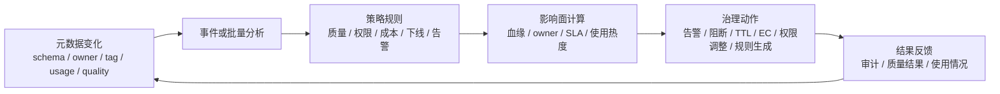

# 主动元数据与治理闭环

## 原文锚点

- 本地文件：
  - [使用主动元数据实现数据质量](../文章/done-使用主动元数据实现数据质量.md)
  - [EB级数仓都在用的算子级血缘如何实现主动数据治理](../文章/done-EB级数仓都在用的算子级血缘如何实现主动数据治理.md)
  - [Apache Gravitino 在B站的最佳实践](<../文章/done-Apache Gravitino 在B站的最佳实践.md>)
- 原文链接：见本地原文 front matter；本轮不联网校验。
- 关键段落：主动元数据与传统元数据差异、7 个活跃元数据用例、算子级血缘支撑指标链路治理、FileSet tag 触发 TTL/EC 治理。
- 关键图：主动治理和算子级血缘图在 Markdown 中缺失。

## 图片处理

| 图片 | 类型 | 是否保留 | 理由 | 处理方式 |
|---|---|---|---|---|
| 主动元数据治理流程图 | 流程图 | 原图缺失 | 有助于理解从元数据变化到治理动作 | Mermaid 重建 |
| 算子级血缘指标链路图 | 架构图/说明图 | 原图缺失 | 展示字段口径裁剪与影响面收敛 | 在血缘笔记中重建 |

## 一句话结论

主动元数据不是“更实时的元数据目录”，而是把元数据变化、血缘影响面、规则和负责人连接起来，形成可执行、可反馈的治理闭环。

## 用户相关性判断

| 项 | 内容 |
|---|---|
| 用户当前认知层级 | 元数据血缘与治理 L2，数据质量与治理 L2 |
| 认知成熟度 | draft |
| 阅读投入建议 | 精读 |
| 阅读投入理由 | 能补元数据和数据质量、权限、成本、模型治理之间的边界；但部分内容偏概念，需要工程证据 |
| 对用户的新信息 | 主动元数据的核心是行动触发和反馈闭环，而不是“采集更多元数据” |
| 问题指纹 | 元数据平台 + 主动元数据 + 事件/策略/质量/成本/权限动作 + 可执行治理 |
| 排重判断 | 新建主题笔记；与字段/算子级血缘笔记互相引用但不重复展开 |
| 置信度 | 中 |

## 认知校准点

| 校准点 | 文章观点/信息 | 与用户认知或价值观的关系 | 处理建议 |
|---|---|---|---|
| 主动元数据强调行动 | 原文说主动元数据用于触发访问控制、错误解决、根因分析、ETL 变更等动作 | 补充使用准则 | 判断元数据平台价值时看是否能执行治理动作 |
| 数据质量不能只靠规则表 | 主动元数据把质量问题、血缘、owner、使用场景和修复动作关联起来 | 补缺 | 数据质量目录应与血缘/owner/告警联动 |
| 算子级血缘是主动治理的一种前提 | EB 文章用算子级血缘识别指标口径、相似表和模型坏味道 | 补充边界 | 只有影响面需要精确收敛时，才值得做到算子级 |
| 主动治理容易被产品话术污染 | AI 预测、自动建议、变更模拟等说法缺少评测和误报成本 | 降权 | 不把“智能建议”写成已验证能力 |
| 治理动作需要负责人和反馈 | Gravitino FileSet tag -> SDM 执行 TTL/EC -> 看板优化 | 补充闭环 | 元数据 tag 必须连接执行系统和反馈指标 |

## 冲突点

| 冲突类型 | 具体表现 | 影响 | 处理 |
|---|---|---|---|
| 证据不足 | 主动元数据文章偏概念，缺具体系统实现和评估指标 | 不能直接落地 | 只吸收闭环模型 |
| 标题/观点降权 | “AI 预测性维护”“主动模型治理”容易过度承诺 | 误投入 | 标为待验证 |
| 跨类目边界 | 主动元数据同时涉及数据质量、安全权限、模型治理、成本治理 | 容易分散 | 本笔记归元数据平台，具体规则落到相邻目录 |
| 排重冲突 | 算子级血缘内容与字段血缘笔记重叠 | 重复沉淀 | 本文只讲主动治理闭环，细节放血缘笔记 |

## 待吸收点

| 分级 | 内容 | 为什么值得吸收 | 后续动作 |
|---|---|---|---|
| 理解 | 主动元数据的输入包括 schema、usage、quality、owner、tag、血缘、运行时指标 | 决定事件来源 | 后续整理主动元数据输入清单 |
| 理解 | 主动元数据的输出应是告警、阻断、规则生成、权限调整、TTL/EC、下线建议 | 区分目录展示和治理执行 | 写入元数据平台使用准则 |
| 理解 | 数据质量闭环需要根因分析和影响面，而不只是异常检测 | 补质量治理边界 | 后续在数据质量目录复用 |
| 记住 | 没有 owner、血缘和执行系统的主动元数据，只是“实时同步目录” | 影响平台判断 | 作为排重准则 |
| 实践 | 为核心表建立 schema 变更 -> 血缘影响 -> owner 通知 -> 质量规则检查的最小闭环 | 可迁移到数仓治理 | 后续实验设计 |

## 已知可跳过

| 内容 | 跳过理由 |
|---|---|
| 数据质量与数据素养的泛泛关系 | 价值不高，不影响工程判断 |
| 主动元数据 ROI、业务影响等笼统说法 | 缺基线和数据 |
| 传统元数据“手工更新”概念解释 | 用户大概率已知 |

## 实践门槛

| 门槛 | 判断 | 证据 |
|---|---|---|
| 可运行 | 否 | 原文没有给出可运行系统或配置 |
| 可验证 | 部分 | 可用 schema 变更、质量异常、血缘影响面、owner 通知做最小验证 |
| 可排障 | 部分 | 提供根因分析方向，但缺日志和诊断链路 |
| 可迁移 | 是 | 可迁移到数据质量、权限、成本和模型治理 |
| 结论 | 降为精读 | 形成治理闭环准则，不直接判实践 |

## 归类判断

| 项 | 内容 |
|---|---|
| 技术本体 | 主动元数据治理 |
| 文章主问题 | 元数据如何从被动展示变成治理动作触发器 |
| 使用场景 | 数据质量、权限、根因分析、数据可观测性、ETL/schema 变更、成本治理 |
| 关键词干扰 | AI、质量、模型治理是应用场景，不改变本体 |
| 最终归类 | 数据工程与数仓 / 元数据血缘与治理 / 元数据平台 |
| 归类理由 | 主问题是元数据驱动治理闭环，不是单独的数据质量规则或 AI 应用 |

## 技术定位

| 项 | 内容 |
|---|---|
| 技术类型 | 治理机制 / 平台能力 |
| 所属领域 | 数据工程与数仓 |
| 二级类目 | 元数据血缘与治理 |
| 全局架构位置 | 元数据平台和数据质量、安全、成本、调度之间的策略执行层 |
| 涉及模块 | 元数据事件、血缘影响分析、规则引擎、owner、告警、质量结果、审计反馈 |
| 解决问题 | 让元数据变化自动进入治理流程，降低人工发现和协调成本 |
| 原文局限 | 概念多、工程细节少、收益和 AI 能力缺评估 |
| 我的结论 | 以后关注；作为治理闭环设计准则 |

## 纵向理解

| 维度 | 判断 |
|---|---|
| 全局架构 | 元数据变化 -> 事件/分析 -> 规则 -> 影响面 -> 动作 -> 反馈 |
| 本文位置 | 讲治理范式，不讲具体元数据存储或血缘解析实现 |
| 核心机制 | 利用元数据上下文和血缘关系，把变化转成可执行治理动作 |
| 使用链路 | 采集变化 -> 判断影响 -> 找 owner -> 执行规则/告警/阻断 -> 记录结果 |
| 前置条件 | 稳定元模型、owner、血缘、质量规则、执行系统和审计反馈 |
| 边界 | 不替代数据质量规则本身，也不保证 AI 建议可靠 |

## 横向对标

| 对标技术 | 实现方式 | 优势 | 劣势 | 适合场景 |
|---|---|---|---|---|
| 传统元数据目录 | 手工/周期采集 + 展示 | 成本低，易理解 | 被动，不能触发动作 | 查找资产、基础治理 |
| 数据质量平台 | 规则和监控 | 质量检测明确 | 缺血缘和 owner 时闭环弱 | 表/字段质量保障 |
| 主动元数据平台 | 事件 + 规则 + 血缘 + 动作 | 能前置治理、自动通知和执行 | 依赖元数据准确性，误报成本高 | 核心链路治理 |
| 算子级血缘治理 | 精细口径和影响面 | 能收敛字段/指标影响范围 | 解析成本高、覆盖难 | 关键指标和模型治理 |

## 后续追查

- 关键词：active metadata、data observability、metadata event、schema change impact、quality rule generation、operator lineage。
- 相关技术：DataHub、OpenMetadata、Gravitino、OpenLineage、数据质量平台、调度平台。
- 需要补读的文章：主动元数据工程架构、数据质量与血缘联动案例、质量规则自动生成的误报/漏报评估。
