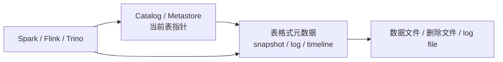

# 元数据持久化与统计口径边界

## 原文锚点

- 本地文件：
  - [从零开始学Flink：Flink SQL 元数据持久化实战](<../文章/从零开始学Flink：Flink SQL 元数据持久化实战.md>)
  - [基于Hive进行数仓建设的资源元数据信息统计](../文章/基于Hive进行数仓建设的资源元数据信息统计.md)
  - [新一代表格式的底座：Iceberg、Hudi、Delta Lake 如何隔离数据与元数据](<../文章/新一代表格式的底座：Iceberg、Hudi、Delta Lake 如何隔离数据与元数据.md>)
- 原文链接：见本地原文 front matter；本轮不联网校验。
- 关键段落：Flink GenericInMemoryCatalog 与 Hive Catalog 差异、Kafka 表 DDL 写入 HMS、Hive/Spark analyze 统计字段差异、湖表 Catalog 指针/metadata file/snapshot/log/timeline。
- 关键图：无有效技术图。

## 图片处理

| 图片 | 类型 | 是否保留 | 理由 | 处理方式 |
|---|---|---|---|---|
| Flink Hive Catalog 配置截图/命令 | 配图 | 不保留 | 命令细节不是长期知识点 | 只保留关键配置概念 |
| 湖表元数据层级图 | 说明图 | 原图缺失 | 解释数据文件与表状态隔离有价值 | Mermaid 重建 |

## 一句话结论

这组文章应合并吸收：Flink Catalog 持久化、Hive/Spark 统计信息和湖表元数据协议都叫“元数据”，但分别服务于 DDL 复用、优化统计和表版本可见性，不能混成一个层次。

## 用户相关性判断

| 项 | 内容 |
|---|---|
| 用户当前认知层级 | Hive / 离线数仓 L3-L4，Flink L2-L3，元数据治理 L2 |
| 认知成熟度 | draft |
| 阅读投入建议 | 精读 |
| 阅读投入理由 | 能补“元数据”这个词在 Catalog、统计信息、湖表协议中的分层边界 |
| 对用户的新信息 | Hive Catalog 可以持久化 Flink Connector DDL；Hive 和 Spark 写入 HMS 的统计 key 不同；湖表元数据维护表版本而不是简单目录 |
| 问题指纹 | 元数据平台 + Catalog/HMS/表格式元数据 + DDL 持久化/统计信息 + 口径差异 |
| 排重判断 | 新建主题笔记；不为 Flink 入门步骤单独建实践笔记 |
| 置信度 | 高 |

## 认知校准点

| 校准点 | 文章观点/信息 | 与用户认知或价值观的关系 | 处理建议 |
|---|---|---|---|
| Hive Catalog 不等于 Hive Connector | Flink 文章明确区分元数据管理和数据读写 | 纠偏 | 后续遇到 Catalog/Connector 必须分层 |
| HMS 可存非 Hive 表 DDL | Kafka/MySQL 等 Flink 表配置可序列化进 HMS 参数表 | 补充边界 | 记住 HMS 可作为 DDL 元数据仓库，但不代表 Hive 能读这些数据 |
| Hive/Spark 统计口径不同 | Hive 使用 numRows/totalSize，Spark 使用 spark.sql.statistics.* 等 key | 补缺 | 做统计口径治理时必须记录生成引擎 |
| 湖表元数据不是数据目录 | Iceberg/Hudi/Delta 用快照、日志、timeline 管表状态 | 纠偏 | 把湖表元数据归到表格式协议层，不简单归为资产目录 |
| 入门部署步骤不等于实践沉淀 | Flink Hive Catalog 文章可运行，但网络下载、版本匹配需实际环境验证 | 降权 | 只吸收边界和排障点，不复制命令清单 |

## 冲突点

| 冲突类型 | 具体表现 | 影响 | 处理 |
|---|---|---|---|
| 关键词误导 | “元数据持久化”容易被误认为完整元数据治理平台 | 误沉淀 | 归为 Catalog/HMS 局部机制 |
| 原目录冲突 | 湖表元数据文章原始路径在 raw big-data，主问题偏湖表格式 | 可能误归类 | 本轮只吸收元数据隔离边界，不把整篇归入元数据平台 |
| 实践门槛不足 | Flink 文章有命令但依赖下载和版本兼容未本地验证 | 不能直接当 SOP | 降为精读 |
| 证据不足 | 湖表文章是概念解释，无版本和实现细节 | 不能替代官方协议 | 后续补证 |

## 待吸收点

| 分级 | 内容 | 为什么值得吸收 | 后续动作 |
|---|---|---|---|
| 理解 | Flink 默认内存 Catalog 只随 session 存活 | 解释为什么 SQL Client 重启丢表 | 后续验证 Hive Catalog 最小链路 |
| 理解 | Hive Catalog 把 Connector DDL 属性写入 HMS 参数表 | 说明 DDL 复用机制 | 与统一元数据平台做边界对比 |
| 理解 | Hive/Spark analyze 对分区表、表级统计和 key 命名不同 | 影响统计治理和数据质量口径 | 后续整理 Hive/Spark 统计字段表 |
| 理解 | 湖表 Catalog 只保存当前元数据指针，表状态由格式元数据维护 | 影响 Iceberg/Hudi/Delta 选型理解 | 放入湖仓表格式目录时可复用 |
| 记住 | “元数据”至少分资产元数据、执行统计、表格式状态、治理标签四类 | 避免概念污染 | 写入排重准则 |

## 已知可跳过

| 内容 | 跳过理由 |
|---|---|
| Docker、wget、pip/yum 逐步安装命令 | 本轮不实践，且容易过时 |
| Hive/Spark 基础定义 | 用户大概率已知 |
| 湖表“不是列式文件”这种入门解释 | 只保留表状态隔离机制 |

## 实践门槛

| 门槛 | 判断 | 证据 |
|---|---|---|
| 可运行 | 部分 | Flink/HMS 文章给出命令和 SQL；本轮未执行 |
| 可验证 | 是 | 可通过重启 SQL Client、查询 HMS 参数表、对比 analyze 结果验证 |
| 可排障 | 部分 | 提到 jar 冲突、Hive 版本匹配、MySQL 驱动、分区统计差异 |
| 可迁移 | 是 | 可迁移到实时数仓元数据持久化和数仓统计治理 |
| 结论 | 降为精读 | 有实践线索，但本轮不运行、不联网下载依赖 |

## 归类判断

| 项 | 内容 |
|---|---|
| 技术本体 | Catalog/HMS/表格式元数据 |
| 文章主问题 | DDL 如何持久化、统计信息如何落到 HMS、湖表状态如何由元数据协议维护 |
| 使用场景 | Flink SQL、Hive/Spark 数仓统计、Iceberg/Hudi/Delta 湖表 |
| 关键词干扰 | Flink、Hive、Iceberg 是具体承载技术，主问题是元数据边界 |
| 最终归类 | 数据工程与数仓 / 元数据血缘与治理 / 元数据平台 |
| 归类理由 | 关注元数据持久化和口径，不是 Flink 计算、Hive 建模或湖表完整选型 |

## 技术定位

| 项 | 内容 |
|---|---|
| 技术类型 | 局部机制 / 实践案例 |
| 所属领域 | 数据工程与数仓 |
| 二级类目 | 元数据血缘与治理 |
| 全局架构位置 | Catalog/HMS/表格式协议层 |
| 涉及模块 | Catalog、HMS、TABLE_PARAMS、PARTITION_PARAMS、snapshot、manifest、transaction log、timeline |
| 解决问题 | DDL 复用、统计口径、表版本可见性和多引擎一致读取 |
| 原文局限 | 命令和版本可能过时，未做本地验证，湖表官方细节需补证 |
| 我的结论 | 以后关注；作为“元数据分层边界”准则 |

## 纵向理解

| 维度 | 判断 |
|---|---|
| 全局架构 | 开发者 DDL/写入 -> Catalog/HMS/表格式元数据 -> 引擎读取/优化/治理 |
| 本文位置 | 讲元数据持久化和统计信息，不讲完整数据目录或血缘平台 |
| 核心机制 | 把临时会话元数据持久化到外部 Metastore；把表版本状态交给表格式元数据协议 |
| 使用链路 | 注册 Catalog -> 创建表/统计表 -> 写入 HMS 或表格式元数据 -> 引擎复用 |
| 前置条件 | Metastore 可用、版本兼容、依赖正确、统计任务可控、湖表维护任务存在 |
| 边界 | 不解决权限、owner、质量规则、血缘准确性和数据目录体验 |

## 横向对标

| 对标技术 | 实现方式 | 优势 | 劣势 | 适合场景 |
|---|---|---|---|---|
| GenericInMemoryCatalog | 会话内存 | 简单快速 | 重启丢失，不能共享 | 临时调试 |
| Hive Catalog / HMS | 外部 Metastore | 跨会话、跨作业共享，能存扩展属性 | 版本和依赖复杂，非表资产弱 | Flink/Spark/Hive 表 DDL 持久化 |
| JDBC Catalog | 映射物理库表 | 适合关系库元数据 | 难表达 Kafka topic 等 Connector 属性 | 关系数据库物理表 |
| Iceberg/Hudi/Delta 元数据 | 快照/日志/timeline | 管表版本、一致性和多引擎读取 | 维护任务和协议兼容成本 | 湖表事务与版本管理 |
| 统一元数据平台 | 抽象资产和治理服务 | 跨源、搜索、血缘、权限、质量 | 平台建设成本高 | 企业级治理 |

## 后续追查

- 关键词：Flink Hive Catalog、Hive Metastore TABLE_PARAMS、Spark analyze statistics、Iceberg snapshot manifest、Delta transaction log、Hudi timeline。
- 相关技术：Hive、Spark SQL、Flink SQL、Iceberg、Hudi、Delta Lake、Gravitino。
- 需要补读的文章：Flink Catalog 官方文档、Hive/Spark 统计信息官方文档、湖表格式官方元数据结构。
