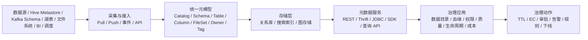

# 元数据平台
## 知识点入口

- 本模块先看宏观流程，再看文章：[知识地图](030801_知识地图.md)。
- 新文章必须先归入流程节点，再判断是补充、冲突、不同层次还是降权。
- `文章/` 只保留原文锚点，长期知识必须沉淀到 `030801_核心知识点/` 下的主题文件。

## 技术定位

| 项 | 内容 |
|---|---|
| 技术名 | 元数据平台 / 统一元数据服务 |
| 一级类目 | 数据工程与数仓 |
| 二级类目 | 元数据血缘与治理 |
| 技术本体 | 统一采集、建模、存储、检索和服务数据资产元数据，向开发、治理、安全、质量和引擎侧提供一致的元数据视图 |
| 全局架构位置 | 位于计算引擎、存储系统、调度平台、数据开发平台、数据目录和治理应用之间，承担元数据控制面 |
| 主要使用者 | 数据平台工程师、数仓工程师、治理团队、安全团队、数据开发 |
| 主要产出 | 资产目录、Catalog/Schema/Table/FileSet 模型、统一 API、搜索索引、血缘关系、权限/质量/生命周期治理动作 |

## 官方锚点

- DataHub 官网：后续补证
- DataHub GitHub：后续补证
- Apache Gravitino 官网：后续补证
- Apache Gravitino GitHub：后续补证
- Apache Atlas 官网/GitHub：后续补证
- OpenMetadata 官网/GitHub：后续补证

## 架构图

## 核心模块

| 模块 | 职责 | 重点问题 |
|---|---|---|
| 元数据采集 | 从 HMS、引擎、库表、文件、消息、BI、调度等系统获取资产信息 | 覆盖率、实时性、重复资产合并、采集失败补偿 |
| 统一元模型 | 把异构资产映射成稳定对象和关系 | Catalog 层级、唯一 ID、物理资产与逻辑资产映射 |
| 元数据存储 | 支撑检索、关系查询和批量分析 | 关系库、搜索索引、图存储之间的职责边界 |
| 元数据服务 | 给引擎、平台和治理应用提供统一访问入口 | API 稳定性、权限、缓存、批量查询、版本兼容 |
| 主动元数据 | 基于元数据变化触发治理动作 | 事件、策略、规则、自动化闭环和误触发风险 |
| 治理应用 | 数据目录、影响分析、权限、质量、生命周期和成本治理 | 是否从“展示”走到“可执行治理动作” |

## 上下游

| 方向 | 对象 | 关系 |
|---|---|---|
| 上游 | Hive Metastore、Kafka Schema Registry、Iceberg/Hudi/Delta 元数据、HDFS/对象存储、BI、调度、数据开发平台 | 元数据来源 |
| 下游 | 数据目录、SQL 预检查、数据开发、数据质量、安全权限、成本治理、血缘服务 | 消费统一元数据 |
| 依赖 | 搜索引擎、图数据库、消息队列、关系库、引擎 Catalog 扩展 | 支撑检索、血缘和事件化处理 |

## 横向对标

| 对标技术 | 对标点 | 优势 | 劣势 | 使用判断 |
|---|---|---|---|---|
| Hive Metastore | 单一大数据元数据服务 | 生态成熟，Hive/Spark/Flink 常用 | 难覆盖非表资产、跨源 schema、统一治理动作 | 适合基础表元数据，不适合作为全域元数据平台唯一入口 |
| DataHub | 一站式元数据平台 | 强调搜索、发现、ingestion、事件化元数据架构 | 本轮文章偏旧版入门，部署和版本信息需补证 | 适合作为现代元数据平台对标对象 |
| Apache Gravitino | 统一 Catalog 和多源元数据服务 | 强调多源统一视图、FileSet、跨引擎接入 | 本轮只读本地实践，社区能力边界需补证 | 适合评估统一 Catalog、非表资产和引擎接入 |
| Apache Atlas | Hadoop 生态元数据治理 | 本地文章把它作为传统对标对象 | 本轮未读专门原文，不能展开结论 | 作为传统大数据治理平台后续补证 |
| OpenMetadata | 元数据平台 | 本地 Gravitino 文章提到调研对比 | 本轮缺专门资料，不能写成确认结论 | 后续补证后再与 DataHub/Gravitino 对比 |
| 自研 OneMeta / CyberData | 内部统一元数据服务 | 能贴合内部引擎、权限、文件治理、schema 管理 | 长期维护、模型演进和平台耦合成本高 | 有强内部场景和平台团队时可走自研或二次封装 |

## 已沉淀核心知识点

| 主题 | 文件 | 问题指纹 | 解决什么问题 | 认知增量 |
|---|---|---|---|---|
| Gravitino 与统一元数据服务边界 | [Gravitino与统一元数据服务边界](030801_核心知识点/Gravitino与统一元数据服务边界.md) | 元数据平台 + 统一 Catalog/FileSet/Schema + 多源元数据服务 + 非表资产治理 + 治理动作闭环 | 区分 HMS、统一 Catalog、数据目录和治理执行面 | 统一元数据的价值不只是查表，而是降低跨源 schema、非表资产、权限和生命周期治理成本 |
| 元数据持久化与统计口径边界 | [元数据持久化与统计口径边界](030801_核心知识点/元数据持久化与统计口径边界.md) | 元数据平台 + Catalog/HMS/表格式元数据 + DDL 持久化/统计信息 + 口径差异 | 区分 Flink Catalog、Hive/Spark 统计和湖表元数据协议 | 不是所有“元数据”都属于同一层，Catalog、统计、表格式提交协议要分层理解 |
| 主动元数据与治理闭环 | [主动元数据与治理闭环](030801_核心知识点/主动元数据与治理闭环.md) | 元数据平台 + 主动元数据 + 事件/策略/质量/成本/权限动作 + 可执行治理 | 把元数据从目录展示升级为治理触发器 | 主动元数据必须连接规则、影响面、负责人和执行动作，否则只是更实时的目录 |
| 元数据平台产品化与资产目录边界 | [元数据平台产品化与资产目录边界](030801_核心知识点/元数据平台产品化与资产目录边界.md) | 元数据平台 + 资产目录/DataHub/OpenMetadata/自研平台 + 产品化边界 | 判断资产目录和治理闭环的差异 | 菜单清单不等于治理能力，必须连接 owner、血缘、质量、权限和动作 |
| Gravitino AI 元数据与上下文工程边界 | [Gravitino AI元数据与上下文工程边界](<030801_核心知识点/Gravitino AI元数据与上下文工程边界.md>) | Gravitino + Metadata Lake/MCP/AI Context + 策略/统计/任务 | 判断元数据如何进入 Agent 上下文 | AI 上下文要包含权限、血缘、质量、owner 和动作入口 |

## 后续追查

- 关键词：DataHub ingestion、Metadata Change Event、Apache Gravitino Metalake、Fileset、OpenMetadata、Apache Atlas、active metadata。
- 待读资料：DataHub、OpenMetadata、Atlas、Gravitino 官方架构与 GitHub；本轮不联网，统一标为后续补证。
- 待补实验：选一组 Hive/Kafka/Flink 表，验证统一 Catalog 是否能稳定返回物理标识、schema、owner、tag 和变更事件。
