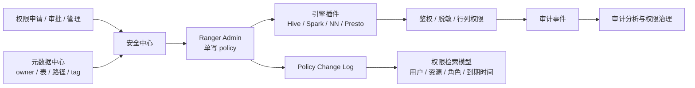

# Ranger 权限治理与元数据联动

## 原文锚点

- 本地文件：
  - [网易基于Apache Ranger 的数据安全中心实践](<../文章/done-网易基于Apache Ranger 的数据安全中心实践.md>)
  - [网易基于Apache Ranger 的数据安全中心实践](<../文章/done-网易基于Apache Ranger 的数据安全中心实践.md>)
- 原文链接：见本地原文 front matter；本轮不联网校验。
- 关键段落：Ranger 优势与不足、安全中心整体方案、低耦合/低侵入/流量分摊/一致性、权限检索模型、鉴权优化、冻结目录、动态脱敏、审计治理、owner 语义、Spark 权限/脱敏。
- 关键图：Ranger 能力图、安全中心架构图、权限检索模型图、鉴权优化图、脱敏和 owner 图均缺失。

## 图片处理

| 图片 | 类型 | 是否保留 | 理由 | 处理方式 |
|---|---|---|---|---|
| 安全中心整体架构图 | 架构图 | 原图缺失 | 说明 Ranger Admin、安全中心、插件、元数据中心关系 | Mermaid 重建 |
| 权限检索模型图 | 流程图 | 原图缺失 | 说明 change log 到只读检索视图 | Mermaid 重建 |
| Spark 执行计划脱敏图 | 说明图 | 原图缺失 | 可辅助理解 analyzed/optimized 阶段 | 标记原图缺失 |

## 一句话结论

Ranger 更适合作为底层鉴权控制面；要变成可用的数据安全治理平台，必须补权限检索、owner 元数据、审计分析、一致性和插件性能优化。

## 用户相关性判断

| 项 | 内容 |
|---|---|
| 用户当前认知层级 | 元数据血缘与治理 L2，数据质量/治理 L2 |
| 认知成熟度 | draft |
| 阅读投入建议 | 精读 |
| 阅读投入理由 | 能补权限治理和元数据中心的联动边界，且有明确失败场景和工程取舍 |
| 对用户的新信息 | Ranger policy 原生模型不等于完整权限治理，检索、生命周期、owner、审计都需要平台层补齐 |
| 问题指纹 | 数据安全治理 + Ranger policy/plugin/change log/元数据 owner + 权限检索与审计闭环 |
| 排重判断 | 新建主题笔记；两篇 Ranger 原文近重复合并 |
| 置信度 | 高 |

## 认知校准点

| 校准点 | 文章观点/信息 | 与用户认知或价值观的关系 | 处理建议 |
|---|---|---|---|
| Ranger 不是完整安全中心 | 原文指出 Ranger 管理性、效率、生命周期粒度都有缺陷 | 纠偏 | 只把 Ranger 当控制面，不当完整产品 |
| 权限检索要从 policy 语义中派生 | 网易用 Ranger change log 同步只读权限模型 | 补机制 | 权限治理查询不要直接打 Ranger Admin |
| 元数据 owner 可修正引擎污染 | 低版本 Spark 可能污染 HMS owner，平台从元数据中心补 owner | 补失败场景 | owner 不能只相信底层引擎字段 |
| 删除权限需要高于写权限 | Ranger/HDFS 写权限包含 delete/rename 会导致误删风险 | 纠偏 | 关键路径应把删除/重命名单独治理 |
| 审计要能还原命中角色和 item | 仅 policy 视角难解释“谁通过什么权限访问” | 补治理闭环 | 审计事件需补用户、角色、资源、policy item 维度 |

## 冲突点

| 冲突类型 | 具体表现 | 影响 | 处理 |
|---|---|---|---|
| 图片缺失 | 多张架构/流程/代码图未保留 | 影响理解 | Mermaid 重建核心链路 |
| 排重冲突 | `03_数据工程与数仓` 与 `09_其他` 两篇 Ranger 文章差异主要是头尾 | 重复沉淀 | 合并为同一锚点 |
| 跨类目边界 | Ranger 属于安全权限，但在数据治理中依赖元数据/血缘/owner | 容易误放到通用安全 | 本轮放在元数据血缘与治理下的“数据安全治理” |
| 证据不足 | 内部性能数字和 bug 细节缺复现 | 不能泛化 | 作为工程风险和后续补证 |

## 待吸收点

| 分级 | 内容 | 为什么值得吸收 | 后续动作 |
|---|---|---|---|
| 理解 | Ranger policy 适合写入控制，查询检索应异步构建只读模型 | 避免管理查询拖垮 Admin | 写入数据安全治理 index |
| 理解 | client 模式全量缓存 policy 会放大内存成本，可转网络鉴权 | 补性能边界 | 后续追查高可用和降级策略 |
| 理解 | owner、路径递归权限、表重建权限丢失都依赖元数据中心 | 补元数据联动 | 设计 owner 验收场景 |
| 记住 | 权限治理必须同时看安全性、精准性、管理性、效率和性能 | 形成选型准则 | 后续权限文章按五维评价 |
| 实践 | 构造表重建、路径误删、无效权限半年未用、Spark 脱敏四类测试场景 | 可验证治理闭环 | 后续实验 |

## 已知可跳过

| 内容 | 跳过理由 |
|---|---|
| RBAC/ABAC 基础定义 | 只保留与 Ranger 使用判断相关部分 |
| Ranger 事实标准等泛化表述 | 本轮不联网，不校验生态状态 |
| 分享嘉宾和会议介绍 | 无技术增量 |

## 实践门槛

| 门槛 | 判断 | 证据 |
|---|---|---|
| 可运行 | 否 | 原文是生产实践分享，没有最小可运行配置 |
| 可验证 | 部分 | 可通过 policy change log、表重建、owner、审计事件构造验收 |
| 可排障 | 是 | 给出 Admin 锁冲突、policy 缓存 GC、owner 污染、delete 权限等失败模式 |
| 可迁移 | 是 | 可迁移到大数据平台权限中心设计 |
| 结论 | 精读 | 作为安全治理架构准则，后续再做实验 |

## 归类判断

| 项 | 内容 |
|---|---|
| 技术本体 | 大数据安全治理 / Ranger 权限控制 |
| 文章主问题 | 如何基于 Ranger 构建可管理、可审计、可扩展的数据安全中心 |
| 使用场景 | Hive/Spark/Presto/NameNode 鉴权、脱敏、审计、owner、权限回收 |
| 关键词干扰 | 安全、Spark、HDFS 都是场景，主问题是数据资产权限治理 |
| 最终归类 | 数据工程与数仓 / 元数据血缘与治理 / 数据安全治理 |
| 归类理由 | 权限策略依赖表、字段、owner、路径、tag 等元数据，属于治理控制面 |

## 技术定位

| 项 | 内容 |
|---|---|
| 技术类型 | 数据安全治理平台 / 权限控制实践 |
| 所属领域 | 数据工程与数仓 |
| 二级类目 | 元数据血缘与治理 |
| 全局架构位置 | 元数据中心、安全中心、Ranger Admin 和引擎插件之间 |
| 涉及模块 | Ranger policy、change log、插件、审计、owner、脱敏、行列权限 |
| 解决问题 | 统一多引擎权限、提升权限检索与审计能力、降低误删和冗余权限风险 |
| 原文局限 | 官方机制未补证，内部实现不可直接复用 |
| 我的结论 | 以后关注；作为元数据治理与权限治理联动的关键笔记 |

## 纵向理解

| 维度 | 判断 |
|---|---|
| 全局架构 | 申请审批 -> 安全中心 -> Ranger policy -> 插件鉴权/脱敏 -> 审计 -> 权限治理分析 |
| 本文位置 | 讲权限治理平台化，不讲元数据采集和血缘解析 |
| 核心机制 | 用 Ranger 做单写策略控制面，用安全中心补检索、owner、审计和产品闭环 |
| 使用链路 | 用户申请 -> 写 policy -> 插件同步/远程鉴权 -> 审计命中 -> 数仓分析无效权限 |
| 前置条件 | 稳定元数据中心、用户角色、Ranger change log、插件接入、审计数据入仓 |
| 边界 | 不直接解决数据质量，不替代敏感数据识别，也不能忽略网络鉴权高可用 |

## 横向对标

| 对标技术 | 实现方式 | 优势 | 劣势 | 适合场景 |
|---|---|---|---|---|
| 原生 Ranger 页面 | 管理 policy | 接入快 | 检索弱、效率低、生命周期粗 | 小规模或管理员直管 |
| 安全中心 + Ranger | 单写 policy + 自建检索/审批/审计 | 管理性强，可产品化 | 建设和兼容成本高 | 企业级数据平台 |
| 引擎本地 ACL | 各引擎各自控制 | 简单 | 跨引擎不统一 | 单引擎小团队 |
| 元数据 tag 驱动权限 | tag/policy 联动 | 适合分类分级 | 依赖标签准确性 | 敏感数据治理 |

## 后续追查

- 关键词：Apache Ranger policy cache、Ranger change log、Ranger audit、Spark row-level policy、column masking、owner privilege、recursive owner。
- 相关技术：Hive Metastore、Spark SQL、NameNode、Kerberos、LDAP、数据分类分级、数据审计。
- 需要补读的文章：Ranger 官方插件机制、Ranger tag based policy、Spark Ranger 权限脱敏实现、权限回收实践。
