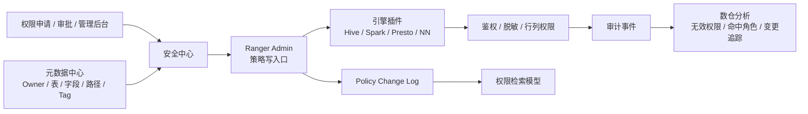

# 数据安全治理
## 知识点入口

- 本模块先看宏观流程，再看文章：[知识地图](030802_知识地图.md)。
- 新文章必须先归入流程节点，再判断是补充、冲突、不同层次还是降权。
- `文章/` 只保留原文锚点，长期知识必须沉淀到 `030802_核心知识点/` 下的主题文件。

## 技术定位

| 项 | 内容 |
|---|---|
| 技术名 | 数据安全治理 / Apache Ranger 生态 |
| 一级类目 | 数据工程与数仓 |
| 二级类目 | 元数据血缘与治理 |
| 技术本体 | 以数据资产元数据为对象，管理权限、脱敏、审计、owner、生命周期和安全治理动作 |
| 全局架构位置 | 位于数据平台、Ranger Admin、引擎插件、元数据中心、审计日志和审批系统之间 |
| 主要使用者 | 安全团队、数据平台工程师、数仓工程师、数据负责人 |
| 主要产出 | 权限策略、鉴权结果、审计事件、权限检索模型、脱敏规则、owner 语义、无效权限治理结果 |

## 官方锚点

- Apache Ranger 官网：后续补证
- Apache Ranger GitHub：后续补证
- Ranger 插件/审计/Tag Based Policy 文档：后续补证

## 架构图

## 核心模块

| 模块 | 职责 | 重点问题 |
|---|---|---|
| 策略管理 | 管理用户、角色、资源和权限策略 | 最小权限、生命周期、双写一致性 |
| 鉴权插件 | 在引擎或存储访问路径上执行鉴权 | 性能、缓存、网络化鉴权、故障降级 |
| 权限检索模型 | 把 policy 转成用户、资源、角色、到期时间等可检索视图 | 查询维度、最终一致性、延迟 |
| 元数据联动 | 从元数据中心补 owner、资源路径、敏感标签 | owner 污染、路径递归权限、tag 准确性 |
| 审计治理 | 记录鉴权命中、角色来源、策略变更和无效权限 | 粒度、可追责、回收风险 |

## 上下游

| 方向 | 对象 | 关系 |
|---|---|---|
| 上游 | 元数据中心、Ranger policy、审批系统、敏感数据扫描、用户角色系统 | 提供资源、人员、策略和标签 |
| 下游 | Hive/Spark/Presto/NameNode、审计平台、数据治理平台、数仓分析 | 消费鉴权、脱敏和审计结果 |
| 依赖 | Ranger Admin、引擎插件、消息/日志、权限检索存储 | 支撑策略同步和审计闭环 |

## 横向对标

| 对标技术 | 对标点 | 优势 | 劣势 | 使用判断 |
|---|---|---|---|---|
| 原生 Ranger | 大数据权限控制 | 插件生态、policy 缓存、RBAC/ABAC、审计能力 | 管理检索弱、生命周期粒度粗、client 缓存成本高 | 适合作为底层鉴权控制面 |
| 自研安全中心 + Ranger | 产品化权限治理 | 能补审批、检索、owner、脱敏、审计分析和无效权限治理 | 需要维护一致性、插件兼容和平台抽象 | 企业内部大数据安全中心更常见 |
| 引擎内置权限 | 单引擎鉴权 | 接入简单，贴近引擎 | 跨引擎统一难、审计分散 | 小规模或单引擎场景可用 |
| 元数据标签驱动权限 | Tag/分类分级权限 | 适合敏感数据、动态分类和批量规则 | 依赖标签准确率和元数据治理成熟度 | 数据分类分级稳定后再加强 |

## 已沉淀核心知识点

| 主题 | 文件 | 问题指纹 | 解决什么问题 | 认知增量 |
|---|---|---|---|---|
| Ranger 权限治理与元数据联动 | [Ranger权限治理与元数据联动](030802_核心知识点/Ranger权限治理与元数据联动.md) | 数据安全治理 + Ranger policy/plugin/change log/元数据 owner + 权限检索与审计闭环 | 把 Ranger 从“鉴权工具”校准为安全治理底座的一部分 | 真正可用的权限治理要补检索模型、owner 语义、审计分析和一致性，而不只是配置 policy |
| 敏感字段加密脱敏与查询边界 | [敏感字段加密脱敏与查询边界](030802_核心知识点/敏感字段加密脱敏与查询边界.md) | 数据安全治理 + 加密/脱敏/模糊查询/Ranger + 字段级安全 | 区分展示脱敏、存储加密、查询检索和权限审计 | 一个注解不能解决全链路敏感数据治理 |

## 后续追查

- 关键词：Apache Ranger policy cache、Ranger audit、Ranger tag based policy、Spark Ranger plugin、owner privilege、权限生命周期。
- 待读资料：Apache Ranger 官方架构、插件机制、审计模型；本轮不联网，统一后续补证。
- 待补实验：构造表重建、owner 污染、路径递归权限和无效权限回收四个场景，验证权限治理链路。
