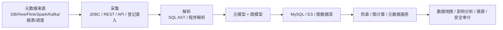

# 元数据与数据血缘实现分层

## 原文锚点

- 本地文件：[【技术分享】元数据与数据血缘实现思路](../文章/【技术分享】元数据与数据血缘实现思路.md)
- 原文链接：`http://mp.weixin.qq.com/s?__biz=MzUyMTA1NTcyOA==&mid=2247485468&idx=1&sn=2ab5a28afec273133bf38189d26f5f9d`
- 关键段落：架构概览、元数据来源、采集解析、元模型/图模型、图数据库、服务层、应用层、字段血缘取舍。
- 关键图：正文多处引用图，但 Markdown 缺失。

## 图片处理

| 图片 | 类型 | 是否保留 | 理由 | 处理方式 |
|---|---|---|---|---|
| 元数据与血缘应用架构 | 架构图 | 原图缺失 | 是文章主结构 | Mermaid 重建 |
| 元数据采集示例、Hive Metastore 图、DolphinScheduler API 图、AST 图、元模型图 | 说明图 | 原图缺失 | 辅助理解采集和解析 | 标记原图缺失 |

## 一句话结论

这篇文章值得精读：它把数据血缘从“可视化画图”校准为“采集、解析、建模、存储、服务、应用”的完整治理系统。

## 用户相关性判断

| 项 | 内容 |
|---|---|
| 用户当前认知层级 | 元数据、血缘、治理：L2 |
| 认知成熟度 | draft |
| 阅读投入建议 | 精读 |
| 阅读投入理由 | 能补血缘系统纵向模块和字段血缘取舍，但实现细节仍需更强工程证据 |
| 对用户的新信息 | 血缘真正落地需要绑定元数据模型、图模型、服务层和业务应用，不只是解析 SQL |
| 问题指纹 | 数据血缘 + 采集/解析/建模/存储/服务/应用 + 治理闭环 + 字段血缘取舍 |
| 排重判断 | 新建 |
| 置信度 | 高 |

## 认知校准点

| 校准点 | 文章观点/信息 | 与用户认知或价值观的关系 | 处理建议 |
|---|---|---|---|
| 血缘不等于 SQL 解析 | 原文强调解析只是基础，还要建模、存储、服务和应用 | 补充系统位置 | 后续血缘文章按链路模块排重 |
| 元数据和血缘要绑定 | 文章提出全局唯一主键，把元数据记录和血缘节点绑定 | 补充落地关键 | 记住“血缘节点必须能回到元数据资产” |
| 图数据库适合关系查询但有成本 | 原文讲图模型和免索引邻接 | 有价值，但内存成本要标出 | 不把图数据库写成唯一答案 |
| 字段级血缘争议要保留 | 原文认为字段血缘费时费力 | 与用户重工程投入匹配 | 标为待验证准则，不绝对化 |

## 冲突点

| 冲突类型 | 具体表现 | 影响 | 处理 |
|---|---|---|---|
| 图片缺失 | 大量图示未保留 | 影响架构理解 | Mermaid 重建主图 |
| 观点需降权 | “字段级血缘是伪需求”表达较绝对 | 可能受团队规模和场景影响 | 写成成本高、需场景判断 |
| 实践门槛不足 | 有方法但无完整系统代码和验收指标 | 不能直接判实践 | 降为精读 |

## 待吸收点

| 分级 | 内容 | 为什么值得吸收 | 后续动作 |
|---|---|---|---|
| 理解 | 元数据来源包括数据库、存储、计算引擎、消息、报表、调度和业务录入 | 决定覆盖边界 | 建立采集对象清单 |
| 理解 | 血缘解析包括 SQL 采集、SQL AST 解析和程序解析 | 防止只做表级 SQL 静态解析 | 后续补 SQL 解析器对比 |
| 理解 | 元模型和图模型是落地核心 | 没有模型就无法稳定服务化 | 后续补节点、边、属性、唯一 ID 设计 |
| 记住 | 图数据库适合深层关系查询，但不是免成本 | 影响存储选型 | 按查询深度和规模评估 |
| 记住 | 治理价值来自影响分析、溯源、安全审计、数据下架和质量联动 | 形成业务闭环 | 后续核心知识点必须写应用场景 |

## 已知可跳过

| 内容 | 跳过理由 |
|---|---|
| 元数据是描述数据的数据 | 基础概念 |
| 血缘用于跟踪数据流转 | 已知基础 |
| 作者和社群介绍 | 不进入知识点 |

## 实践门槛

| 门槛 | 判断 | 证据 |
|---|---|---|
| 可运行 | 否 | 没有完整系统代码 |
| 可验证 | 部分 | 有采集对象、解析步骤、应用场景 |
| 可排障 | 部分 | 能用于溯源和影响分析，但缺实际案例 |
| 可迁移 | 是 | 可迁移到数仓治理设计 |
| 结论 | 降为精读 | 作为系统架构准则，不直接当实现 SOP |

## 归类判断

| 项 | 内容 |
|---|---|
| 技术本体 | 元数据与数据血缘系统 |
| 文章主问题 | 元数据和血缘如何实现并服务治理 |
| 使用场景 | 数据地图、资产管理、溯源、影响分析、安全审计 |
| 关键词干扰 | SQL、图数据库、调度、报表都是组件，不是主类目 |
| 最终归类 | 数据工程与数仓 / 元数据血缘与治理 |
| 归类理由 | 主问题是数据治理链路，不是 SQL 优化或 BI 展示 |

## 技术定位

| 项 | 内容 |
|---|---|
| 技术类型 | 数据治理系统能力 |
| 所属领域 | 数据工程与数仓 |
| 二级类目 | 元数据血缘与治理 |
| 全局架构位置 | 横跨采集、开发、调度、计算、报表和治理应用 |
| 涉及模块 | 元数据采集、SQL 解析、图模型、图数据库、检索、影响分析 |
| 解决问题 | 数据资产可见、上下游可追、变更影响可评估 |
| 原文局限 | 图缺失，字段级血缘观点较强，需要场景校验 |
| 我的结论 | 以后关注，作为血缘系统纵向地图 |

## 纵向理解

| 维度 | 判断 |
|---|---|
| 全局架构 | 来源 -> 采集 -> 解析 -> 建模 -> 存储 -> 服务 -> 应用 |
| 本文位置 | 给出完整实现分层，不深入某个解析器 |
| 核心机制 | 把技术元数据、业务元数据和血缘节点绑定成可查询图 |
| 使用链路 | 采集对象 -> 解析 SQL/任务 -> 建图 -> 提供检索/图计算 -> 支撑治理应用 |
| 前置条件 | 数据源覆盖、元模型、唯一 ID、权限和质量指标 |
| 边界 | 不解决数据加工本身，也不保证字段级血缘一定值得做 |

## 横向对标

| 对标技术 | 实现方式 | 优势 | 劣势 | 适合场景 |
|---|---|---|---|---|
| 关系库 | 表结构存节点和边 | 易维护、事务强 | 深层关系查询复杂 | 简单元数据管理 |
| Elasticsearch | 同步元数据做检索 | 全文搜索方便 | 不适合复杂依赖遍历 | 数据资产搜索 |
| 图数据库 | 节点边属性建模 | 适合上下游和影响分析 | 运维和模型成本高 | 复杂血缘关系 |
| OpenLineage | 运行时事件标准 | 跨系统标准化 | 依赖引擎和调度接入 | 运行时血缘采集 |

## 后续追查

- 关键词：SQL lineage、字段级血缘、OpenLineage、图数据库、数据地图、影响分析。
- 相关技术：Apache Atlas、DataHub、Neo4j、Calcite、JSQLParser、Druid SQL Parser。
- 需要补读的文章：算子级血缘、数据血缘图谱升级方案、字段级血缘争议。
