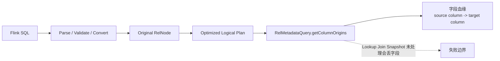

# 字段级算子级血缘与影响分析闭环

## 原文锚点

- 本地文件：
  - [Flink 血缘 | Flink SQL 字段血缘解决方案及源码](<../文章/Flink 血缘 _ Flink SQL 字段血缘解决方案及源码.md>)
  - [深度好文！FlinkSQL字段血缘解决方案及源码](../文章/深度好文！FlinkSQL字段血缘解决方案及源码.md)
  - [EB级数仓都在用的算子级血缘如何实现主动数据治理](../文章/EB级数仓都在用的算子级血缘如何实现主动数据治理.md)
  - [数据资产：数据血缘的典型应用场景以及建设思路介绍](../文章/数据资产：数据血缘的典型应用场景以及建设思路介绍.md)
  - [数据血缘图谱升级方案设计与实现](../文章/数据血缘图谱升级方案设计与实现.md)
  - [DeepSeek助力DataElit：血缘分析黑科技](../文章/DeepSeek助力DataElit：血缘分析黑科技.md)
- 原文链接：见本地原文 front matter；本轮不联网校验。
- 关键段落：Flink RelMetadataQuery#getColumnOrigins、Lookup Join 丢维表字段、Snapshot 补丁、算子级血缘抽取字段口径、影响分析/回溯/质量保障/字段打标、大规模图谱可视化设计。
- 关键图：Calcite/Flink 执行流程图、字段血缘解析流程图、指标链路图、血缘图谱效果图均缺失或仅有占位文本。

## 图片处理

| 图片 | 类型 | 是否保留 | 理由 | 处理方式 |
|---|---|---|---|---|
| Flink SQL 字段血缘解析流程图 | 流程图 | 原图缺失 | 解释 Parse/Validate/Convert/Optimize/ColumnOrigins 链路 | Mermaid 重建 |
| 算子级血缘指标链路图 | 说明图 | 原图缺失 | 说明字段口径裁剪和影响面收敛 | 标记原图缺失 |
| 字节血缘图谱 UI 图 | 说明图 | 原图缺失 | 说明大图展示问题和克制展示原则 | 只吸收设计准则 |

## 一句话结论

字段级/算子级血缘只有在能收敛影响分析、口径回溯、质量保障或安全打标时才值得做细；否则会变成高成本、低可用的大图展示。

## 用户相关性判断

| 项 | 内容 |
|---|---|
| 用户当前认知层级 | 元数据血缘 L2，Flink L2-L3，指标体系 L3 |
| 认知成熟度 | draft |
| 阅读投入建议 | 精读 |
| 阅读投入理由 | 有明确字段血缘失败场景和影响分析应用边界，能补用户关心的机制和反例 |
| 对用户的新信息 | Flink Lookup Join 字段血缘会因 Calcite Snapshot 未处理而丢维表字段；算子级血缘可按字段口径裁剪影响面 |
| 问题指纹 | 数据血缘 + 字段级/算子级/影响分析/图谱可视化 + 解析准确性与治理动作 |
| 排重判断 | 新建主题笔记；DeepSeek/DataElit 降权为观点锚点，不正式吸收 AI 结论 |
| 置信度 | 高 |

## 认知校准点

| 校准点 | 文章观点/信息 | 与用户认知或价值观的关系 | 处理建议 |
|---|---|---|---|
| 字段血缘不是“越细越好” | 原文给出字段级和算子级价值，但也暴露解析边界 | 纠偏 | 只有绑定治理动作才做细 |
| Lookup Join 是具体失败场景 | Calcite RelMdColumnOrigins 未处理 Snapshot 会丢维表字段 | 补失败场景 | 字段血缘验收必须包含 Lookup Join、UDF、聚合、窗口等用例 |
| 算子级血缘的价值是口径裁剪 | EB 文章强调单字段口径抽取、相似指标识别、保障范围收敛 | 补机制 | 影响分析要从表级扩散转为字段/口径级裁剪 |
| 图谱可视化不是全量展开 | 字节文章用列式层级、按需渲染、服务端筛选解决大图不可读 | 纠偏 | 血缘图产品应服务场景，不追求全图一次展示 |
| AI 血缘增强要降权 | DataElit 文章提 DeepSeek 逻辑解析、影响度量、变更模拟但缺实现和评测 | 降权 | 只作为后续追查，不写成技术结论 |

## 冲突点

| 冲突类型 | 具体表现 | 影响 | 处理 |
|---|---|---|---|
| 排重冲突 | Flink 字段血缘两篇仅 3 行左右差异 | 重复沉淀 | 合并为同一锚点 |
| 图片缺失 | 多个流程图和 UI 图未保留 | 影响理解 | 重建核心流程，UI 图只保留准则 |
| 证据不足 | 99% SQL 解析准确率、AI 影响度量等缺评测口径 | 误判能力 | 标为待验证 |
| 实践风险 | 动态改 Calcite 字节码或重编 Flink planner 风险较高 | 生产稳定性风险 | 作为失败场景和实验线索，不直接推荐 |

## 待吸收点

| 分级 | 内容 | 为什么值得吸收 | 后续动作 |
|---|---|---|---|
| 理解 | Flink 字段血缘可基于 Optimized Logical Plan 和 ColumnOrigins 构造 | 补字段血缘机制 | 后续实验验证不同 SQL 类型 |
| 理解 | Lookup Join 通过 LogicalSnapshot 表达，未处理会导致维表字段来源丢失 | 重要失败模式 | 加入血缘解析验收集 |
| 理解 | 算子级血缘可抽取单字段相关 SQL，帮助看清字段加工口径 | 支撑指标治理 | 与指标口径目录联动 |
| 记住 | 影响分析应按场景裁剪：变更通知看下游，找数/归因看上游，链路梳理看路径 | 影响产品设计 | 写入血缘图谱使用准则 |
| 实践 | 建一个包含普通 join、lookup join、UDF、窗口、聚合的字段血缘测试集 | 可验证准确性 | 后续补实验 |

## 已知可跳过

| 内容 | 跳过理由 |
|---|---|
| Calcite/Flink 基础介绍 | 只保留与 ColumnOrigins 相关的机制 |
| “血缘能溯源、影响分析”等泛泛场景 | 已在已有分层笔记覆盖 |
| DeepSeek “黑科技”宣传表达 | 证据不足 |
| 图谱 UI 的视觉细节 | 只保留场景驱动和按需渲染准则 |

## 实践门槛

| 门槛 | 判断 | 证据 |
|---|---|---|
| 可运行 | 部分 | Flink 字段血缘文章给出代码思路和测试 SQL；本轮未运行 |
| 可验证 | 是 | 可用 source/target column 对照表验证 |
| 可排障 | 是 | 明确 Lookup Join 丢字段、RDD/只查询等边界可纳入测试 |
| 可迁移 | 是 | 可迁移到内部 SQL 血缘解析和影响分析 |
| 结论 | 精读，后续可实践 | 需要本地构造测试集后再升为实践 |

## 归类判断

| 项 | 内容 |
|---|---|
| 技术本体 | 字段级/算子级数据血缘 |
| 文章主问题 | 如何解析字段来源，并把细粒度血缘用于影响分析和治理 |
| 使用场景 | Flink SQL、指标链路治理、变更影响评估、质量保障、安全打标、血缘图谱 |
| 关键词干扰 | DeepSeek、DataElit、G6/UI 是辅助场景，不改变技术本体 |
| 最终归类 | 数据工程与数仓 / 元数据血缘与治理 / 数据血缘 |
| 归类理由 | 主问题是血缘粒度、解析准确性和治理应用 |

## 技术定位

| 项 | 内容 |
|---|---|
| 技术类型 | 解析机制 / 治理应用 |
| 所属领域 | 数据工程与数仓 |
| 二级类目 | 元数据血缘与治理 |
| 全局架构位置 | SQL/任务解析层与影响分析、数据质量、安全治理应用之间 |
| 涉及模块 | Calcite、RelNode、ColumnOrigins、算子级口径、图谱展示、影响分析 |
| 解决问题 | 把表级依赖细化到字段/口径，降低影响分析噪音 |
| 原文局限 | 准确率缺评测集，部分修复方案侵入性高 |
| 我的结论 | 以后关注；字段血缘验收和影响分析场景的核心准则 |

## 纵向理解

| 维度 | 判断 |
|---|---|
| 全局架构 | SQL/任务 -> 逻辑计划/算子树 -> 字段/算子血缘 -> 图模型 -> 影响分析/质量/安全 |
| 本文位置 | 讲字段/算子级解析和应用，不讲元数据平台整体 |
| 核心机制 | 从逻辑计划追踪输出字段的输入字段来源，再按治理场景裁剪链路 |
| 使用链路 | 解析 SQL -> 构造字段映射 -> 存储图关系 -> 按上游/下游/路径/分组查询 |
| 前置条件 | 元数据可解析、SQL 方言覆盖、测试集、owner、指标/质量/安全规则 |
| 边界 | UDF、动态 SQL、Lookup Join、RDD、服务端二次加工和 BI 口径都可能破坏准确性 |

## 横向对标

| 对标技术 | 实现方式 | 优势 | 劣势 | 适合场景 |
|---|---|---|---|---|
| 表级血缘 | 表到表依赖 | 成本低、覆盖广 | 影响面噪音大 | 粗粒度下游通知 |
| 字段级血缘 | 字段到字段映射 | 变更影响更精准 | SQL 方言和表达式复杂 | 字段回溯、字段变更 |
| 算子级血缘 | 口径/表达式/算子链路 | 能解释加工逻辑 | 解析和展示成本高 | 指标口径、模型治理 |
| 运行时血缘 | 作业事件/计划 | 贴近真实执行 | 引擎版本和事件依赖强 | Spark/Flink App |
| 可视化图谱 | 图查询 + UI 展示 | 便于使用 | 大图噪音和性能问题 | 找数、归因、影响分析 |

## 后续追查

- 关键词：Flink ColumnOrigins、RelMdColumnOrigins Snapshot、字段血缘测试集、operator lineage、impact analysis、lineage visualization。
- 相关技术：Calcite、Flink SQL、Spark SQL、OpenLineage、DataHub、Neo4j/G6。
- 需要补读的文章：字段血缘解析器对比、Flink Lookup Join 官方实现、算子级血缘评测方法、血缘图谱产品设计案例。
