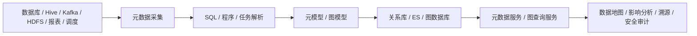

# 数据血缘
## 知识点入口

- 本模块先看宏观流程，再看文章：[知识地图](030803_核心知识点/知识地图.md)。
- 新文章必须先归入流程节点，再判断是补充、冲突、不同层次还是降权。
- `文章/` 只保留原文锚点，长期知识必须沉淀到 `030803_核心知识点/`。

## 技术定位

| 项 | 内容 |
|---|---|
| 技术名 | 数据血缘 |
| 一级类目 | 数据工程与数仓 |
| 二级类目 | 元数据血缘与治理 |
| 技术本体 | 记录数据从源头到加工、消费、报表和指标的流转关系 |
| 全局架构位置 | 位于数据开发、调度、计算、存储、报表和治理系统之间，承担关系建模与影响分析 |
| 主要使用者 | 数据治理、数仓工程师、数据平台工程师、数据负责人 |
| 主要产出 | 血缘节点、边、图模型、影响分析、上下游查询、资产地图 |

## 官方锚点

- 官网：无单一官网，属于数据治理能力
- 典型组件：Apache Atlas、DataHub、OpenLineage、Marquez、Amundsen
- 相关标准：[OpenLineage](https://openlineage.io/)

## 架构图

## 核心模块

| 模块 | 职责 | 重点问题 |
|---|---|---|
| 元数据采集 | 收集库表、字段、任务、报表、主题等信息 | 覆盖率、准确性、采集频率 |
| SQL 血缘解析 | 从 SQL 中解析表、字段和依赖关系 | 方言、动态 SQL、字段级准确性 |
| 程序解析 | 把任务、报表、人员、部门等节点接入全链路 | 业务系统适配成本 |
| 图模型 | 建模节点、边、属性和关系 | 粒度、唯一主键、模型演进 |
| 应用服务 | 支撑检索、影响分析、溯源和审计 | 查询性能、权限、可解释性 |

## 横向对标

| 对标技术 | 对标点 | 优势 | 劣势 | 使用判断 |
|---|---|---|---|---|
| Apache Atlas | 元数据和血缘治理 | Hadoop 生态整合较多 | 定制和体验成本高 | 传统大数据平台可评估 |
| DataHub | 元数据平台 | 现代元数据生态丰富 | 部署和治理模型需要投入 | 企业级元数据治理 |
| OpenLineage | 运行时血缘标准 | 标准化事件采集 | 需要引擎和调度系统支持 | 跨系统血缘事件 |
| 自研血缘平台 | 适配内部系统 | 灵活贴业务 | 长期维护成本高 | 有强内部治理需求时 |

## 已沉淀核心知识点

| 主题 | 文件 | 问题指纹 | 解决什么问题 | 认知增量 |
|---|---|---|---|---|
| 元数据与数据血缘实现分层 | [元数据与数据血缘实现分层](030803_核心知识点/元数据与数据血缘实现分层.md) | 数据血缘 + 采集/解析/建模/存储/服务/应用 + 治理闭环 + 字段血缘取舍 | 把血缘从“画图”校准为“采集到治理应用的系统工程” | 识别采集、SQL 解析、图模型和应用闭环各自边界 |
| Spark 与 Flink 血缘采集边界 | [Spark与Flink血缘采集边界](030803_核心知识点/Spark与Flink血缘采集边界.md) | 数据血缘 + Spark logical plan / Flink Catalog 事件 / 运行时监听 + 采集覆盖边界 | 区分 SQL 静态解析、Spark App 运行时监听和 Flink Catalog 修改监听 | 运行时血缘不是一个入口解决所有任务，不同引擎要按事件来源拆分 |
| 字段级算子级血缘与影响分析闭环 | [字段级算子级血缘与影响分析闭环](030803_核心知识点/字段级算子级血缘与影响分析闭环.md) | 数据血缘 + 字段级/算子级/影响分析/图谱可视化 + 解析准确性与治理动作 | 把字段血缘从“越细越好”校准为“有治理动作才值得做细” | 记录 Lookup Join 丢字段、算子级口径裁剪和大图可视化噪音边界 |

## 后续追查

- 关键词：SQL lineage、OpenLineage、DataHub、Apache Atlas、字段级血缘、图数据库。
- 待读资料：算子级血缘、字段血缘争议、数据血缘图谱升级方案、OpenLineage 官方补证。
- 待补实验：选一个 Hive/Spark SQL，验证表级和字段级血缘解析准确性。
