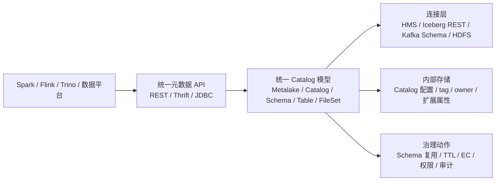

# Gravitino 与统一元数据服务边界

## 原文锚点

- 本地文件：
  - [Apache Gravitino 在B站的最佳实践](../文章/Apache Gravitino 在B站的最佳实践.md)
  - [CyberData统一元数据服务](../文章/CyberData统一元数据服务.md)
  - [一站式元数据治理平台——Datahub入门宝典](../文章/一站式元数据治理平台——Datahub入门宝典.md)
- 原文链接：见本地原文 front matter；本轮不联网校验。
- 关键段落：B 站元数据痛点、Gravitino 架构层级、OneMeta 扩展、FileSet/GVFS、跨源 Schema、CyberData 统一 Catalog/guid/血缘入口、DataHub 第三代事件化架构和 ingestion。
- 关键图：Gravitino 架构图、FileSet 管理图、FileSet 治理流程图、CyberData 架构图、DataHub 架构图在 Markdown 中未保留。

## 图片处理

| 图片 | 类型 | 是否保留 | 理由 | 处理方式 |
|---|---|---|---|---|
| Gravitino 整体架构图 | 架构图 | 原图缺失 | 是理解 Metalake/Catalog/Schema/Table/FileSet 层级的关键 | Mermaid 重建 |
| FileSet 治理流程图 | 流程图 | 原图缺失 | 展示元数据 tag 如何触发 TTL/EC 治理动作 | Mermaid 重建 |
| CyberData 元数据架构图 | 架构图 | 原图缺失 | 说明 MySQL/ES/Graph Engine 和统一 API 分层 | 标记原图缺失 |
| DataHub 架构图 | 架构图 | 原图缺失 | 说明前端、serving、ingestion 以及搜索/图查询职责 | 标记原图缺失 |

## 一句话结论

这组文章值得精读合并：它把“元数据平台”从 Hive Metastore 或数据目录，校准为跨源 Catalog、非表资产、统一 API 和治理动作闭环的控制面。

## 用户相关性判断

| 项 | 内容 |
|---|---|
| 用户当前认知层级 | 元数据、血缘、治理：L2，可能熟悉价值但缺工程边界 |
| 认知成熟度 | draft |
| 阅读投入建议 | 精读 |
| 阅读投入理由 | 能补统一元数据服务的系统位置、非表资产 Fileset、跨源 Schema 和主动治理动作；但部分收益数字和社区能力需要补证 |
| 对用户的新信息 | 统一元数据服务的价值不只是“统一查表”，还包括跨源 schema、非结构化文件、权限、TTL/EC、审计和引擎访问范式 |
| 问题指纹 | 元数据平台 + 统一 Catalog/FileSet/Schema + 多源元数据服务 + 非表资产治理 + 治理动作闭环 |
| 排重判断 | 新建主题笔记；DataHub/CyberData 作为对标和补充锚点，不单独扩写 |
| 置信度 | 中 |

## 认知校准点

| 校准点 | 文章观点/信息 | 与用户认知或价值观的关系 | 处理建议 |
|---|---|---|---|
| HMS 不是全域元数据平台 | B 站文章指出 Hive Metastore 在跨源、非表资产、权限和治理上不足 | 补充系统边界 | 后续把 HMS 视为元数据源之一，而不是统一平台本身 |
| 统一 Catalog 的价值在“解耦使用方和底层源” | OneMeta 让用户从统一入口拿 Hive/Iceberg/Kafka/HDFS 等元数据 | 补充架构位置 | 评估元数据平台时先看统一 API 和物理标识映射能力 |
| 非表资产是元数据治理缺口 | FileSet 把 HDFS 目录、AI 文件等纳入资产模型，并承接 TTL/EC | 补缺 | 元数据平台不能只覆盖表、字段、任务 |
| DataHub 文章偏入门和旧版本 | 文章大量篇幅是安装命令和 0.8.20 版本说明 | 降权 | 仅保留架构/ingestion/搜索图查询方向，版本与部署不写成当前结论 |
| CyberData 准确率数字需降权 | 原文给出血缘准确率 98%+，缺少数据集、方言范围和评测口径 | 待验证 | 不把准确率写入稳定准则，只作为待补证点 |

## 冲突点

| 冲突类型 | 具体表现 | 影响 | 处理 |
|---|---|---|---|
| 图片缺失 | 多篇提到架构图、流程图但 Markdown 无图 | 影响架构理解 | 重建 Gravitino 主链路，其他图标原图缺失 |
| 证据不足 | B 站收益数字、CyberData 准确率、DataHub 生态状态均缺本轮外部补证 | 可能误判成熟度 | 标为 draft，后续官网/GitHub/实验补证 |
| 原目录冲突 | DataHub 原文在 LLM 目录，主问题实际是元数据平台 | 会误归类 | 重路由到数据工程与数仓 / 元数据血缘与治理 |
| 实践资讯混杂 | Gravitino 文章包含实践、规划、收益和社区判断 | 容易把规划当已落地 | 区分已实践、规划、后续补证 |

## 待吸收点

| 分级 | 内容 | 为什么值得吸收 | 后续动作 |
|---|---|---|---|
| 理解 | 统一元数据平台应分为接入、统一模型、服务、治理应用四层 | 防止把目录、HMS、Catalog 混为一谈 | 写入元数据平台 index 的架构图 |
| 理解 | FileSet 把 HDFS/AI 文件这类非表资产纳入 Catalog 层级 | 补传统表元数据治理盲区 | 后续追查 Gravitino Fileset/GVFS 官方资料 |
| 理解 | 跨源 Schema 管理可以把 Kafka topic schema 从任务 DDL 中移出 | 降低 Flink 任务维护成本 | 后续验证 schema registry 与 Flink Catalog 接入方式 |
| 记住 | 统一元数据服务必须能回到物理资产标识，否则影响血缘、权限和治理动作 | 会反复影响平台设计 | 后续评估 DataHub/Gravitino/OpenMetadata 都按此准则排重 |
| 记住 | 治理闭环的关键是元数据 tag/owner/schema 触发 TTL、EC、权限、审计等动作 | 区分展示型目录和治理型平台 | 在主动元数据笔记中继续展开 |

## 已知可跳过

| 内容 | 跳过理由 |
|---|---|
| “元数据是描述数据的数据” | 用户大概率已知 |
| DataHub 安装 Docker/Python/jq 的详细步骤 | 版本旧且本轮不实践 |
| 公众号抽奖、往期推荐、社群引导 | 无技术增量 |
| “开源社区活跃度很高”等泛化描述 | 本轮不联网，无法校验 |

## 实践门槛

| 门槛 | 判断 | 证据 |
|---|---|---|
| 可运行 | 部分 | DataHub/Flink/HMS 有命令，Gravitino/OneMeta 是生产实践描述 |
| 可验证 | 部分 | 可以验证统一 API、schema 返回、FileSet 映射、接口响应；收益数字缺原始基线 |
| 可排障 | 部分 | 暴露 HMS 性能、元数据不一致、跨源 schema 成本，但缺完整日志路径 |
| 可迁移 | 是 | 可迁移到数仓治理、实时任务 Catalog、非表资产管理 |
| 结论 | 降为精读 | 作为架构准则吸收，暂不直接判实践 |

## 归类判断

| 项 | 内容 |
|---|---|
| 技术本体 | 元数据平台 / 统一元数据服务 |
| 文章主问题 | 如何统一管理多源表、文件、schema 和治理动作 |
| 使用场景 | 数据平台、Flink/Spark/Trino 引擎接入、HDFS 文件治理、AI 文件管理、数据目录 |
| 关键词干扰 | AI、DataHub、HMS、Flink、Iceberg 都是场景或组件，不改变主类目 |
| 最终归类 | 数据工程与数仓 / 元数据血缘与治理 / 元数据平台 |
| 归类理由 | 主问题是元数据控制面，不是 LLM、湖表、实时计算或单一 HMS 运维 |

## 技术定位

| 项 | 内容 |
|---|---|
| 技术类型 | 平台能力 / 元数据控制面 |
| 所属领域 | 数据工程与数仓 |
| 二级类目 | 元数据血缘与治理 |
| 全局架构位置 | 引擎、存储、调度、数据目录和治理应用之间 |
| 涉及模块 | Catalog、Schema、FileSet、统一 API、搜索、图查询、权限、治理 tag |
| 解决问题 | 降低跨源元数据使用成本，统一资产视图，并把元数据转成治理动作 |
| 原文局限 | 图缺失、版本旧、收益数字缺基线、官方能力未补证 |
| 我的结论 | 以后关注；作为元数据平台选型和自研边界的核心笔记 |

## 纵向理解

| 维度 | 判断 |
|---|---|
| 全局架构 | 数据源/引擎 -> 采集/连接器 -> 统一元模型 -> 存储/索引/图 -> 服务 API -> 治理应用 |
| 本文位置 | 主要讲统一元数据服务和平台实践，不深入具体血缘解析器 |
| 核心机制 | 通过统一 Catalog 层级和 API 隔离上层使用方与底层异构元数据源 |
| 使用链路 | 注册数据源/Catalog -> 采集或代理元数据 -> 查询 schema/owner/tag -> 触发治理动作 |
| 前置条件 | 元模型稳定、资产唯一 ID、引擎适配、权限策略、质量/生命周期规则 |
| 边界 | 不直接执行计算，不替代数据质量规则，也不天然保证字段血缘准确 |

## 横向对标

| 对标技术 | 实现方式 | 优势 | 劣势 | 适合场景 |
|---|---|---|---|---|
| Hive Metastore | Thrift 元数据服务 | 生态成熟，表元数据复用强 | 跨源、非表资产和治理动作弱 | Hive/Spark/Flink 基础表元数据 |
| DataHub | ingestion + serving + 搜索/图查询 | 资产发现和现代元数据平台完整度高 | 本轮资料旧，需补证当前架构 | 数据目录、血缘、数据发现 |
| Gravitino | Metalake/Catalog/Schema/Table/FileSet | 统一 Catalog 与多源接入更突出 | 本轮只读生产实践，官方边界待补证 | 统一引擎访问、非表资产治理 |
| OpenMetadata | 元数据平台 | 本轮只作为对标名出现 | 缺本地专门原文 | 后续补证 |
| Apache Atlas | Hadoop 生态治理 | 传统大数据生态常见 | 本轮缺专门原文 | 传统 Hadoop 治理对标 |
| 自研元数据服务 | 内部模型和 API | 最贴合内部系统 | 长期维护成本高 | 强平台团队和复杂内部治理 |

## 后续追查

- 关键词：Apache Gravitino Metalake、Fileset、GVFS、DataHub ingestion、OpenMetadata、Apache Atlas、active metadata。
- 相关技术：Hive Metastore、Kafka Schema Registry、Iceberg REST Catalog、Ranger、OpenLineage。
- 需要补读的文章：Gravitino 官方架构、DataHub 当前架构、OpenMetadata/Atlas 对标资料、B 站 OneMeta 后续实践。
