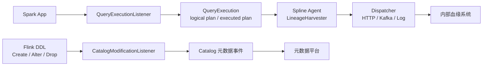

# Spark 与 Flink 血缘采集边界

## 原文锚点

- 本地文件：
  - [Spark App 血缘解析方案](../文章/Spark App 血缘解析方案.md)
  - [Spark 方案 | Spark App 血缘解析方案](../文章/Spark 方案 _ Spark App 血缘解析方案.md)
  - [白话 Apache Flink FLIP-294 让数据血缘有迹可循：支持自定义Catalog修改监听器](../文章/白话 Apache Flink FLIP-294 让数据血缘有迹可循：支持自定义Catalog修改监听器.md)
  - [Flink 血缘 | Flink SQL 字段血缘解决方案及源码](../文章/Flink 血缘 _ Flink SQL 字段血缘解决方案及源码.md)
- 原文链接：见本地原文 front matter；本轮不联网校验。
- 关键段落：Spark App 三类解析思路、event log 对 Spark 2/3 的差异、Spline agent 注册 QueryExecutionListener、LineageDispatcher、Flink CatalogModificationListener、FLIP-294 与 FLIP-314 的边界。
- 关键图：Spark/Spline 架构图、Flink 事件体系图在 Markdown 中缺失。

## 图片处理

| 图片 | 类型 | 是否保留 | 理由 | 处理方式 |
|---|---|---|---|---|
| Spline 总架构图 | 架构图 | 原图缺失 | 说明 agent/server/ui 职责 | Mermaid 重建 |
| Flink Catalog 监听事件图 | 流程图 | 原图缺失 | 说明 DDL 事件采集边界 | Mermaid 重建 |

## 一句话结论

Spark App 血缘更适合从运行时 QueryExecution 采集；Flink FLIP-294 采集的是 Catalog 元数据变更，不等于作业运行时血缘，二者不能混为一个血缘入口。

## 用户相关性判断

| 项 | 内容 |
|---|---|
| 用户当前认知层级 | Spark L3、Flink L2-L3、元数据血缘 L2 |
| 认知成熟度 | draft |
| 阅读投入建议 | 精读 |
| 阅读投入理由 | 能补血缘采集入口的工程边界，尤其是静态 SQL、Spark 运行时、Flink Catalog 事件之间的差异 |
| 对用户的新信息 | Spark 2 event log 元信息不足会影响日志解析；Spline 基于 QueryExecutionListener；FLIP-294 只覆盖 DDL/Catalog 修改 |
| 问题指纹 | 数据血缘 + Spark logical plan / Flink Catalog 事件 / 运行时监听 + 采集覆盖边界 |
| 排重判断 | 新建主题笔记；Spark 两篇近重复合并为一个锚点 |
| 置信度 | 高 |

## 认知校准点

| 校准点 | 文章观点/信息 | 与用户认知或价值观的关系 | 处理建议 |
|---|---|---|---|
| 静态 SQL 解析不是 Spark App 血缘的唯一方式 | Spark App 写法多样，代码解析跨 Java/Python/Scala 成本高 | 补充工程边界 | 对 Spark App 优先考虑运行时监听或日志，但要看版本能力 |
| event log 不是稳定万能入口 | 原文指出 Spark 2 event log 缺完整 Hive 表元信息，Spark 3 才更可用 | 纠偏 | 血缘采集设计要记录引擎版本和事件字段 |
| Spline 的触发依赖写入和 logical plan | 只查询不写入时可能解析不到血缘，RDD 链路会丢 | 补失败场景 | 字段血缘/任务血缘需记录不可覆盖场景 |
| FLIP-294 是 Catalog 修改监听 | 它采集表/库 create/alter/drop 事件，不是作业读写链路 | 纠偏 | 不把 Catalog 事件当完整运行时血缘 |
| 多 Dispatcher 是集成点 | Spline 可通过 HTTP/Kafka/日志输出，适合接内部系统 | 补落地路径 | 后续可设计最小上报链路 |

## 冲突点

| 冲突类型 | 具体表现 | 影响 | 处理 |
|---|---|---|---|
| 图片缺失 | 原文架构图和流程图未保留 | 影响采集链路理解 | Mermaid 重建 |
| 排重冲突 | `Spark App 血缘解析方案` 与 `Spark 方案 | Spark App 血缘解析方案` 仅少量头尾差异 | 重复沉淀 | 合并为同一问题指纹 |
| 证据不足 | FLIP-294/314 文章为白话解释，未用官方文档补证 | 版本边界可能漂移 | 标记后续补证 |
| 实践门槛不足 | Spark/Spline 有配置，但本轮未编译或接入运行 | 不能判实践 | 降为精读 |

## 待吸收点

| 分级 | 内容 | 为什么值得吸收 | 后续动作 |
|---|---|---|---|
| 理解 | Spark App 血缘解析可分代码解析、动态监听、日志解析三类 | 形成采集路线图 | 后续血缘文章按采集入口排重 |
| 理解 | Spline agent 监听 Spark SQL 执行结束事件并解析 QueryExecution | 补运行时采集机制 | 后续验证 Spark 版本和 listener 配置 |
| 理解 | LineageDispatcher 是内部系统接入点 | 补集成边界 | 设计 HTTP/Kafka 上报最小模型 |
| 记住 | Flink Catalog 修改事件只表达元数据变化，不表达作业真实读写 | 防误用 | 与作业血缘、OpenLineage 类事件区分 |
| 实践 | 用一个 Spark SQL 写入任务验证 Spline 上报 plan/event，记录 RDD 和只查询场景是否丢失 | 可迁移到血缘平台评估 | 后续实验 |

## 已知可跳过

| 内容 | 跳过理由 |
|---|---|
| Spark/Flink 是大数据计算引擎 | 基础常识 |
| Spline server/ui 展示细节 | 可被内部系统替代，不是核心机制 |
| FLIP-294 电商类比开场 | 低价值背景 |

## 实践门槛

| 门槛 | 判断 | 证据 |
|---|---|---|
| 可运行 | 部分 | Spark/Spline 文章给出 spark-submit 和配置；本轮未执行 |
| 可验证 | 是 | 可检查 plan/event 是否含 read/write、appId、metrics、任务名 |
| 可排障 | 部分 | 已知 RDD、只查询、Spark 2 event log 元信息不足等失败场景 |
| 可迁移 | 是 | 可迁移到内部 Spark App 血缘补采集 |
| 结论 | 降为精读 | 有实践线索，但本轮不运行 |

## 归类判断

| 项 | 内容 |
|---|---|
| 技术本体 | 数据血缘采集机制 |
| 文章主问题 | Spark/Flink 血缘信息从哪里采集，能覆盖哪些事件 |
| 使用场景 | Spark App、Flink SQL DDL、元数据平台上报 |
| 关键词干扰 | Spline、FLIP-294、DataHub 都是实现或接收端，不改变主类目 |
| 最终归类 | 数据工程与数仓 / 元数据血缘与治理 / 数据血缘 |
| 归类理由 | 主问题是血缘采集入口和覆盖边界 |

## 技术定位

| 项 | 内容 |
|---|---|
| 技术类型 | 血缘采集方案 / 实践案例 |
| 所属领域 | 数据工程与数仓 |
| 二级类目 | 元数据血缘与治理 |
| 全局架构位置 | 计算引擎运行时和元数据平台之间 |
| 涉及模块 | Spark listener、logical plan、Dispatcher、Flink Catalog listener、元数据事件 |
| 解决问题 | 补 SQL 静态解析无法覆盖的 Spark App 和 DDL 变更血缘 |
| 原文局限 | 官方版本边界未补证，实践未本地复现 |
| 我的结论 | 以后关注；作为血缘采集入口边界准则 |

## 纵向理解

| 维度 | 判断 |
|---|---|
| 全局架构 | 引擎事件 -> 解析 agent/listener -> 血缘事件 -> MQ/API -> 血缘存储/应用 |
| 本文位置 | 讲采集入口，不讲图模型和应用层 |
| 核心机制 | 在运行时或 Catalog 修改时截获结构化事件，转成内部血缘模型 |
| 使用链路 | 配置 listener/agent -> 运行任务或 DDL -> 解析 read/write/metadata event -> 上报 |
| 前置条件 | 引擎版本、listener classpath、元数据可解析、任务名关联、Dispatcher 可用 |
| 边界 | 不覆盖所有 RDD、只查询任务、动态 SQL、作业运行时字段血缘和跨系统下游消费 |

## 横向对标

| 对标技术 | 实现方式 | 优势 | 劣势 | 适合场景 |
|---|---|---|---|---|
| 静态 SQL 解析 | 解析 SQL 文本 | 接入简单、可前置 | 动态代码和运行时信息弱 | Hive/Flink/Spark SQL 任务 |
| Spark event log | 解析历史日志 | 非侵入 | 版本字段不稳定，Spark 2 缺关键信息 | 批量补采集 |
| Spark QueryExecutionListener / Spline | 运行时监听 logical plan | 无感接入 App，信息更完整 | RDD 和只查询场景有边界 | Spark App 血缘 |
| Flink CatalogModificationListener | 监听 DDL/Catalog 事件 | 实时感知元数据变化 | 不是作业读写血缘 | 元数据变更同步 |
| OpenLineage 类运行时事件 | 标准化作业事件 | 跨系统潜力高 | 依赖调度/引擎接入 | 多系统运行时血缘 |

## 后续追查

- 关键词：Spark QueryExecutionListener、Spline LineageHarvester、Spark event log lineage、Flink CatalogModificationListener、FLIP-294、FLIP-314。
- 相关技术：Spline、Apache Atlas、OpenLineage、DataHub ingestion、Spark SQL、Flink SQL。
- 需要补读的文章：Spark/Flink 官方 listener 文档、OpenLineage Spark/Flink 集成、Spline 版本兼容说明。
