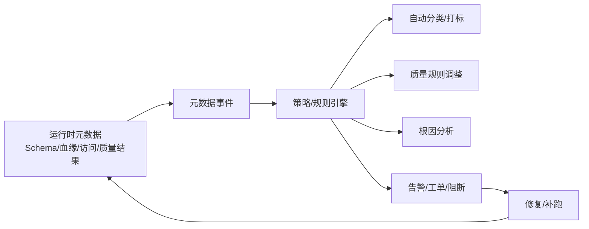

# 主动元数据驱动数据质量闭环

## 原文锚点

- 本地文件：[使用主动元数据实现数据质量](../文章/done-使用主动元数据实现数据质量.md)
- 原文链接：http://mp.weixin.qq.com/s?__biz=MzIwOTIyMDE1NA==&mid=2247499240&idx=1&sn=e4426a1467e67df7f56d293066f250dc
- 关键段落：传统元数据与主动元数据、DQ 错误解决、根因分析、数据可观测性、ETL 或架构更改。
- 关键图：无图。

## 图片处理

| 图片 | 类型 | 是否保留 | 理由 | 处理方式 |
|---|---|---|---|---|
| 主动元数据触发质量动作 | 流程图 | 重建 | 能解释“元数据不是目录，而是触发器” | Mermaid 重建 |

## 一句话结论

这篇文章适合精读方法论部分：主动元数据的价值不是“目录更实时”，而是把 Schema、血缘、访问、质量结果变成能触发治理动作的事件。

## 用户相关性判断

| 项 | 内容 |
|---|---|
| 用户当前认知层级 | 元数据治理 L2；数据质量与治理 L2-L3 draft |
| 认知成熟度 | draft |
| 阅读投入建议 | 精读 |
| 阅读投入理由 | 能补元数据与质量闭环的连接方式，但原文偏概念，没有具体平台架构和规则实现 |
| 对用户的新信息 | 主动元数据可作为质量规则、根因分析、访问控制和 Schema 变更响应的触发层 |
| 问题指纹 | 数据质量 + 主动元数据 + 元数据事件/API/自动分类/根因分析/Schema 变更 + 质量治理动作闭环 |
| 排重判断 | 新建 |
| 置信度 | 中 |

## 认知校准点

| 校准点 | 文章观点/信息 | 与用户认知或价值观的关系 | 处理建议 |
|---|---|---|---|
| 元数据不只是资产目录 | 主动元数据通过事件/API 触发治理动作 | 纠偏“元数据管理工具化” | 与血缘和质量联动 |
| 质量修复要靠闭环动作 | 错误检测后还要分类、定位、自动或半自动修复 | 符合用户重工程闭环 | 写入质量规则平台要求 |
| 方法论过宽 | 7 个用例覆盖 ML、治理、分析、ETL，但缺实现细节 | 防泛泛总结 | 只吸收质量相关模块 |
| ROI 表述需降权 | 原文称提高运营效率和降低错误成本，但无基线 | 反标题党和证据不足 | 不沉淀收益数字 |

## 冲突点

| 冲突类型 | 具体表现 | 影响 | 处理 |
|---|---|---|---|
| 证据不足 | 没有架构、产品、规则样例或指标基线 | 不能判实践 | 方法论精读 |
| 概念泛化 | 主动元数据覆盖范围过宽 | 容易变成口号 | 限定到质量触发闭环 |
| 分类交叉 | 同时涉及元数据、质量、访问控制、可观测性 | 容易误归元数据工具 | 主问题归数据质量闭环，相关联到元数据 |
| 缺少技术图 | 没有系统架构图 | 影响落地理解 | Mermaid 重建 |

## 待吸收点

| 分级 | 内容 | 为什么值得吸收 | 后续动作 |
|---|---|---|---|
| 理解 | 主动元数据将 Schema、血缘、运行指标、访问模式、质量结果变成可触发事件 | 补质量平台事件驱动思路 | 更新数据质量 index |
| 理解 | DQ 错误解决不止检测，还包括分类、根因定位和修复动作 | 补质量闭环边界 | 与调度补跑联动 |
| 记住 | 元数据目录如果不能触发动作，只是资产说明书，不是治理闭环 | 会影响平台选型 | 写入认知校准 |
| 实践 | 设计一个 Schema 变更事件 -> 影响表识别 -> DQC 规则调整/通知 的最小流程 | 可验证主动元数据价值 | 待实验 |

## 已知可跳过

| 内容 | 跳过理由 |
|---|---|
| 数据素养基础描述 | 与技术沉淀弱相关 |
| ROI 泛化表述 | 无基线和量化证据 |
| 7 个用例的宽泛列表 | 只保留与质量闭环相关的部分 |

## 实践门槛

| 门槛 | 判断 | 证据 |
|---|---|---|
| 可运行 | 否 | 无接口、事件模型或规则配置 |
| 可验证 | 否 | 无输入输出和指标 |
| 可排障 | 否 | 无失败模式 |
| 可迁移 | 是 | 方法可迁移到元数据/血缘/质量平台 |
| 结论 | 精读 | 方法论有价值，实践证据不足 |

## 归类判断

| 项 | 内容 |
|---|---|
| 技术本体 | 主动元数据管理 |
| 文章主问题 | 如何用元数据事件和自动化流程推动数据质量 |
| 使用场景 | 数据质量规则、根因分析、Schema 变更、数据可观测性 |
| 关键词干扰 | 元数据、数据治理、机器学习、分析 |
| 最终归类 | 数据工程与数仓 / 数据质量与治理 / 数据质量 |
| 归类理由 | 元数据是手段，文章核心价值是质量改进动作闭环 |

## 技术定位

| 项 | 内容 |
|---|---|
| 技术类型 | 方法论 |
| 所属领域 | 数据工程与数仓 |
| 二级类目 | 数据质量与治理 |
| 全局架构位置 | 元数据/血缘和质量规则平台之间的触发层 |
| 涉及模块 | 元数据事件、API、分类打标、根因分析、Schema 变更响应 |
| 解决问题 | 让质量治理从人工维护转向事件驱动和自动化 |
| 原文局限 | 缺具体实现和验证 |
| 我的结论 | 以后关注，作为质量平台设计准则 |

## 纵向理解

| 维度 | 判断 |
|---|---|
| 全局架构 | 元数据采集 -> 事件/规则 -> 质量动作 -> 告警/修复 -> 元数据回写 |
| 本文位置 | 讲治理动作思想，不讲具体采集和存储实现 |
| 核心机制 | 用元数据变化触发规则、通知、修复或访问控制调整 |
| 使用链路 | 捕获元数据变化 -> 识别影响范围 -> 触发质量规则/通知/补跑 -> 记录结果 |
| 前置条件 | 元数据实时性、血缘准确性、事件总线、规则平台和责任人 |
| 边界 | 元数据不准或规则不可执行时，主动化会放大误报和误操作 |

## 横向对标

| 对标技术 | 实现方式 | 优势 | 劣势 | 适合场景 |
|---|---|---|---|---|
| 主动元数据 | 元数据事件驱动治理动作 | 能形成闭环 | 建设成本高，依赖元数据准确性 | 质量、权限、影响分析 |
| 传统元数据目录 | 人工登记和查询 | 简单，便于资产查看 | 滞后，不触发动作 | 资产盘点 |
| 数据血缘平台 | 图关系和影响分析 | 能定位上下游 | 不直接修复质量 | 质量失败溯源 |
| 数据可观测性 | 指标和异常检测 | 自动发现异常 | 需要业务解释和动作闭环 | 大规模监控 |

## 后续追查

- 关键词：active metadata、data quality automation、metadata event、schema change impact、root cause analysis。
- 相关技术：DataHub、OpenMetadata、Apache Atlas、Great Expectations、调度补跑。
- 需要补读的文章：主动元数据事件模型、质量规则自动生成、Schema 变更影响分析。

