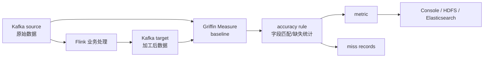

# 流式数据质量监控 Griffin Flink Kafka

## 原文锚点

- 本地文件：[Apache Griffin+Flink+Kafka实现流式数据质量监控实战](<../文章/Apache Griffin+Flink+Kafka实现流式数据质量监控实战.md>)
- 原文链接：http://mp.weixin.qq.com/s?__biz=MzU3MzgwNTU2Mg==&mid=2247512073&idx=1&sn=b537dbcea355b59a2d302dbcbc94c3aa
- 官方锚点：[Apache Griffin](https://griffin.apache.org/)；项目已退役，[GitHub](https://github.com/apache/griffin) 已归档，只作为历史机制参考。
- 关键段落：Kafka source/target、Flink 处理模拟异常、Griffin `dq.json`、`accuracy` 规则、baseline/source-target 对比、metric 和 record 输出。
- 关键图：无图。

## 图片处理

| 图片 | 类型 | 是否保留 | 理由 | 处理方式 |
|---|---|---|---|---|
| 流式质量监控链路 | 流程图 | 重建 | 能解释 source/target 双流比对 | Mermaid 重建 |

## 一句话结论

这篇文章值得精读其中的“流式质量比对模型”，但不能作为当前技术栈实践范本：Griffin 和依赖版本都偏旧，代码示例更多是教学 Demo。

## 用户相关性判断

| 项 | 内容 |
|---|---|
| 用户当前认知层级 | 数据质量与治理 L2-L3 draft；Flink/Kafka L2 |
| 认知成熟度 | draft |
| 阅读投入建议 | 精读 |
| 阅读投入理由 | 补质量规则如何落到实时链路，但版本老、示例简化，实践前需替换为当前可维护方案 |
| 对用户的新信息 | 流式数据质量可以通过 baseline/source-target 双流窗口比对输出 metric 和明细记录 |
| 问题指纹 | 数据质量 + 流式 accuracy + Kafka source-target/Flink 处理/Griffin dq rule + 双流比对 + 实时质量监控边界 |
| 排重判断 | 新建 |
| 置信度 | 中 |

## 认知校准点

| 校准点 | 文章观点/信息 | 与用户认知或价值观的关系 | 处理建议 |
|---|---|---|---|
| 数据质量不是只跑离线 SQL | Griffin 通过流式 source-target 比对检测加工后异常 | 补数据质量实时链路 | 写入数据质量 index |
| accuracy 要有比较对象 | 原文把 source 作为 baseline，target 作为被检测对象 | 补准确性规则落地方式 | 作为质量维度实例 |
| 工具过旧且项目退役要降权 | Griffin 项目已退役，原文使用 Griffin 0.6.0、Kafka 0.11、Flink 1.10.1、Spark 2.4.1 | 防版本和生态状态污染 | 只保留模型，不保留版本栈 |
| Demo 不是生产闭环 | 只检测并输出 metric/record，没有告警、阻断、补跑、责任人 | 符合用户重闭环偏好 | 后续补闭环 |

## 冲突点

| 冲突类型 | 具体表现 | 影响 | 处理 |
|---|---|---|---|
| 版本时效 | 组件版本明显旧，且 Griffin 已退役/归档 | 直接实践风险高 | 降为机制参考 |
| 实践门槛不足 | 有代码和配置，但没有真实数据、指标阈值、告警链路 | 不能判实践 | 精读 |
| 证据不足 | 没有质量结果样例和误报漏报分析 | 不能判断效果 | 标记待验证 |
| 分类边界 | 文中有 Flink/Kafka 大量代码 | 容易误归实时计算 | 主问题是数据质量监控 |

## 待吸收点

| 分级 | 内容 | 为什么值得吸收 | 后续动作 |
|---|---|---|---|
| 理解 | 流式质量监控可用 source-target 双流比对 | 能把准确性落到实时链路 | 更新数据质量核心模块 |
| 理解 | `dq.json` 中 `data.sources`、`evaluate.rule`、`sinks` 对应输入、规则和输出 | 帮助理解质量平台的三段式结构 | 抽象成通用规则平台 |
| 记住 | 实时质量规则必须定义窗口、baseline、匹配键、延迟容忍和明细输出 | 影响规则可用性 | 写入后续追查 |
| 实践 | 用 Kafka source/target 构造小数据集，输出 missing/matched 指标 | 可验证质量规则 | 用现代方案替代 Griffin 旧栈 |

## 已知可跳过

| 内容 | 跳过理由 |
|---|---|
| Maven 依赖和 Java Bean 全量代码 | Demo 细节，版本过旧 |
| Kafka topic 创建脚本 | 通用环境搭建 |
| 推广和学习链接 | 无知识价值 |

## 实践门槛

| 门槛 | 判断 | 证据 |
|---|---|---|
| 可运行 | 部分 | 有 Kafka/Flink/Griffin 配置 |
| 可验证 | 部分 | 有 metric/record 输出配置，但缺结果样例 |
| 可排障 | 否 | 没有延迟、窗口错配、乱序、重复数据处理 |
| 可迁移 | 部分 | 模型可迁移，工具栈需替换 |
| 结论 | 降为精读 | 只吸收流式质量比对模式 |

## 归类判断

| 项 | 内容 |
|---|---|
| 技术本体 | 数据质量规则平台 / Apache Griffin |
| 文章主问题 | 如何在 Kafka-Flink-Kafka 链路上做流式准确性检测 |
| 使用场景 | 实时数据处理链路质量监控 |
| 关键词干扰 | Flink、Kafka、实战、代码 |
| 最终归类 | 数据工程与数仓 / 数据质量与治理 / 数据质量 |
| 归类理由 | 文章最终目标是质量检测，不是实时计算算子或消息队列机制 |

## 技术定位

| 项 | 内容 |
|---|---|
| 技术类型 | 实践 Demo |
| 所属领域 | 数据工程与数仓 |
| 二级类目 | 数据质量与治理 |
| 全局架构位置 | 实时链路处理后、结果消费前的质量校验层 |
| 涉及模块 | Kafka、Flink、Griffin Measure、规则配置、指标输出 |
| 解决问题 | 检测流式加工后数据与源数据是否一致 |
| 原文局限 | 工具老、缺生产闭环 |
| 我的结论 | 以后关注，作为实时质量规则模型参考 |

## 纵向理解

| 维度 | 判断 |
|---|---|
| 全局架构 | 源流 -> 处理流 -> 目标流 -> 质量规则 -> 指标/明细 -> 告警/修复 |
| 本文位置 | 只覆盖规则执行和结果输出，不覆盖治理闭环 |
| 核心机制 | 在时间窗口内用 baseline 与目标数据按 key/字段规则对齐比较 |
| 使用链路 | 准备源/目标流 -> 配置数据源和 checkpoint -> 配置 accuracy rule -> 输出 metric/record |
| 前置条件 | 有稳定事件 key、时间窗口、延迟容忍、源目标字段映射 |
| 边界 | 乱序、迟到、重复、源端脏数据会影响准确性判断 |

## 横向对标

| 对标技术 | 实现方式 | 优势 | 劣势 | 适合场景 |
|---|---|---|---|---|
| Apache Griffin | 规则配置 + Spark/Flink/Kafka | 有质量模型和输出结构 | 生态和版本老 | 机制参考或遗留系统 |
| Great Expectations | 数据断言和文档化 | 离线规则表达成熟 | 实时链路需额外集成 | 离线表/批校验 |
| 自研 SQL/流式规则 | 按业务自定义规则 | 灵活，可贴近平台 | 建设成本高 | 强治理平台 |
| Flink CEP/SQL 校验 | 直接在实时作业中检测 | 延迟低，易联动作业 | 规则治理和复用弱 | 强实时校验 |

## 后续追查

- 关键词：Apache Griffin streaming accuracy、baseline、data quality metric、miss records。
- 相关技术：Great Expectations、Deequ、Flink SQL、Kafka、数据可观测性。
- 需要补读的文章：现代数据质量平台实时规则设计、Griffin 项目现状、Flink SQL 实时质量校验。
