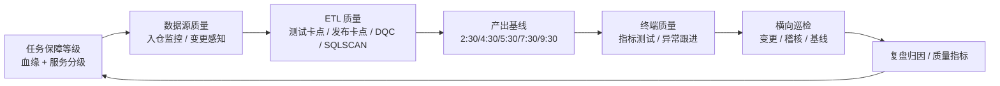

# 网易严选离线数仓质量建设闭环

## 原文锚点

- 本地文件：[网易严选离线数仓质量建设实践](../文章/网易严选离线数仓质量建设实践.md)
- 原文链接：http://mp.weixin.qq.com/s?__biz=MzA5MTc0NTMwNQ==&mid=2650738173&idx=1&sn=df147d8d9ee7e4b35172b55dd47f70cc
- 关键段落：任务保障等级、完整性/准确性/一致性/及时性、数据源质量、ETL 质量、终端质量、横向巡检、质量衡量。
- 关键图：原文无图，质量闭环可重建。

## 图片处理

| 图片 | 类型 | 是否保留 | 理由 | 处理方式 |
|---|---|---|---|---|
| 数仓质量治理闭环 | 架构图 | 重建 | 能说明数据源、ETL、终端、巡检、复盘的关系 | Mermaid 重建 |

## 一句话结论

这篇文章值得精读：它把数据质量从“几个维度的概念”推进到“任务分级、卡点、基线、巡检、复盘、个人推进”的工程闭环。

## 用户相关性判断

| 项 | 内容 |
|---|---|
| 用户当前认知层级 | 数据质量与治理 L2-L3 draft；调度编排 L2 |
| 认知成熟度 | draft |
| 阅读投入建议 | 精读 |
| 阅读投入理由 | 对用户补质量工程闭环最有价值，但平台名和内部流程不可直接迁移 |
| 对用户的新信息 | 质量保障可以先按血缘和服务等级给任务分级，再选择卡点、基线和巡检强度 |
| 问题指纹 | 数据质量 + 离线数仓 + 任务分级/源端变更/ETL卡点/基线巡检/复盘归因 + 质量治理闭环 |
| 排重判断 | 新建 |
| 置信度 | 高 |

## 认知校准点

| 校准点 | 文章观点/信息 | 与用户认知或价值观的关系 | 处理建议 |
|---|---|---|---|
| 质量治理要先分级 | 基于终端服务等级和血缘上推 FLOW 重要度 | 补质量治理优先级模型 | 写入数据质量 index |
| 质量覆盖三段链路 | 数据源、ETL、终端质量分别治理 | 纠偏只在产出表上做规则 | 形成纵向模块 |
| 及时性是质量的一部分 | 产出基线和破线预警被纳入质量 | 与调度补跑强关联 | 连接调度补跑 |
| 巡检和复盘是治理闭环 | 弱稽核连续失败、变更风险、破线责任要巡检和打标 | 符合用户重闭环偏好 | 作为质量文章排重主线 |

## 冲突点

| 冲突类型 | 具体表现 | 影响 | 处理 |
|---|---|---|---|
| 可迁移性限制 | 有数平台、CMDB、POPO、内部消息中心是公司内实现 | 不能照搬工具 | 抽象为模块和机制 |
| 证据不足 | 缺质量指标改善前后数据 | 不能证明效果强度 | 保留方法，不采信收益 |
| 实践门槛不足 | 没有具体规则 SQL、平台配置和验收数据 | 不能直接判实践 | 精读 |
| 分类交叉 | 同时涉及调度、血缘、指标测试 | 可能被拆散 | 主问题归数据质量，交叉写入对标 |

## 待吸收点

| 分级 | 内容 | 为什么值得吸收 | 后续动作 |
|---|---|---|---|
| 理解 | 保障等级可由终端场景重要性通过血缘上推到任务 | 解决质量规则优先级问题 | 更新质量 index |
| 理解 | 数据源质量包括入仓监控、上游变更感知、DB 运维感知 | 补源端质量模块 | 后续与元数据联动 |
| 理解 | ETL 质量包括测试卡点、发布卡点、DQC、SQLSCAN、基线控制 | 补过程质量模块 | 与 Change/调度经验结合 |
| 记住 | 弱稽核失败不阻断，也必须巡检和追责，否则质量规则会失效 | 影响治理闭环 | 写入规则平台要求 |
| 实践 | 选一条关键链路，定义任务等级、DQC 规则、基线预警、破线打标和复盘表 | 可落地验证 | 待实验 |

## 已知可跳过

| 内容 | 跳过理由 |
|---|---|
| 完整性、准确性、一致性、及时性的基础定义 | 已有概念边界笔记，压缩阅读 |
| 内部平台名和消息工具 | 不可直接迁移 |
| “罚一天值班”等组织管理细节 | 可了解，不当技术准则 |

## 实践门槛

| 门槛 | 判断 | 证据 |
|---|---|---|
| 可运行 | 否 | 无具体平台配置或 SQL |
| 可验证 | 部分 | 有 DQC 配置率、基线破线率等指标方向 |
| 可排障 | 部分 | 有巡检、破线打标、责任归因 |
| 可迁移 | 是 | 模块化方法可迁移 |
| 结论 | 精读 | 可做治理设计参考，不是直接 SOP |

## 归类判断

| 项 | 内容 |
|---|---|
| 技术本体 | 离线数仓数据质量治理 |
| 文章主问题 | 如何建设数仓质量保障体系 |
| 使用场景 | 离线数仓任务、源端入仓、指标出口和巡检复盘 |
| 关键词干扰 | 调度、血缘、指标、消息通知 |
| 最终归类 | 数据工程与数仓 / 数据质量与治理 / 数据质量 |
| 归类理由 | 调度和血缘是支撑手段，主问题是质量保障体系 |

## 技术定位

| 项 | 内容 |
|---|---|
| 技术类型 | 生产实践方法 |
| 所属领域 | 数据工程与数仓 |
| 二级类目 | 数据质量与治理 |
| 全局架构位置 | 数仓生产链路的质量控制面 |
| 涉及模块 | 任务分级、源端变更、ETL 卡点、DQC、基线、巡检、复盘 |
| 解决问题 | 让质量规则从概念变成可执行、可巡检、可追责的闭环 |
| 原文局限 | 缺规则细节和改善指标 |
| 我的结论 | 以后关注，作为离线数仓质量闭环核心文章 |

## 纵向理解

| 维度 | 判断 |
|---|---|
| 全局架构 | 服务等级/血缘 -> 任务等级 -> 源端/ETL/终端质量 -> 巡检 -> 复盘指标 |
| 本文位置 | 讲治理体系，不讲具体质量规则 SQL 实现 |
| 核心机制 | 通过分级和卡点把有限治理资源投到高影响链路 |
| 使用链路 | 识别重要任务 -> 配规则和基线 -> 执行卡点/巡检 -> 打标归因 -> 指标化推进 |
| 前置条件 | 血缘可用、任务元数据可用、质量规则平台、消息通知和责任人 |
| 边界 | 无血缘、无责任人、无规则执行平台时只能做局部质量检查 |

## 横向对标

| 对标技术 | 实现方式 | 优势 | 劣势 | 适合场景 |
|---|---|---|---|---|
| 离线数仓质量闭环 | 分级 + 卡点 + 巡检 + 复盘 | 覆盖生产链路 | 依赖平台和组织机制 | 关键数仓链路 |
| 单表 DQC | 表/字段规则检查 | 快速落地 | 容易碎片化 | 局部表质量 |
| 数据可观测性 | 指标、异常检测、血缘联动 | 自动发现异常 | 可能缺业务口径 | 大规模平台 |
| 调度 SLA 治理 | 基线和补跑 | 强恢复能力 | 不判断数据值正确性 | 及时性问题 |

## 后续追查

- 关键词：数仓质量、DQC、基线破线、SQLSCAN、质量巡检、数据源变更感知。
- 相关技术：调度补跑、数据血缘、主动元数据、指标测试平台。
- 需要补读的文章：数据质量规则平台设计、质量失败驱动补跑、SQL 静态分析规则。

