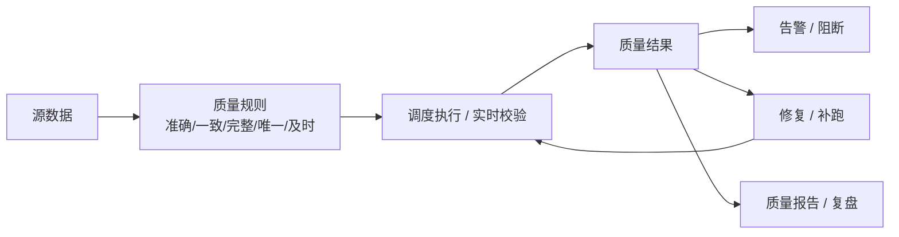

# 数据质量
## 知识点入口

- 本模块先看宏观流程，再看文章：[知识地图](030901_知识地图.md)。
- 新文章必须先归入流程节点，再判断是补充、冲突、不同层次还是降权。
- `文章/` 只保留原文锚点，长期知识必须沉淀到 `030901_核心知识点/` 下的主题文件。

## 技术定位

| 项 | 内容 |
|---|---|
| 技术名 | 数据质量 |
| 一级类目 | 数据工程与数仓 |
| 二级类目 | 数据质量与治理 |
| 技术本体 | 用质量维度、规则、监控、告警、阻断和修复流程保证数据可信可用 |
| 全局架构位置 | 位于数据集成、数仓加工、调度、指标交付之间，对输入、过程和产出做质量校验 |
| 主要使用者 | 数据治理、数仓工程师、数据平台、业务指标负责人 |
| 主要产出 | 质量规则、质量报告、告警、阻断记录、修复和复盘 |

## 官方和工具锚点

- 标准来源：DAMA-DMBOK、企业数据治理规范。
- Apache Griffin：[官网](https://griffin.apache.org/)、[GitHub](https://github.com/apache/griffin)。注意项目已退役/归档，只保留批流数据质量模型作历史参考。
- Great Expectations：[官方文档](https://docs.greatexpectations.io/docs/home/)、[GitHub](https://github.com/great-expectations/great_expectations)。
- Deequ：[GitHub](https://github.com/awslabs/deequ)。
- 本地相关：[调度补跑](../../0306_调度编排/030602_调度补跑/AGENTS.md)、[数据血缘](../../0308_元数据血缘与治理/030803_数据血缘/AGENTS.md)

## 架构图

## 核心模块

| 模块 | 职责 | 重点问题 |
|---|---|---|
| 质量维度 | 定义检查什么 | 准确性、一致性、完整性、唯一性、及时性、有效性 |
| 质量规则 | 把维度落成可执行条件 | 规则来源、阈值、业务例外 |
| 质量执行 | 跑规则并记录结果 | 调度、实时、抽样、全量 |
| 告警与阻断 | 防止坏数据扩散 | 告警等级、SLA、下游影响 |
| 修复闭环 | 让质量失败可恢复 | 补跑、回滚、人工确认、复盘 |

## 横向对标

| 对标技术 | 对标点 | 优势 | 劣势 | 使用判断 |
|---|---|---|---|---|
| 数据质量规则 | 具体数据值校验 | 可自动化 | 需要业务定义 | 数仓生产必需 |
| 数据血缘 | 影响范围和责任追踪 | 能定位上下游 | 不判断值是否正确 | 质量失败后做影响分析 |
| 调度补跑 | 失败恢复 | 可恢复产出 | 不判断结果是否可信 | 质量规则触发补跑 |
| 指标治理 | 指标口径 | 业务一致性强 | 不覆盖底层字段质量 | 指标消费侧 |

## 二级目录文章来源初始化

当前已按 `数据工程与数仓 / 数据质量与治理` 整池扫描 13 篇文章：

| 状态 | 数量 | 处理 |
|---|---:|---|
| 已沉淀 | 4 | 保留为核心知识点，作为后续排重基线 |
| 精读候选 | 5 | 先并入主题簇，只有新增问题指纹才写新笔记 |
| 略读 | 4 | 只保留原文锚点或作为平台/方法论补充 |
| 原图缺失 | 3 | 需要回原文查看架构图或流程图，必要时 Mermaid 重建 |

### 主题簇与处理决策

| 主题簇 | 文章来源 | 当前处理 | 排重依据 | 认知校准点 |
|---|---|---|---|---|
| 质量维度与规则口径 | [数据质量里的“准确性”和“一致性”有啥区别？](030901_核心知识点/数据质量准确性与一致性边界.md)、[数据中台建设之数据质量治理（一）](文章/done-数据中台建设之数据质量治理（一）.md) | 已覆盖准确性/一致性；后者只补规则模板、稽核计算方式 | 质量维度 + 规则表达 + 校验对象 + 反例 | 不再重复沉淀“质量很重要”，只吸收可执行规则和边界 |
| 离线数仓质量闭环 | [网易严选离线数仓质量建设实践](030901_核心知识点/网易严选离线数仓质量建设闭环.md)、[如何保障数仓数据质量？](文章/done-如何保障数仓数据质量？.md)、[数仓建设｜5个方案助你搞定数据质量问题](文章/done-数仓建设｜5个方案助你搞定数据质量问题.md) | 已有闭环主线；后两篇只补链路测试、数据产品协作和源头责任边界 | 任务分级 + 数据源/ETL/终端 + 规则卡点 + 基线 + 巡检复盘 | 质量治理不是只在产出表上加 DQC，而是覆盖源端、过程、出口和复盘 |
| 流式质量监控 | [Apache Griffin+Flink+Kafka实现流式数据质量监控实战](030901_核心知识点/流式数据质量监控GriffinFlinkKafka.md) | 已沉淀流式 source-target 双流比对模型 | 流式链路 + baseline/source-target + 窗口/匹配键 + metric/record 输出 | Griffin 项目已退役，不能作为新实践栈，只保留质量模型 |
| 主动元数据与可观测 | [使用主动元数据实现数据质量](030901_核心知识点/主动元数据驱动数据质量闭环.md)、[[开源]新一代数据可观测性系统](文章/done-[开源]新一代数据可观测性系统，提供元数据管理和数据质量检查功能，让您心中有数！.md)、[数据平台开源](文章/done-数据平台开源！提供元数据管理、数据概览报告、数据质量管理，数据分布查询、数据趋势洞察等核心能力.md)、[数据质量动态探查及相关前端实现](文章/done-数据质量动态探查及相关前端实现.md) | 已有主动元数据主线；平台介绍只补规则类型、探查报告、SLA 告警、插件化 | 元数据事件 + 质量规则 + 探查/监控 + 告警/修复动作 | 平台功能列表不等于治理闭环，必须看是否能触发动作 |
| 跨域数据质量 | [大模型时代：数据质量管理](文章/done-大模型时代：数据质量管理.md) | 保留为 LLM 数据质量交叉锚点，不直接扩展数仓质量主线 | 大模型训练数据 + 质量来源 + 质量治理方法 | 原目录和最终归类冲突，阅读时要区分“训练数据质量”和“数仓数据质量” |
| 方法论低沉淀 | [对着《洗冤录》看《数据质量管理十步法》](文章/done-对着《洗冤录》看《数据质量管理十步法》，化身神探搞定数据质量难题！.md)、[完整数据中台开源](文章/done-【开源】完整数据中台包含数据源，元数据，数据标准，数据质量，建模，数据采集，数据血缘，数据安全，数据服务等.md) | 略读，不单独写核心知识点 | 没有新增机制、反例、可验证动作时不新建 | 类比和平台清单容易稀释重点，只保留可执行动作 |

### 对我的认知初始化

| 项 | 当前判断 |
|---|---|
| 当前 level | L2 draft：知道数据质量重要，已开始补质量维度、规则、监控、闭环和平台边界 |
| 已确认 | 准确性/一致性边界、离线质量闭环、流式质量比对、主动元数据触发质量动作 |
| 仍缺口 | 完整性/唯一性/及时性/有效性的可执行规则模板；质量失败与调度补跑的自动联动；数据质量平台的真实规则配置和验收指标 |
| 下一步提升到 L3 的证据 | 能为一张 Hive 表或一条 Flink/Kafka 链路定义 3 类以上规则、阈值、告警、责任人、补跑动作和验收指标 |

### 后续正式沉淀策略

| 候选 | 是否新建核心知识点 | 原因 |
|---|---|---|
| 数据中台建设之数据质量治理（一） | 暂不新建 | 与质量维度主题重叠，先补“规则模板/稽核计算方式”到已有主题 |
| 如何保障数仓数据质量？ | 候选合并 | 有赞链路和数据层/应用层测试有价值，但原图缺失，需回原文确认架构图 |
| 数据质量动态探查及相关前端实现 | 候选新建或合并 | 如果能补“探查 -> 监控 -> SQL 生成 -> 调试”闭环，可新建动态探查主题；否则合并主动元数据/可观测 |
| 数据平台开源 / DataVines 类文章 | 不单独新建 | 平台介绍类，除非补出现有 index 没有的规则类型或执行引擎边界 |
| 大模型时代：数据质量管理 | 暂不新建 | 更偏 LLM 训练数据质量，后续放到 LLM 与数据质量交叉时处理 |

## 已沉淀核心知识点

| 主题 | 文件 | 问题指纹 | 解决什么问题 | 认知增量 |
|---|---|---|---|---|
| 准确性与一致性边界 | [数据质量准确性与一致性边界](030901_核心知识点/数据质量准确性与一致性边界.md) | 数据质量 + 准确性/一致性 + 规则合规/真实正确 + 质量维度边界 + 避免把质量维度混成一个词 | 区分“符合规则”和“真实正确”的不同校验口径 | 一致性更偏规则和逻辑，准确性更偏真实世界和业务事实 |
| 流式质量监控 | [流式数据质量监控 Griffin Flink Kafka](030901_核心知识点/流式数据质量监控GriffinFlinkKafka.md) | 数据质量 + 流式 accuracy + Kafka source-target/Flink 处理/Griffin dq rule + 双流比对 + 实时质量监控边界 | 说明流式链路如何做 source-target 准确性比对 | 只吸收质量模型，不采用 Griffin 旧栈 |
| 离线数仓质量闭环 | [网易严选离线数仓质量建设闭环](030901_核心知识点/网易严选离线数仓质量建设闭环.md) | 数据质量 + 离线数仓 + 任务分级/源端变更/ETL卡点/基线巡检/复盘归因 + 质量治理闭环 | 把质量治理从维度概念推进到生产闭环 | 质量治理要先分级，再按链路配置卡点、基线、巡检和复盘 |
| 主动元数据驱动闭环 | [主动元数据驱动数据质量闭环](030901_核心知识点/主动元数据驱动数据质量闭环.md) | 数据质量 + 主动元数据 + 元数据事件/API/自动分类/根因分析/Schema 变更 + 质量治理动作闭环 | 说明元数据如何触发质量动作 | 元数据目录如果不能触发动作，只是资产说明，不是治理闭环 |
| 数仓 SLA 与发布准入闭环 | [数仓SLA与发布准入闭环](030901_核心知识点/数仓SLA与发布准入闭环.md) | 数据质量 + SLA/准入准出/发布流水线/调度依赖 + 闭环治理 | 把质量治理前移到发布和调度契约 | SLA 不是几点跑完，而是业务消费契约和失败恢复机制 |
| 数据质量平台化与可观测边界 | [数据质量平台化与可观测边界](030901_核心知识点/数据质量平台化与可观测边界.md) | 数据质量 + 可观测/profile/规则/告警/大模型 + 平台化 | 判断数据质量平台功能是否形成治理动作 | 可观测只能发现和解释问题，闭环还要责任人、动作和复盘 |

## 后续追查

- 关键词：data quality、accuracy、consistency、validity、completeness、uniqueness、timeliness。
- 待读资料：DAMA-DMBOK 数据质量维度、Great Expectations、Deequ、Apache Griffin 历史机制、质量规则平台实践。
- 待补实验：为一张 Hive 表定义字段级准确性、一致性、完整性规则，并和调度补跑联动。
