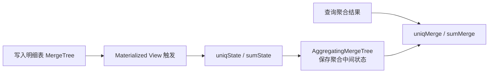

# ClickHouse AggregateFunction 与物化视图预聚合边界

## 原文锚点

- 本地文件：[「ClickHouse系列」实时分析优化AggregateFunction及物化视图](../文章/「ClickHouse系列」实时分析优化AggregateFunction及物化视图.md)
- 原文链接：`http://mp.weixin.qq.com/s?__biz=MzU3MzgwNTU2Mg==&mid=2247512491&idx=1&sn=84bd50bb724d2217a78bce1236ddf4d5`
- 关键段落：`AggregateFunction` 类型、`State` 写入、`Merge` 查询、`AggregatingMergeTree`、物化视图同步写入、`POPULATE`、源表删除不同步。
- 关键图：无可用技术图。

## 图片处理

| 图片 | 类型 | 是否保留 | 理由 | 处理方式 |
|---|---|---|---|---|
| 无 | 无图 | 不适用 | 原文以 SQL 和规则说明为主 | Mermaid 重建写入链路 |

## 一句话结论

这篇文章值得精读：ClickHouse 物化视图更接近写入时触发的派生表和预聚合状态存储，不应按 StarRocks 那类透明查询改写物化视图来理解。

## 用户相关性判断

| 项 | 内容 |
|---|---|
| 用户当前认知层级 | ClickHouse / OLAP 引擎：L2 draft |
| 认知成熟度 | draft |
| 阅读投入建议 | 精读 |
| 阅读投入理由 | 能补 ClickHouse 物化视图和 `AggregateFunction` 的机制边界，但缺生产一致性和刷新失败案例 |
| 对用户的新信息 | `AggregateFunction` 存储的是聚合中间状态，写入用 `State`，查询用 `Merge`，物化视图不会自动同步源表删除 |
| 问题指纹 | ClickHouse + AggregatingMergeTree/Materialized View + State/Merge 聚合状态 + 写入时预聚合 + 删除和分区边界 |
| 排重判断 | 新建 |
| 置信度 | 高 |

## 认知校准点

| 校准点 | 文章观点/信息 | 与用户认知或价值观的关系 | 处理建议 |
|---|---|---|---|
| ClickHouse MV 不是透明改写加速器 | 原文让查询直接访问物化视图表 | 纠偏跨技术同名误解 | 和 StarRocks MV 明确区分 |
| `AggregateFunction` 是中间状态类型 | 写入用 `uniqState/sumState`，读取用 `uniqMerge/sumMerge` | 补存储模型细节 | 写入 ClickHouse index |
| 聚合只在分区/合并语境下生效 | 原文强调同分区、同排序 Key 的数据合并 | 补边界条件 | 分区键和排序键要服务聚合粒度 |
| 源表删除不会同步删除 MV 数据 | 原文明确物化视图目前不支持同步删除 | 重要失败场景 | 不把 MV 当强一致派生表 |
| `POPULATE` 有初始化窗口风险 | 创建时是否导入存量由 `POPULATE` 决定 | 补上线边界 | 创建 MV 前先设计补历史策略 |

## 冲突点

| 冲突类型 | 具体表现 | 影响 | 处理 |
|---|---|---|---|
| 关键词误导 | 物化视图在不同 OLAP 中语义不同 | 容易误用 StarRocks/Doris 的透明改写概念 | 写明 ClickHouse 语境 |
| 实践门槛不足 | 有 SQL 片段但没有完整数据校验和异常路径 | 不能判实践 | 降为精读 |
| 证据不足 | 原文只说性能高，没有基线、数据量和 Profile | 不能作为优化收益结论 | 保留机制，不保留收益 |
| 已知可跳过 | 大量公众号推荐链接 | 干扰阅读 | 不进入知识点 |

## 待吸收点

| 分级 | 内容 | 为什么值得吸收 | 后续动作 |
|---|---|---|---|
| 理解 | `AggregatingMergeTree` 保存聚合函数状态而不是普通数值 | 解释为什么查询必须用 `Merge` 函数 | 补最小 SQL 实验 |
| 理解 | 物化视图写入源表时同步生成派生结果 | 解释 ClickHouse 预聚合的写入代价 | 对比 StarRocks MV |
| 记住 | `POPULATE` 只影响创建时存量初始化，不使用则只接后续写入 | 上线时容易漏历史数据 | 后续追查官方细节 |
| 记住 | 源表删除不自动清理物化视图 | 会造成口径不一致 | 查询口径必须显式设计 |
| 实践 | 建明细表和 MV 后验证 State/Merge、POPULATE、删除不同步 | 可形成最小实验 | 后续补 |

## 已知可跳过

| 内容 | 跳过理由 |
|---|---|
| 物化视图可以提升查询性能的泛泛说法 | 必须落到写入、状态和删除边界 |
| 基础 SQL 建表语法 | 按需回看原文即可 |
| 文末推广链接 | 无沉淀价值 |

## 实践门槛

| 门槛 | 判断 | 证据 |
|---|---|---|
| 可运行 | 部分 | 有建表、插入和查询 SQL |
| 可验证 | 部分 | 可验证 State/Merge 结果，但缺错误和刷新边界 |
| 可排障 | 否 | 没有 MV 数据不一致、历史补数、删除残留的定位路径 |
| 可迁移 | 是 | 可迁移到 ClickHouse 预聚合建模 |
| 结论 | 降为精读 | 等补最小实验后可升级为实践 |

## 归类判断

| 项 | 内容 |
|---|---|
| 技术本体 | ClickHouse 物化视图与 AggregatingMergeTree |
| 文章主问题 | 如何用 `AggregateFunction` 和物化视图做实时预聚合 |
| 使用场景 | 固定聚合口径、报表加速、写入时维护聚合结果 |
| 关键词干扰 | “实时分析优化”容易泛化为所有查询优化 |
| 最终归类 | OLAP 与数据库 / OLAP 引擎 / ClickHouse |
| 归类理由 | 主问题是 ClickHouse 内部表引擎和物化视图机制 |

## 技术定位

| 项 | 内容 |
|---|---|
| 技术类型 | OLAP 预计算和表引擎机制 |
| 所属领域 | OLAP 与数据库 |
| 二级类目 | OLAP 引擎 |
| 全局架构位置 | ClickHouse 写入链路上的派生表维护层 |
| 涉及模块 | MergeTree、Materialized View、AggregatingMergeTree、AggregateFunction、State/Merge 函数 |
| 解决问题 | 将重复聚合计算前移到写入和后台合并阶段 |
| 原文局限 | 缺生产一致性、删除同步和失败恢复说明 |
| 我的结论 | 以后关注，适合固定聚合报表，不适合作为通用透明优化器理解 |

## 跨域判断

| 问题 | 判断 |
|---|---|
| 它本体属于哪里 | OLAP 与数据库 / OLAP 引擎 |
| 这篇文章为什么可能跨域 | 物化视图也常用于数仓建模和 BI 语义层 |
| 当前文章主问题是否改变分类 | 不改变，主问题是 ClickHouse 表引擎机制 |
| 应避免的误归类 | 不归到离线数仓建模，也不等同 StarRocks 透明改写 MV |

## 纵向理解

| 维度 | 判断 |
|---|---|
| 全局架构 | 源表写入 -> MV 触发 SELECT -> AggregatingMergeTree 保存状态 -> 查询用 Merge 聚合状态 |
| 本文位置 | 只讲预聚合型 MV，不讲 ClickHouse 完整查询优化和分布式执行 |
| 核心机制 | 写入时生成聚合状态，后台合并时按 Key 进一步聚合，查询时合并状态 |
| 使用链路 | 定义明细表 -> 定义 MV 和聚合状态列 -> 写入明细 -> 查询 MV -> 验证历史和删除边界 |
| 前置条件 | 聚合口径稳定，分区/排序键匹配聚合粒度，能接受写入侧维护成本 |
| 边界 | 源表删除、历史补数、口径变更、高度随机查询都需要额外设计 |

## 横向对标

| 对标技术 | 实现方式 | 优势 | 劣势 | 适合场景 |
|---|---|---|---|---|
| ClickHouse MV + AggregatingMergeTree | 写入时触发预聚合，保存状态 | 查询快，模型直接 | 删除和历史补数需谨慎 | 固定聚合报表 |
| StarRocks MV | 预计算 + 刷新 + 优化器透明改写 | 查询可不改 SQL | 刷新和改写命中复杂 | 重复聚合/Join 查询 |
| 离线 ETL 宽表 | 调度任务预加工 | 治理和血缘清楚 | 链路长，延迟高 | 固定指标生产 |
| Query Cache | 缓存查询中间或最终结果 | 接入成本低 | 命中依赖查询重复度 | 高频相似查询 |

## 后续追查

- 关键词：ClickHouse Materialized View、AggregatingMergeTree、AggregateFunction、State、Merge、POPULATE。
- 相关技术：StarRocks Materialized View、Doris Rollup/MV、Query Cache、离线 ETL 宽表。
- 需要补读的文章：ClickHouse 物化视图官方文档、删除/更新场景、MV 历史补数与重建。
