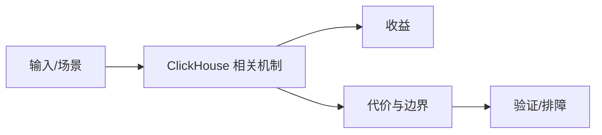

# ReplacingMergeTree 与 Upsert 边界

## 来源
- [ReplacingMergeTree得到史诗级加强，我不允许大家不知道](<../文章/done-ReplacingMergeTree得到史诗级加强，我不允许大家不知道.md>)
- [火山引擎：ClickHouse增强计划之“Upsert”](<../文章/done-火山引擎：ClickHouse增强计划之“Upsert”.md>)

## 核心问题
ClickHouse 原生 MergeTree 更适合追加写和批量分析，ReplacingMergeTree/UniqueMergeTree 这类更新方案是在列式分析系统里补实时更新能力。它们能缓解人群圈选、标签更新和删除标记问题，但会把成本转移到查询过滤、后台合并、删除清理和主键约束维护。

## 判断准则
- 更新频繁且要求事务语义时不要直接把 ClickHouse 当 OLTP。
- ReplacingMergeTree 要关注查询是否主动过滤删除标记、后台 merge 是否及时、最终一致性是否可接受。
- ByteHouse/UniqueMergeTree 属于增强实现，不能直接外推到所有 ClickHouse 集群。

## 认知偏差
| 常见错误认知 | 正确理解 |
|---|---|
| 只要文章给了性能数字或最佳实践，就可以直接复用 | 必须确认版本、数据规模、查询/写入模式、硬件和失败场景 |
| 只按标题中的技术名归类 | 以正文主问题和技术本体归类 |
| 能跑通示例就等于生产可用 | 还要验证权限、恢复、监控、重试、成本和边界条件 |
| “支持 Upsert”不等于“和关系库一样更新”；这是分析型更新，不是交易事务。 | 把它记录为降权或待验证点，而不是稳定结论 |

## 架构/流程图（如有）

## 待验证缺口
- 版本、引擎实现和删除清理语义需要用官方文档或实际集群验证。
