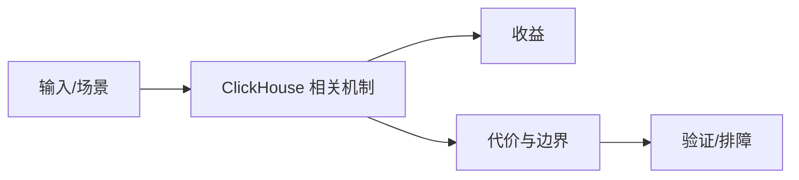

# 业务分析模型与日志留存边界

## 来源
- [1w字详解 ClickHouse漏斗模型实践方案（收藏）](<../文章/done-1w字详解 ClickHouse漏斗模型实践方案（收藏）.md>)
- [基于Clickhouse 的用户圈选实践](<../文章/done-基于Clickhouse 的用户圈选实践.md>)
- [使用ClickHouse、Grafana和WarpStream规模化的解决可预测成本的日志留存](<../文章/done-使用ClickHouse、Grafana和WarpStream规模化的解决可预测成本的日志留存.md>)
- [使用 ClickHouse 实现 Medallion 架构](<../文章/done-使用 ClickHouse 实现 Medallion 架构.md>)

## 核心问题
ClickHouse 适合把结构化事件、日志和标签数据组织成可扫描、可聚合的分析表。漏斗、人群圈选、日志留存和 Medallion 分层的共同点是读多写少、按时间或标签裁剪、批量聚合明显，核心难点不是 SQL 函数，而是数据模型、分区、排序键、冷热留存和成本边界。

## 判断准则
- 事件分析优先校准时间粒度、用户粒度、路径窗口和排序键，而不是只套漏斗函数。
- 日志留存要同时看写入成本、压缩比、查询保留窗口和与 Elasticsearch 的全文检索边界。
- 在 ClickHouse 里做 Medallion 分层适合轻量分析链路，不能替代完整数仓治理。

## 认知偏差
| 常见错误认知 | 正确理解 |
|---|---|
| 只要文章给了性能数字或最佳实践，就可以直接复用 | 必须确认版本、数据规模、查询/写入模式、硬件和失败场景 |
| 只按标题中的技术名归类 | 以正文主问题和技术本体归类 |
| 能跑通示例就等于生产可用 | 还要验证权限、恢复、监控、重试、成本和边界条件 |
| 场景文章的性能结论只在相同数据量、保留周期、查询模式和硬件条件下成立。 | 把它记录为降权或待验证点，而不是稳定结论 |

## 架构/流程图（如有）

## 待验证缺口
- 缺少与 Doris/StarRocks/Elasticsearch 在相同日志与标签场景下的成本对比。
