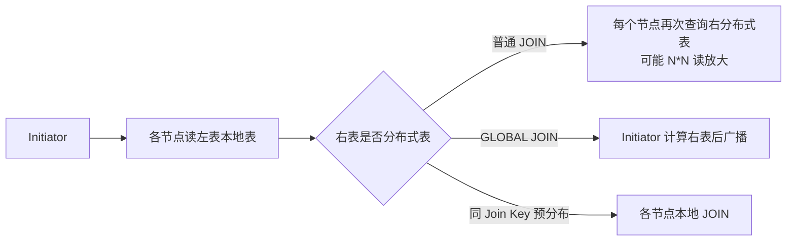

# ClickHouse 分布式 JOIN 读放大与 GLOBAL 边界

## 来源
- [ClickHouse分布式JOIN](<../文章/done-ClickHouse分布式JOIN.md>)

## 原文锚点

- 本地文件：[ClickHouse分布式JOIN](../文章/done-ClickHouse分布式JOIN.md)
- 原文链接：`http://mp.weixin.qq.com/s?__biz=MzU5MTc1NDUyOA==&mid=2247488045&idx=1&sn=e0831a6679b290bc64efa935b2a049d2`
- 关键段落：单机 Hash Join、普通分布式 JOIN 的右表读放大、`GLOBAL JOIN`、按 Join Key 预分布实现 Colocate JOIN。
- 关键图：正文出现图示占位符，但本地 Markdown 没有图片链接。

## 图片处理

| 图片 | 类型 | 是否保留 | 理由 | 处理方式 |
|---|---|---|---|---|
| 普通分布式 JOIN 时序图 | 流程图 | 原图缺失 | 读放大机制必须看链路 | Mermaid 重建 |
| GLOBAL JOIN 时序图 | 流程图 | 原图缺失 | 帮助理解 Broadcast 边界 | Mermaid 重建 |
| Colocate JOIN 时序图 | 流程图 | 原图缺失 | 帮助理解预分布的使用条件 | Mermaid 重建 |

## 一句话结论

这篇文章值得精读：ClickHouse 分布式 JOIN 的核心风险不是“能不能 JOIN”，而是右表数据如何被复制、广播或预分布；普通 JOIN、GLOBAL JOIN、Colocate JOIN 分别对应读放大、网络广播和建模前置成本。

## 用户相关性判断

| 项 | 内容 |
|---|---|
| 用户当前认知层级 | ClickHouse / OLAP 引擎：L2 draft |
| 认知成熟度 | draft |
| 阅读投入建议 | 精读 |
| 阅读投入理由 | 能补 ClickHouse 分布式查询的失败场景和选型边界，尤其是和 Doris/StarRocks MPP Join 对标 |
| 对用户的新信息 | 不带 `GLOBAL` 的分布式 JOIN 在右表也是分布式表时可能触发 N*N 读放大 |
| 问题指纹 | ClickHouse + 分布式 JOIN + 普通 JOIN/GLOBAL JOIN/Colocate + 右表读放大与广播成本 + Join Key 预分布边界 |
| 排重判断 | 新建 |
| 置信度 | 高 |

## 认知校准点

| 校准点 | 文章观点/信息 | 与用户认知或价值观的关系 | 处理建议 |
|---|---|---|---|
| 普通分布式 JOIN 可能 N*N 读放大 | 每个节点执行本地左表 JOIN 时又触发右表分布式查询 | 补关键失败场景 | 大表 Join 前先看右表是否分布式 |
| `GLOBAL JOIN` 不是免费优化 | Initiator 计算右表后广播到各节点 | 纠偏“一加 GLOBAL 就快” | 仅右表可控时使用 |
| ClickHouse 没有完整 Shuffle JOIN | 原文说未实现完整意义上的 Shuffle JOIN | 横向对标价值高 | 与 StarRocks/Doris MPP Join 分开理解 |
| Colocate 依赖数据预分布 | 相同 Join Key 必须在相同分片 | 补建模前置条件 | 表设计阶段决定，不是查询时临时优化 |
| 右表大小决定内存风险 | 单机 Hash Join 需要将右表放入内存 HashMap | 补排障边界 | 右表过滤、列裁剪、内存阈值要前置 |

## 冲突点

| 冲突类型 | 具体表现 | 影响 | 处理 |
|---|---|---|---|
| 原目录冲突 | 原文位于数据工程与数仓目录 | 主问题是 ClickHouse 查询执行 | 重路由到 OLAP 与数据库 / ClickHouse |
| 图片缺失 | 分布式 JOIN 图缺失 | 影响链路理解 | Mermaid 重建 |
| 证据不足 | 无版本、参数、Profile 和实际数据规模 | 不能直接生成调优参数 | 保留机制和边界 |
| 关键词误导 | Broadcast、Shuffle、Colocate 容易被按通用 Spark/Flink JOIN 理解 | 会误判 ClickHouse 实现 | 明确 ClickHouse 语境 |

## 待吸收点

| 分级 | 内容 | 为什么值得吸收 | 后续动作 |
|---|---|---|---|
| 理解 | 单机 Hash Join 默认把右表读入内存构建 HashMap | 是分布式 JOIN 风险的基础 | 后续追查 Join 算法和内存限制 |
| 理解 | 普通分布式 JOIN 会把左分布式表改为本地表下发，各节点再处理右表 | 解释 N*N 读放大来源 | 写入 ClickHouse index |
| 记住 | `GLOBAL JOIN` 是广播右表，不适合大右表 | 会影响查询写法 | 压测右表大小和网络带宽 |
| 记住 | 大表 Join 要优先考虑按 Join Key 预分布 | 是建模阶段准则 | 对照 StarRocks colocate/分桶 |
| 实践 | 用小集群分别跑普通 JOIN、GLOBAL JOIN、本地 JOIN，比较读行数和网络 | 可验证 | 后续补实验 |

## 已知可跳过

| 内容 | 跳过理由 |
|---|---|
| JOIN 是 OLAP 常见操作 | 基础背景 |
| Hash Join 原理泛讲 | 用户大概率知道 |
| 原文来源说明 | 不影响沉淀 |

## 实践门槛

| 门槛 | 判断 | 证据 |
|---|---|---|
| 可运行 | 部分 | 有 SQL 形态和执行步骤 |
| 可验证 | 部分 | 可用集群 Profile 验证读放大，但原文没有提供 |
| 可排障 | 部分 | 能解释右表过大、广播过大、分片不一致 |
| 可迁移 | 是 | 可迁移到 OLAP 大表 Join 建模 |
| 结论 | 降为精读 | 缺本地集群和 Profile，不判实践 |

## 归类判断

| 项 | 内容 |
|---|---|
| 技术本体 | ClickHouse 分布式查询执行 |
| 文章主问题 | ClickHouse 分布式 JOIN 的执行方式和读放大边界 |
| 使用场景 | 分布式表之间 Join、小表广播、大表按 Key 预分布 |
| 关键词干扰 | 原始目录、Flink 公众号名、Shuffle/Broadcast 泛概念 |
| 最终归类 | OLAP 与数据库 / OLAP 引擎 / ClickHouse |
| 归类理由 | 主问题是 OLAP 查询执行，不是数据同步或实时计算 |

## 技术定位

| 项 | 内容 |
|---|---|
| 技术类型 | 分布式查询执行机制 |
| 所属领域 | OLAP 与数据库 |
| 二级类目 | OLAP 引擎 |
| 全局架构位置 | ClickHouse 集群 SQL 执行层 |
| 涉及模块 | Distributed 表、本地表、Initiator、Hash Join、GLOBAL JOIN、分片键 |
| 解决问题 | 在分布式表上执行 Join，并控制右表复制和网络成本 |
| 原文局限 | 图缺失，缺版本和 Profile，未覆盖新版本 Join 能力 |
| 我的结论 | 以后关注，作为 ClickHouse 分布式查询边界入口 |

## 跨域判断

| 问题 | 判断 |
|---|---|
| 它本体属于哪里 | OLAP 与数据库 / OLAP 引擎 |
| 这篇文章为什么可能跨域 | 文章来自数据工程目录，且出现 Broadcast/Shuffle 等实时计算常用词 |
| 当前文章主问题是否改变分类 | 不改变，主问题是 ClickHouse 查询执行 |
| 应避免的误归类 | 不归到 Flink/Spark Join，也不归到数据同步 |

## 纵向理解

| 维度 | 判断 |
|---|---|
| 全局架构 | Client -> Initiator -> 各节点本地表执行 -> 右表查询/广播/本地 Join -> 汇总返回 |
| 本文位置 | 只讲分布式 JOIN，不讲存储、索引、物化视图 |
| 核心机制 | 普通 JOIN 的右表读放大、GLOBAL JOIN 的广播、Colocate 的预分布 |
| 使用链路 | 判断左右表大小 -> 判断右表是否分布式 -> 决定 GLOBAL/本地表/预分布 -> 用 Profile 验证 |
| 前置条件 | 了解分布式表与本地表映射，掌握分片键和右表大小 |
| 边界 | 大右表广播、大表未按 Join Key 分布、右表过滤不足都会带来内存或网络风险 |

## 横向对标

| 对标技术 | 实现方式 | 优势 | 劣势 | 适合场景 |
|---|---|---|---|---|
| ClickHouse 普通 JOIN | 各节点本地左表 + 右表分布式查询 | 写法简单 | 右表可能读放大 | 小规模或谨慎使用 |
| ClickHouse GLOBAL JOIN | Initiator 汇总右表后广播 | 避免 N*N 读放大 | 网络和内存压力集中 | 右表较小 |
| ClickHouse Colocate | 按 Join Key 预分布为本地 JOIN | 大表 Join 成本低 | 建模前置，灵活性差 | 稳定大表 Join |
| StarRocks/Doris MPP Join | 查询计划中做分布式 Join 策略 | SQL 优化器参与更多 | 仍需统计信息和资源治理 | 复杂报表和多表分析 |

## 后续追查

- 关键词：ClickHouse Distributed JOIN、GLOBAL JOIN、local table、initiator、colocate join。
- 相关技术：StarRocks Colocate Join、Doris Join、分桶键、统计信息。
- 需要补读的文章：ClickHouse 新版本 Join 算法、分布式查询 Profile、`distributed_product_mode` 等参数。
