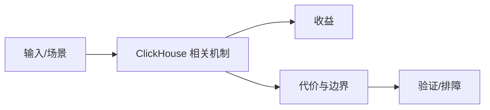

# 向量化执行与 Block Pipeline

## 来源
- [ClickHouse：向量化执行如何压榨 CPU](<../文章/done-ClickHouse：向量化执行如何压榨 CPU.md>)

## 核心问题
ClickHouse 的执行性能来自列式内存布局、Block 批处理、函数批量执行和 Pipeline 并行，而不是单点 SIMD 魔法。CPU 打满不一定是坏信号，关键要看是否在扫描、过滤、聚合和合并路径上持续喂饱 CPU。

## 判断准则
- 查询慢时先看列裁剪、过滤下推、Block 大小、聚合局部化和字符串/Nullable 破坏批处理路径的情况。
- CPU 利用率低更可能是 IO、网络、分布式等待或 Pipeline 断点；CPU 高且吞吐高通常是 ClickHouse 的正常执行形态。

## 认知偏差
| 常见错误认知 | 正确理解 |
|---|---|
| 只要文章给了性能数字或最佳实践，就可以直接复用 | 必须确认版本、数据规模、查询/写入模式、硬件和失败场景 |
| 只按标题中的技术名归类 | 以正文主问题和技术本体归类 |
| 能跑通示例就等于生产可用 | 还要验证权限、恢复、监控、重试、成本和边界条件 |
| 不要把向量化理解成“所有地方都用 SIMD”；更稳定的判断是整条路径是否减少逐行解释、分支和随机访问。 | 把它记录为降权或待验证点，而不是稳定结论 |

## 架构/流程图（如有）

## 待验证缺口
- 需要用 system.query_log、ProfileEvents 和实际查询 Profile 验证瓶颈位置。
