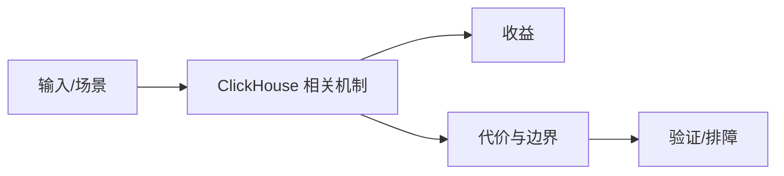

# 导入与外部引擎接入边界

## 来源
- [ClickHouse 直接读取 MySQL Dump 文件：高效数据迁移与分析的进阶指南](<../文章/done-ClickHouse 直接读取 MySQL Dump 文件：高效数据迁移与分析的进阶指南.md>)
- [基于Seatunnel连通Hive数仓和ClickHouse的实战](<../文章/done-基于Seatunnel连通Hive数仓和ClickHouse的实战.md>)
- [如何在ClickHouse中使用EmbeddedRocksDB表引擎](<../文章/done-如何在ClickHouse中使用EmbeddedRocksDB表引擎.md>)

## 核心问题
ClickHouse 的外部数据接入能力适合减少一次性迁移、全量导入或点查维表接入成本，但不应替代稳定的数据集成链路。MySQLDump、SeaTunnel、EmbeddedRocksDB 分别对应离线导入、同步管道和嵌入式 KV 查询，主问题不同。

## 判断准则
- 一次性迁移可评估 MySQLDump 直接读；持续同步仍应交给 SeaTunnel/Flink CDC/DataX 等链路。
- Hive 到 ClickHouse 的同步要关注分区增量、重跑幂等和目标表排序键。
- EmbeddedRocksDB 适合少量 KV 点查增强，不适合替代 MergeTree 的大扫描路径。

## 认知偏差
| 常见错误认知 | 正确理解 |
|---|---|
| 只要文章给了性能数字或最佳实践，就可以直接复用 | 必须确认版本、数据规模、查询/写入模式、硬件和失败场景 |
| 只按标题中的技术名归类 | 以正文主问题和技术本体归类 |
| 能跑通示例就等于生产可用 | 还要验证权限、恢复、监控、重试、成本和边界条件 |
| “直接读取”降低流程复杂度，但不自动解决一致性、类型兼容和增量同步。 | 把它记录为降权或待验证点，而不是稳定结论 |

## 架构/流程图（如有）

## 待验证缺口
- 需要补官方格式支持、RocksDB 表引擎限制和生产同步失败处理。
