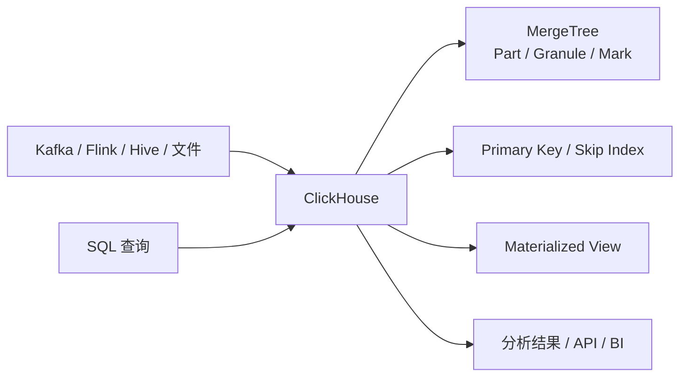

# ClickHouse
## 知识点入口

- 本模块先看宏观流程，再看文章：[知识地图](040101_核心知识点/知识地图.md)。
- 新文章必须先归入流程节点，再判断是补充、冲突、不同层次还是降权。
- `文章/` 只保留原文锚点，长期知识必须沉淀到 `040101_核心知识点/`。

## 技术定位

| 项 | 内容 |
|---|---|
| 技术名 | ClickHouse |
| 一级类目 | OLAP 与数据库 |
| 二级类目 | OLAP 引擎 |
| 技术本体 | 面向高吞吐列式分析、日志分析、明细查询和聚合分析的 OLAP 数据库 |
| 全局架构位置 | 位于数仓/实时链路之后，承担交互式分析、明细检索、日志分析和指标查询出口 |
| 主要使用者 | OLAP 平台工程师、数据开发、分析应用工程师 |
| 主要产出 | ClickHouse 表、MergeTree 数据、Skip Index、物化视图、查询结果 |

## 官方锚点

- 官网：[ClickHouse](https://clickhouse.com/)
- GitHub：[ClickHouse/ClickHouse](https://github.com/ClickHouse/ClickHouse)
- 官方文档：[ClickHouse Docs](https://clickhouse.com/docs)

## 架构图

## 核心模块

| 模块 | 职责 | 重点问题 |
|---|---|---|
| MergeTree | 表引擎和数据组织基础 | 分区、排序键、part、merge |
| Primary Key | 稀疏主键索引 | 排序键设计、granule 裁剪 |
| Skip Index | 排除不需要读取的数据块 | 数据分布、索引类型、granularity |
| 物化视图 | 预计算和写入派生表 | 一致性、维护成本 |
| 分布式表 | 集群查询和分片 | 副本、路由、资源隔离 |

## 横向对标

| 对标技术 | 对标点 | ClickHouse 优势 | ClickHouse 劣势 | 使用判断 |
|---|---|---|---|---|
| Doris | OLAP 查询服务 | ClickHouse 明细分析和列式性能强 | 更新和一体化场景需评估 | 明细/日志分析重点看 ClickHouse |
| StarRocks | 实时 OLAP | ClickHouse 生态成熟、性能强 | 部分实时更新和湖仓能力不如新架构 | 按更新、并发、运维压测 |
| Elasticsearch | 日志检索 | ClickHouse SQL 聚合强、成本可控 | 全文检索能力不同 | 结构化日志分析可选 ClickHouse |
| DuckDB | 列式分析 | ClickHouse 适合服务化和集群 | DuckDB 更适合本地嵌入式 | 生产服务看 ClickHouse，本地分析看 DuckDB |

## 已沉淀核心知识点

| 主题 | 文件 | 问题指纹 | 解决什么问题 | 认知增量 |
|---|---|---|---|---|
| Skip Index 原理 | [ClickHouseSkipIndex原理](040101_核心知识点/ClickHouseSkipIndex原理.md) | ClickHouse + 索引 + skip index/minmax/set/bloomfilter/granularity + 数据排除 + 不等同 B-tree | ClickHouse 索引为什么不是传统 RDBMS 索引 | 把“索引加速查询”校准为“按 granule 排除不需要读的数据” |
| MergeTree 批处理预排序与 LSM 边界 | [ClickHouseMergeTree批处理预排序与LSM边界](040101_核心知识点/ClickHouseMergeTree批处理预排序与LSM边界.md) | ClickHouse + MergeTree 存储 + Block/排序键/Part Merge/压缩 + 范围查询加速 + 小批写入和更新删除边界 | ClickHouse 为什么靠排序键、批处理、压缩和后台 merge 支撑范围分析查询 | 把“LSM/列存很快”校准为“读多写少 OLAP 的有序 part 取舍” |
| AggregateFunction 与物化视图预聚合 | [ClickHouseAggregateFunction与物化视图预聚合边界](040101_核心知识点/ClickHouseAggregateFunction与物化视图预聚合边界.md) | ClickHouse + AggregatingMergeTree/Materialized View + State/Merge 聚合状态 + 写入时预聚合 + 删除和分区边界 | ClickHouse 物化视图如何保存聚合中间状态 | 把 ClickHouse MV 和 StarRocks 透明改写 MV 区分开 |
| 分布式 JOIN 读放大与 GLOBAL 边界 | [ClickHouse分布式JOIN读放大与GLOBAL边界](040101_核心知识点/ClickHouse分布式JOIN读放大与GLOBAL边界.md) | ClickHouse + 分布式 JOIN + 普通 JOIN/GLOBAL JOIN/Colocate + 右表读放大与广播成本 + Join Key 预分布边界 | ClickHouse 分布式 JOIN 为什么容易出现读放大和广播成本 | 把“能 JOIN”校准为“右表复制方式决定成本” |

## 后续追查

- 关键词：MergeTree、primary key、skip index、granule、mark、materialized view、GLOBAL JOIN、ReplacingMergeTree。
- 待读资料：ClickHouse Upsert/ByteHouse UniqueMergeTree 边界、日志留存成本、分布式查询 Profile。
- 待补实验：用不同数据分布验证 minmax、set、bloomfilter 的命中效果；用普通 JOIN/GLOBAL JOIN/本地 JOIN 比较读放大；验证 MV 删除不同步和 POPULATE 边界。
