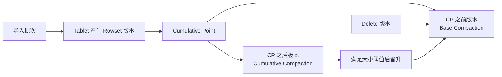

# Doris Compaction 版本治理与删除边界

## 原文锚点

- 本地文件：[Doris Compaction 原理 | 实践全析](<../文章/Doris Compaction 原理 _ 实践全析.md>)
- 原文链接：`http://mp.weixin.qq.com/s?__biz=Mzg5Mzg3MzkwNA==&mid=2247490075&idx=4&sn=665d850f5fe3d1968004b2c9214899df`
- 关键段落：Rowset 版本、Cumulative Compaction、Base Compaction、Cumulative Point、Delete 版本、Vertical/Segment/Ordered Data Compaction、Compaction Score、手动触发和生产规范。
- 关键图：正文多处“下图”缺失，本地 Markdown 没有图片。

## 图片处理

| 图片 | 类型 | 是否保留 | 理由 | 处理方式 |
|---|---|---|---|---|
| Rowset 版本和 CP 图 | 说明图 | 原图缺失 | 解释 BC/CC 边界必须看版本线 | Mermaid 重建 |
| Delete 版本阻塞 CC 图 | 说明图 | 原图缺失 | 是失败场景核心 | Mermaid 重建 |
| Compaction 监控图 | 说明图 | 原图缺失 | 监控证据缺失 | 保留指标名，不重建曲线 |

## 一句话结论

这篇文章适合实践沉淀：Doris Compaction 是写入版本、查询合并成本、删除版本和后台资源之间的治理机制；高频小批、过多分桶和 delete 交替写入都会把它推成生产瓶颈。

## 用户相关性判断

| 项 | 内容 |
|---|---|
| 用户当前认知层级 | Doris / OLAP 引擎：L2 draft |
| 认知成熟度 | draft |
| 阅读投入建议 | 实践 |
| 阅读投入理由 | 有版本模型、失败场景、监控指标、API 命令和生产规范，可迁移成 Doris 巡检与排障清单 |
| 对用户的新信息 | Delete 版本只能通过 Base Compaction 处理，导入和删除交替会让 Cumulative Compaction 难以推进 |
| 问题指纹 | Doris + Compaction + Rowset/BC/CC/CP/Delete Version/Segment Compaction + 写入版本治理 + 删除与小文件失败场景 |
| 排重判断 | 新建 |
| 置信度 | 高 |

## 认知校准点

| 校准点 | 文章观点/信息 | 与用户认知或价值观的关系 | 处理建议 |
|---|---|---|---|
| Compaction 不是单纯后台清理 | 它降低读时 Merge、处理删除版本、控制 Rowset 数 | 补 Doris 存储纵向模块 | 写入 Doris index |
| 分区/分桶数量会放大 Compaction 压力 | 一次导入产生的 Rowset 数取决于 Tablet 数 | 纠偏“导入慢只调导入参数” | 建表前估算 Tablet 数 |
| Delete 版本会改变 CP 推进路径 | Delete 版本只能由 BC 处理，可能阻塞 CC | 关键失败场景 | 避免高频 delete 与小批导入交替 |
| BC 要尽量减少但不能没有 | BC 合并基线和增量，成本高但负责删除和长期版本治理 | 补工程取舍 | 不盲目加大线程数 |
| Segment Compaction 是导入期治理 | 导入中合并多个 Segment，避免 too many segments | 连接导入和 Compaction | 与导入笔记联动 |

## 冲突点

| 冲突类型 | 具体表现 | 影响 | 处理 |
|---|---|---|---|
| 图片缺失 | 版本图、监控图、流程图缺失 | 影响完整证据 | 用 Mermaid 重建机制，监控曲线标缺失 |
| 版本时效 | 参数和默认值可能随 Doris 版本变化 | 直接照调参有风险 | 参数只作追查锚点 |
| 证据不足 | 性能提升和资源下降数字缺少本地基线 | 不能写成通用结论 | 只沉淀机制和排障路径 |
| 实践风险 | 手动触发 Compaction、调整线程和删除数据都可能影响线上 | 误操作会放大故障 | 只在测试或 DBA 审核下实践 |

## 待吸收点

| 分级 | 内容 | 为什么值得吸收 | 后续动作 |
|---|---|---|---|
| 理解 | Tablet 由多个 Rowset 版本组成，每批导入会产生版本 | 解释为什么小批写入制造读放大 | 和导入攒批联动 |
| 理解 | CC 处理增量版本，BC 处理基线和已晋升增量 | 是理解 CP 的关键 | 写入 Doris 技术地图 |
| 记住 | Delete 版本只通过 BC 处理，导入与删除交替容易拖慢 Compaction | 会反复影响生产操作 | 写入删除规范 |
| 记住 | Compaction Score 是观察积压入口，但要结合 IO、内存和查询影响 | 防止单指标治理 | 建巡检表 |
| 实践 | 用 `/api/compaction/show`、`run_status`、metrics、mem_tracker 观察任务和资源 | 可落地为排障 SOP | 后续做内部模板 |

## 已知可跳过

| 内容 | 跳过理由 |
|---|---|
| LSM-Tree 基础概念 | 作为背景即可 |
| “速度提升”“资源降低”宣传数字 | 缺本地基线 |
| 社区引流和参考外链 | 本轮不联网，不补外部证据 |

## 实践门槛

| 门槛 | 判断 | 证据 |
|---|---|---|
| 可运行 | 是 | 有 `/api/compaction/run_status`、`/api/compaction/show`、手动触发 API、metrics 和 mem_tracker |
| 可验证 | 是 | 可观察 Compaction Score、Rowset 版本、任务状态、内存和 IO |
| 可排障 | 是 | 有 too many segments、Delete 版本阻塞、分桶过多、小文件等失败模式 |
| 可迁移 | 是 | 可迁移到 Doris 导入、建表、删除和巡检 |
| 结论 | 实践 | 仅限测试环境或线上只读巡检；写操作需 DBA 审核 |

## 归类判断

| 项 | 内容 |
|---|---|
| 技术本体 | Apache Doris BE 存储层 Compaction |
| 文章主问题 | Doris 如何治理 Rowset 版本、小文件、删除版本和查询合并成本 |
| 使用场景 | 高频导入、实时写入、删除清理、Compaction 积压、查询变慢 |
| 关键词干扰 | LSM、生产实践、调优参数可能被归到通用运维 |
| 最终归类 | OLAP 与数据库 / OLAP 引擎 / Doris |
| 归类理由 | 主问题是 Doris 存储和查询性能治理，不是数据同步链路 |

## 技术定位

| 项 | 内容 |
|---|---|
| 技术类型 | OLAP 存储后台治理与排障实践 |
| 所属领域 | OLAP 与数据库 |
| 二级类目 | OLAP 引擎 |
| 全局架构位置 | Doris BE 存储层，连接导入写入、版本可见性和查询读取 |
| 涉及模块 | Tablet、Rowset、Segment、BC、CC、CP、Delete Version、Vertical/Segment/Ordered Compaction |
| 解决问题 | 减少读时合并、控制小文件和版本积压、处理删除版本、降低查询成本 |
| 原文局限 | 图片缺失，参数时效需官方补证，性能数字不可直接迁移 |
| 我的结论 | 现在可用，优先沉淀为巡检和排障规则 |

## 跨域判断

| 问题 | 判断 |
|---|---|
| 它本体属于哪里 | OLAP 与数据库 / OLAP 引擎 |
| 这篇文章为什么可能跨域 | 涉及导入、删除、建表规范和运维指标 |
| 当前文章主问题是否改变分类 | 不改变，主问题是 Doris BE 存储治理 |
| 应避免的误归类 | 不归到数据集成；Flink/CDC 只是可能的写入来源 |

## 纵向理解

| 维度 | 判断 |
|---|---|
| 全局架构 | Load -> MemTable/Segment -> Rowset Version -> Tablet -> Compaction -> 查询扫描 |
| 本文位置 | BE 存储层后台合并，不讲 FE 元数据恢复和查询优化器 |
| 核心机制 | BC/CC 分层、CP 推进、版本合并、删除版本处理、按场景选择 Vertical/Segment/Ordered Compaction |
| 使用链路 | 看写入批次和 Tablet 数 -> 看 Compaction Score -> 看版本/Rowset -> 看内存/IO -> 决定建表/攒批/删除策略 |
| 前置条件 | 有 BE 监控、metrics、HTTP 端口、表结构和导入频率信息 |
| 边界 | 参数调优不是首选，先处理小批写入、过多分桶、历史分区和 delete 模式 |

## 横向对标

| 对标技术 | 实现方式 | 优势 | 劣势 | 适合场景 |
|---|---|---|---|---|
| Doris Compaction | Rowset 版本合并，BC/CC 分层 | 与导入、删除、聚合模型紧密结合 | 积压会影响读写和资源 | Doris 实时分析表 |
| StarRocks Compaction | 多版本文件和 Delete Vector 背景下合并 | 与 PK 和存算分离联动 | 主键索引一致性复杂 | 实时 Upsert 分析 |
| ClickHouse MergeTree Merge | 后台合并 part | 明细分析成熟 | 更新删除语义弱 | 追加写明细/日志 |
| 湖格式 Rewrite/Optimize | 重写数据文件 | 与湖仓生态融合 | 调度和查询引擎外置 | Iceberg/Hudi/Paimon 表 |

## 后续追查

- 关键词：Doris Compaction、Rowset、Cumulative Point、Base Compaction、Cumulative Compaction、Segment Compaction、Compaction Score。
- 相关技术：Doris 导入、Doris 表模型、StarRocks Compaction、ClickHouse MergeTree。
- 需要补读的文章：Doris 当前版本 Compaction 官方文档、Compaction metrics、Delete 版本处理、Segment Compaction 参数。
