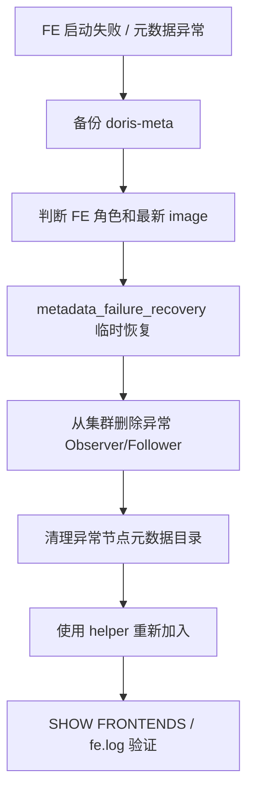

# Doris FE 元数据恢复边界

## 来源
- [Apache Doris FE 元数据常见故障处理方法](<../文章/done-Apache Doris FE 元数据常见故障处理方法.md>)

## 原文锚点

- 本地文件：[Apache Doris FE 元数据常见故障处理方法](<../文章/done-Apache Doris FE 元数据常见故障处理方法.md>)
- 原文链接：http://mp.weixin.qq.com/s?__biz=MzI4ODMyNTcwMw==&mid=2247485220&idx=1&sn=0329acc2f754072d0d45bbce751e9dbe
- 官方锚点：[Apache Doris Docs](https://doris.apache.org/docs/)、[Apache Doris GitHub](https://github.com/apache/doris)
- 关键段落：`metadata_failure_recovery`、Observer/Follower 删除和重加、`priority_networks`、`image.xxxx`。
- 关键图：无图。

## 图片处理

| 图片 | 类型 | 是否保留 | 理由 | 处理方式 |
|---|---|---|---|---|
| FE 恢复流程 | 流程图 | 重建 | 文章主问题是恢复步骤和风险边界 | Mermaid 重建 |

## 一句话结论

这篇文章只能精读“恢复边界”和“先备份再操作”的意识，不能照抄为当前 Doris 元数据恢复 SOP；原文版本旧、命令拼写和官方路径都需要二次核验。

## 用户相关性判断

| 项 | 内容 |
|---|---|
| 用户当前认知层级 | Doris / OLAP L2 draft |
| 认知成熟度 | draft |
| 阅读投入建议 | 精读 |
| 阅读投入理由 | 补 FE 元数据恢复入口，但原文面向 Doris 0.14.x，当前版本差异和危险操作必须降权 |
| 对用户的新信息 | FE 元数据恢复要区分 Follower/Observer、最新 image、网络身份和重加节点流程 |
| 问题指纹 | Doris + FE 元数据恢复 + metadata_failure_recovery/priority_networks/image/Observer-Follower 重加 + 启动失败边界 + 旧版本降权 |
| 排重判断 | 新建 |
| 置信度 | 中 |

## 认知校准点

| 校准点 | 文章观点/信息 | 与用户认知或价值观的关系 | 处理建议 |
|---|---|---|---|
| 元数据恢复是高风险动作 | 涉及删除 Observer/Follower、清理元数据目录、恢复模式 | 符合重工程落地和证据要求 | 必须先备份和确认角色 |
| 版本旧不能照抄 | 原文说适用于 0.14.7 之后，但当前 Doris 已多版本演进 | 防止版本污染 | 标记官方待复核 |
| 命令存在拼写风险 | 原文写 `show fontends`，应核对为 `SHOW FRONTENDS` | 防止错误沉淀 | 在笔记中纠正并标风险 |
| `priority_networks` 是身份绑定问题 | FE 记录的 host 与实际网卡不一致会启动失败 | 补 FE 启动阶段边界 | 写入 Doris index |

## 冲突点

| 冲突类型 | 具体表现 | 影响 | 处理 |
|---|---|---|---|
| 原目录冲突 | 原文在数据工程目录 | 主问题是 Doris FE 元数据和集群运维 | 重路由到 OLAP 与数据库 / Doris |
| 版本时效 | Doris 0.14.x 时代经验 | 当前版本可能不适用 | 只保留恢复原则 |
| 证据不足 | 没有完整错误日志、元数据目录结构、官方命令引用 | 不能作为 SOP | 标记待官方复核 |
| 危险操作 | 清理元数据目录、删除节点不可逆 | 可能扩大故障 | 必须先备份和确认多数派 |

## 待吸收点

| 分级 | 内容 | 为什么值得吸收 | 后续动作 |
|---|---|---|---|
| 理解 | FE 元数据恢复要先判断 Master/Follower/Observer 角色和多数派状态 | FE 故障处理不能无差别重启 | 更新 Doris index |
| 理解 | `metadata_failure_recovery` 应是临时恢复手段，恢复后关闭 | 避免长期运行在恢复模式 | 后续查官方 |
| 理解 | 多 FE 场景要比较 `image.xxxx` 找较新元数据 | 补恢复判断依据 | 待验证 |
| 记住 | 任何清理 `doris-meta` 前都要备份，并确认节点是否可重新加入 | 高风险运维准则 | 写入后续 SOP |
| 实践 | 在测试集群模拟 Observer 重建和 `priority_networks` 配置错误 | 可验证 FE 恢复链路 | 待实验 |

## 已知可跳过

| 内容 | 跳过理由 |
|---|---|
| “解决 99% 问题” | 证据不足，标题化表达 |
| 0.14.7 之前版本外链 | 历史信息，除非维护旧集群 |
| 没有日志的错误描述 | 不能作为诊断依据 |

## 实践门槛

| 门槛 | 判断 | 证据 |
|---|---|---|
| 可运行 | 部分 | 有配置项和 ALTER SYSTEM 示例 |
| 可验证 | 部分 | 可用 `SHOW FRONTENDS` 和 `fe.log` 验证 |
| 可排障 | 部分 | 有两个启动问题路径，但缺完整日志 |
| 可迁移 | 部分 | 当前版本需官方核验 |
| 结论 | 降为精读 | 高风险旧版本运维经验，不判实践 |

## 归类判断

| 项 | 内容 |
|---|---|
| 技术本体 | Apache Doris FE 元数据与集群角色 |
| 文章主问题 | FE 元数据故障和启动失败恢复 |
| 使用场景 | Doris 集群 FE 运维 |
| 关键词干扰 | 数据工程目录、元数据、恢复 |
| 最终归类 | OLAP 与数据库 / OLAP 引擎 / Doris |
| 归类理由 | FE 是 Doris 查询和元数据控制平面，不属于数仓元数据治理 |

## 技术定位

| 项 | 内容 |
|---|---|
| 技术类型 | 运维排障案例 |
| 所属领域 | OLAP 与数据库 |
| 二级类目 | OLAP 引擎 |
| 全局架构位置 | Doris FE 控制面和元数据层 |
| 涉及模块 | FE、Follower、Observer、BDBJE 元数据、网络身份 |
| 解决问题 | FE 启动失败、元数据异常、Observer/Follower 重建 |
| 原文局限 | 旧版本、缺官方链接、缺完整日志 |
| 我的结论 | 以后关注，必须官方复核后才能实践 |

## 纵向理解

| 维度 | 判断 |
|---|---|
| 全局架构 | Client -> FE SQL/Metadata/Planner -> BE Storage/Execution |
| 本文位置 | 只讲 FE 元数据恢复，不讲查询优化和 BE |
| 核心机制 | FE 依赖本地元数据镜像和日志，节点角色与网络身份必须一致 |
| 使用链路 | 备份 -> 判断角色和最新 image -> 临时恢复 -> 删除/重加节点 -> 验证 |
| 前置条件 | 有可用 Master/Follower、多数派状态清楚、元数据目录备份 |
| 边界 | 元数据损坏、版本差异、无法形成多数派时不能按文章简化处理 |

## 横向对标

| 对标技术 | 实现方式 | 优势 | 劣势 | 适合场景 |
|---|---|---|---|---|
| Doris FE 恢复 | 控制面元数据恢复和节点重加 | 与 Doris 角色模型直接对应 | 高风险，版本差异大 | Doris FE 启动和元数据故障 |
| StarRocks FE 恢复 | 类似 FE/BDBJE 控制面 | 架构相近 | 命令和细节不同 | StarRocks 集群运维 |
| Hive Metastore 恢复 | 独立元数据库恢复 | 与数仓元数据结合 | 不涉及 MPP FE 多数派 | Hive 元数据服务 |

## 后续追查

- 关键词：Doris FE metadata_failure_recovery、priority_networks、BDBJE、SHOW FRONTENDS、doris-meta。
- 相关技术：Doris FE 高可用、Observer、Follower、Master、FE edit log。
- 需要补读的文章：Doris 当前版本 FE FAQ、元数据备份恢复、FE 扩缩容和 BDBJE 故障处理。

