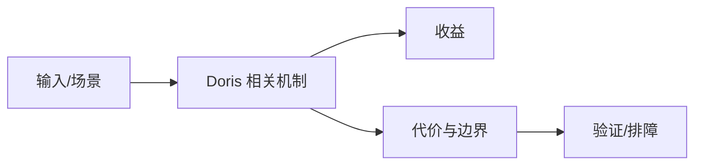

# 架构与 Pipeline 执行边界

## 来源
- [Apache Doris 为分析而生开篇：整体架构！](<../文章/done-Apache Doris 为分析而生开篇：整体架构！.md>)
- [再见火山模型！Doris2.0 正式将Pipeline模型确定为新一代执行模型 ↗](<../文章/done-再见火山模型！Doris2.0 正式将Pipeline模型确定为新一代执行模型 ↗.md>)
- [「硬刚Doris系列」Apache Doris的向量化和Roaring BitMap](<../文章/done-「硬刚Doris系列」Apache Doris的向量化和Roaring BitMap.md>)
- [Doris实践分享_它做了哪些架构优化和场景优化？](<../文章/done-Doris实践分享_它做了哪些架构优化和场景优化？.md>)

## 核心问题
Doris 的性能不是单一列存能力，而是 FE 查询规划、BE 向量化执行、Pipeline 调度、Runtime Filter、Bitmap 等多个环节共同作用。Pipeline 模型的价值在于降低阻塞、提升并行度和资源利用，但查询仍受数据分布、算子代价和资源组限制。

## 判断准则
- 遇到慢查询先区分规划慢、执行慢、数据倾斜、内存不足还是 Compaction/导入干扰。
- Pipeline 是执行模型升级，不等于所有 SQL 自动变快；复杂 Join 和大聚合仍要看计划和数据分布。

## 认知偏差
| 常见错误认知 | 正确理解 |
|---|---|
| 只要文章给了性能数字或最佳实践，就可以直接复用 | 必须确认版本、数据规模、查询/写入模式、硬件和失败场景 |
| 只按标题中的技术名归类 | 以正文主问题和技术本体归类 |
| 能跑通示例就等于生产可用 | 还要验证权限、恢复、监控、重试、成本和边界条件 |
| “再见火山模型”是传播表达，工程上要看 Profile 中算子耗时和 Pipeline 阻塞点。 | 把它记录为降权或待验证点，而不是稳定结论 |

## 架构/流程图（如有）

## 待验证缺口
- 需要补官方 Profile 字段、Pipeline 指标和 Doris 2.x/3.x 行为差异。
