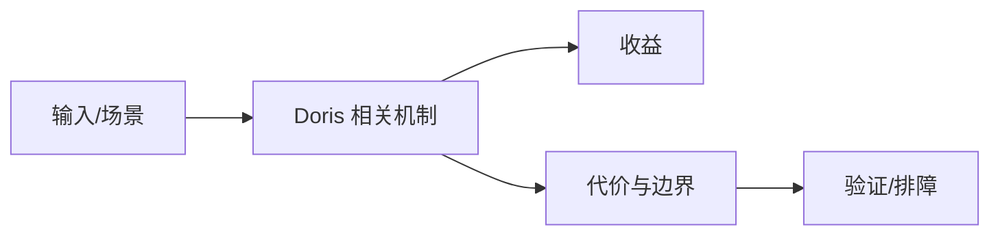

# 版本演进与弹性冷存候选

## 来源
- [版本通告｜Apache Doris (incubating) 1.0 Release 版本正式发布！](<../文章/done-版本通告｜Apache Doris (incubating) 1.0 Release 版本正式发布！.md>)
- [[2.0快速体验]Apache Doris 2.0 弹性计算节点快速体验](<../文章/done-[2.0快速体验]Apache Doris 2.0 弹性计算节点快速体验.md>)
- [Apache Doris 2.0 冷热分离快速体验](<../文章/done-Apache Doris 2.0 冷热分离快速体验.md>)
- [Doris 解析 _ Apache Doris 极速1.0版本解析与未来规划](<../文章/done-Doris 解析 _ Apache Doris 极速1.0版本解析与未来规划.md>)

## 核心问题
Doris 版本资讯类文章只适合作为演进锚点，不能直接沉淀成稳定能力结论。1.0、2.0 这类发布信息要进入版本记录，后续用官方 Release Notes 校验弹性计算、冷热分离、执行模型和兼容性变化。

## 判断准则
- 版本文章先记录“待官方校验”的能力变化，不直接写成生产准则。
- 冷热分离和弹性计算要额外验证对象存储成本、查询延迟、资源隔离和故障恢复。

## 认知偏差
| 常见错误认知 | 正确理解 |
|---|---|
| 只要文章给了性能数字或最佳实践，就可以直接复用 | 必须确认版本、数据规模、查询/写入模式、硬件和失败场景 |
| 只按标题中的技术名归类 | 以正文主问题和技术本体归类 |
| 能跑通示例就等于生产可用 | 还要验证权限、恢复、监控、重试、成本和边界条件 |
| 发布通告和快速体验容易夸大可用性，缺少生产规模、失败场景和回滚路径。 | 把它记录为降权或待验证点，而不是稳定结论 |

## 架构/流程图（如有）

## 待验证缺口
- 需要联网补 Doris 官方 Release Notes 后再升级为 verified。
