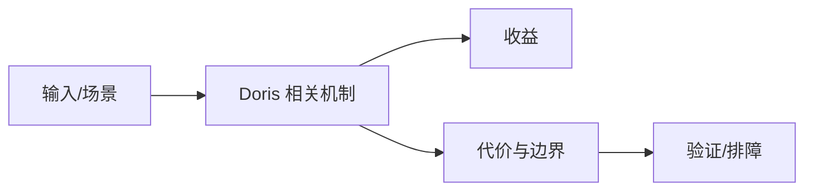

# 索引、统计信息与查询缓存边界

## 来源
- [深入浅出 Apache Doris 索引机制：原理详解 + 实战案例全掌握](<../文章/done-深入浅出 Apache Doris 索引机制：原理详解 + 实战案例全掌握.md>)
- [深度解析｜Apache Doris 索引机制解析](<../文章/done-深度解析｜Apache Doris 索引机制解析.md>)
- [从3分钟到10秒：Doris统计信息背后不得不说的故事](<../文章/done-从3分钟到10秒：Doris统计信息背后不得不说的故事.md>)
- [我用Doris SQL Cache拯救了每日早会，太绝了！](<../文章/done-我用Doris SQL Cache拯救了每日早会，太绝了！.md>)

## 核心问题
Doris 查询优化要把索引、统计信息、CBO 和缓存放在同一条链路里看。索引负责减少扫描，统计信息影响计划选择，SQL Cache 只适合重复且结果可复用的查询。

## 判断准则
- 统计信息过期会导致 Join 顺序和扫描路径错误，调索引前先检查统计信息。
- Bloom/Ngram/倒排等索引要匹配谓词类型，不能把所有查询都寄托在一个索引上。
- SQL Cache 适合报表类重复查询，不适合高变更、强实时或参数高度离散的查询。

## 认知偏差
| 常见错误认知 | 正确理解 |
|---|---|
| 只要文章给了性能数字或最佳实践，就可以直接复用 | 必须确认版本、数据规模、查询/写入模式、硬件和失败场景 |
| 只按标题中的技术名归类 | 以正文主问题和技术本体归类 |
| 能跑通示例就等于生产可用 | 还要验证权限、恢复、监控、重试、成本和边界条件 |
| “加索引就快”是关系库思维，Doris 还要看列存扫描、分区裁剪、Segment、Tablet 和 CBO。 | 把它记录为降权或待验证点，而不是稳定结论 |

## 架构/流程图（如有）

## 待验证缺口
- 需要用真实 EXPLAIN/Profile 对照不同索引和统计信息刷新策略。
