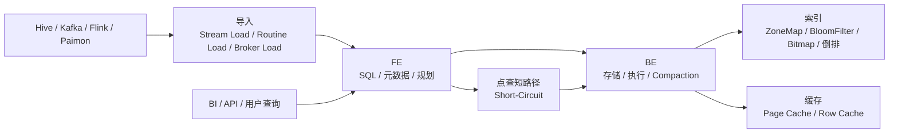

# Doris
## 知识点入口

- 本模块先看宏观流程，再看文章：[知识地图](040102_核心知识点/知识地图.md)。
- 新文章必须先归入流程节点，再判断是补充、冲突、不同层次还是降权。
- `文章/` 只保留原文锚点，长期知识必须沉淀到 `040102_核心知识点/`。

## 技术定位

| 项 | 内容 |
|---|---|
| 技术名 | Apache Doris |
| 一级类目 | OLAP 与数据库 |
| 二级类目 | OLAP 引擎 |
| 技术本体 | 面向实时分析、报表、即席查询和服务化分析的 MPP 分析型数据库 |
| 全局架构位置 | 位于数仓/湖仓加工层之后，承担交互式查询、聚合分析、服务化分析和部分高并发点查出口 |
| 主要使用者 | OLAP 平台工程师、数据开发、分析应用工程师、DBA |
| 主要产出 | Doris 表、物化视图、索引、查询服务、分析 API |

## 官方锚点

- 官网：[Apache Doris](https://doris.apache.org/)
- GitHub：[apache/doris](https://github.com/apache/doris)
- 官方文档：[Doris Docs](https://doris.apache.org/docs/)

## 架构图

## 核心模块

| 模块 | 职责 | 重点问题 |
|---|---|---|
| FE | SQL 接入、元数据、查询规划、调度 | 高并发下的解析和计划开销 |
| FE 高可用 | Master/Follower/Observer 管理元数据和读写角色 | 多数派、选主、元数据日志、状态采集 |
| 导入链路 | Stream/Routine/Broker/Insert 等导入方式的事务化写入 | Label 幂等、FE 事务、Coordinator BE、MemTable、Publish 可见性 |
| BE | 数据存储、向量化执行、Compaction | 存储模型、内存、Compaction、查询执行 |
| 表模型 | Aggregate、Unique、Duplicate、Primary Key 等 | 建模是否匹配更新、聚合和点查需求 |
| Compaction | Rowset 版本、小文件和删除版本后台治理 | BC/CC、Cumulative Point、Delete 版本、Compaction Score |
| 索引与物化视图 | 减少扫描、预计算、加速过滤 | 索引适配条件、维护成本、命中率 |
| 点查优化 | 行存、Row Cache、Short-Circuit、Prepared Statement | 服务化点查是否适合交给 Doris |

## 横向对标

| 对标技术 | 对标点 | Doris 优势 | Doris 劣势 | 使用判断 |
|---|---|---|---|---|
| StarRocks | 实时 OLAP、MPP 查询 | Doris 生态和导入能力成熟，场景覆盖广 | 具体性能要按版本和场景压测 | 两者都需用真实查询和运维成本评估 |
| ClickHouse | 高性能列式分析 | Doris 的导入、更新、服务化场景较完整 | ClickHouse 在部分明细分析和压缩性能上很强 | 需要更新和一体化时看 Doris；极致明细分析压测 ClickHouse |
| Elasticsearch | 检索和聚合 | Doris 更适合 SQL 分析和宽表聚合 | 复杂全文检索生态不如 ES | SQL 分析选 Doris，全文检索选 ES |
| Redis / KV | 点查 | Doris 可承接部分分析型点查 | 延迟和稳定性不等同在线 KV | 高频在线交易点查仍优先 KV，分析型点查可评估 Doris |

## 已沉淀核心知识点

| 主题 | 文件 | 问题指纹 | 解决什么问题 | 认知增量 |
|---|---|---|---|---|
| 高并发点查 | [Doris如何实现高并发点查](040102_核心知识点/Doris如何实现高并发点查.md) | Doris + 点查路径 + 行存/Row Cache/Short-Circuit + 高并发整行查询 + 不替代 KV | Doris 点查为什么需要行存、缓存和短路径 | 把“OLAP 能点查”校准为“特定分析型点查场景可评估” |
| BE 内存 Heap Profile 排查 | [DorisBE内存问题HeapProfile排查](040102_核心知识点/DorisBE内存问题HeapProfile排查.md) | Doris + BE 内存 + Jemalloc Heap Profile/jeprof diff + 泄漏定位 + 生产排障 | Doris BE 内存持续增长时如何区分正常增长和泄漏，并用 diff 定位调用栈 | 把“内存高”校准为“先看负载是否脱钩，再做 baseline/diff 排查” |
| FE 运维 SOP | [DorisFE运维SOP](040102_核心知识点/DorisFE运维SOP.md) | Doris + FE 运维 + Follower/Observer/Master/多数派/日志/SHOW FRONTENDS/jstack/jmap + 故障证据采集 SOP | Doris FE 故障前如何统一角色认知并采集有效证据 | FE 排障要先看角色、多数派、日志、版本和 JVM/系统快照，避免凭感觉救火 |
| FE 元数据恢复边界 | [DorisFE元数据恢复边界](040102_核心知识点/DorisFE元数据恢复边界.md) | Doris + FE 元数据恢复 + metadata_failure_recovery/priority_networks/image/Observer-Follower 重加 + 启动失败边界 + 旧版本降权 | Doris FE 元数据恢复时如何区分恢复原则和旧版本危险操作 | 把“恢复步骤”校准为“先备份、确认角色和版本，再官方复核” |
| Compaction 版本治理与删除边界 | [DorisCompaction版本治理与删除边界](040102_核心知识点/DorisCompaction版本治理与删除边界.md) | Doris + Compaction + Rowset/BC/CC/CP/Delete Version/Segment Compaction + 写入版本治理 + 删除与小文件失败场景 | Doris 如何治理 Rowset 版本、小文件、删除版本和查询合并成本 | 把 Compaction 视为导入、删除、查询成本之间的后台治理机制 |
| 数据导入事务与攒批边界 | [Doris数据导入事务与攒批边界](040102_核心知识点/Doris数据导入事务与攒批边界.md) | Doris + 导入链路 + Label/FE 事务/Coordinator BE/MemTable/Rowset/Group Commit + 延迟吞吐取舍 + 小批写入边界 | Doris 导入为什么是事务、幂等、MemTable 和 Rowset 的系统工程 | 把“实时写入”校准为延迟、吞吐和 Compaction 压力的取舍 |
| 表模型选择边界 | [Doris表模型选择边界](040102_核心知识点/Doris表模型选择边界.md) | Doris + 表模型 + Duplicate/Unique/Aggregate/部分列更新 + 写入/查询/灵活性取舍 + 建模边界 | Doris 表模型如何影响明细保留、更新分析和预聚合 | 降权“性能 100 倍”，保留存储模型选择准则 |

## 后续追查

- Doris 点查场景和 Redis/KV 的边界。
- Row Store、Row Cache、Short-Circuit、Prepared Statement 的版本要求和限制。
- Doris 查询计划、统计信息、索引对性能的影响。
- Doris 内存管理、Heap Profile 参数和生产采集收尾 SOP。
- Doris FE 磁盘满、时钟不同步、无法选主、BDBJE 元数据日志和 `SHOW FRONTENDS` 关键字段。
- Doris 当前版本表模型、Group Commit、Segment Compaction、Delete 版本处理和导入错误排查。
