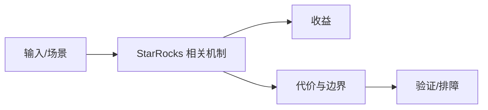

# FE 内存与 Tablet 排障边界

## 来源
- [StarRocks FE 内存异常排查实战：从监控到根因定位（附真实案例）](<../文章/done-StarRocks FE 内存异常排查实战：从监控到根因定位（附真实案例）.md>)
- [对StarRocks的tablet的理解和实验](<../文章/done-对StarRocks的tablet的理解和实验.md>)

## 核心问题
StarRocks 排障不能只看 SQL 慢不慢，FE 元数据、Tablet 数量、调度状态、内存对象和查询计划都可能是瓶颈。Tablet 是分布式存储和调度的基本单元，数量、分布和状态会影响 FE/BE 内存、Compaction 和查询并发。

## 判断准则
- FE 内存异常先看元数据规模、Tablet/Partition 数、查询计划缓存和 Profile，而不是直接扩容。
- Tablet 实验结论只能作为理解入口，生产判断要结合副本、分区、Compaction 和资源组。

## 认知偏差
| 常见错误认知 | 正确理解 |
|---|---|
| 只要文章给了性能数字或最佳实践，就可以直接复用 | 必须确认版本、数据规模、查询/写入模式、硬件和失败场景 |
| 只按标题中的技术名归类 | 以正文主问题和技术本体归类 |
| 能跑通示例就等于生产可用 | 还要验证权限、恢复、监控、重试、成本和边界条件 |
| 把 Tablet 当成“表分片”过于粗糙，真正影响的是元数据、调度和数据文件生命周期。 | 把它记录为降权或待验证点，而不是稳定结论 |

## 架构/流程图（如有）

## 待验证缺口
- 需要补官方 FE 内存指标和 Tablet 状态查询命令。
