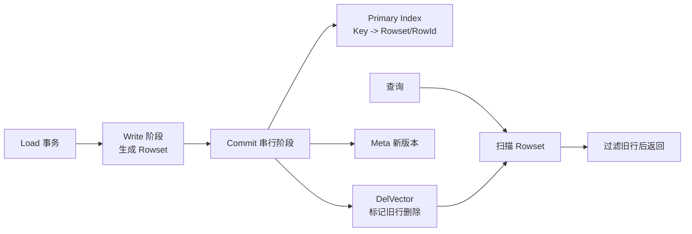

# StarRocks Primary Key 事务与 DelVector 读写边界

## 来源
- [StarRocks 技术内幕：实时更新与极速查询如何兼得](<../文章/done-StarRocks 技术内幕：实时更新与极速查询如何兼得.md>)

## 原文锚点

- 本地文件：[StarRocks 技术内幕：实时更新与极速查询如何兼得](<../文章/done-StarRocks 技术内幕：实时更新与极速查询如何兼得.md>)
- 原文链接：`http://mp.weixin.qq.com/s?__biz=MzI1MTYxOTkxNQ==&mid=2247485927&idx=1&sn=56051046f9eb51a563c6c24eb22c9364`
- 关键段落：Copy-on-Write、Merge-on-Read、Delta Store、Delete-and-Insert、导入事务 Write/Commit、Tablet 内部结构、Primary Index、DelVector、并发冲突、Compaction、读取流程。
- 关键图：正文引用多张结构和流程图，本地 Markdown 没有图片链接。

## 图片处理

| 图片 | 类型 | 是否保留 | 理由 | 处理方式 |
|---|---|---|---|---|
| 更新方案对比图 | 对比图 | 原图缺失 | 是横向理解核心 | 用表格重建 |
| Tablet 内部结构图 | 架构图 | 原图缺失 | 解释 Meta/Rowset/Index/DelVector | Mermaid 重建 |
| 写入和读取流程图 | 流程图 | 原图缺失 | 解释读写取舍 | Mermaid 重建 |

## 一句话结论

这篇文章值得精读：StarRocks Primary Key 的价值不只是“能 Upsert”，而是用主键索引和 DelVector 把更新冲突前移到写入提交阶段，让读取尽量避开 Merge-on-Read 的代价。

## 用户相关性判断

| 项 | 内容 |
|---|---|
| 用户当前认知层级 | StarRocks / OLAP 引擎：L2 draft |
| 认知成熟度 | draft |
| 阅读投入建议 | 精读 |
| 阅读投入理由 | 相比已有 Primary Key 笔记，本文补充事务阶段、主键索引内存、并发冲突和 Compaction 读写边界 |
| 对用户的新信息 | Write 阶段可并行生成 Rowset，Commit 阶段串行更新 Primary Index 和 DelVector；冲突通过标记旧记录删除解决 |
| 问题指纹 | StarRocks + Primary Key + Write/Commit/Primary Index/DelVector/Compaction + 实时 Upsert 查询性能 + CDC/ELT 更新边界 |
| 排重判断 | 新建，和已有 Primary Key 笔记互补 |
| 置信度 | 高 |

## 认知校准点

| 校准点 | 文章观点/信息 | 与用户认知或价值观的关系 | 处理建议 |
|---|---|---|---|
| PK 模型不是简单“更新覆盖” | 它通过主键索引找到旧位置，再用 DelVector 标记删除并写新 Rowset | 补底层机制 | 写入 StarRocks index |
| Write 和 Commit 的资源瓶颈不同 | Write 可并行，Commit 串行且主要消耗在 Primary Index | 补生产边界 | 压测要分写入吞吐和提交延迟 |
| 主键索引有内存成本 | Primary Index 维护在内存中，按需构建并可能释放 | 防止只看查询收益 | 关注热分区和主键宽度 |
| DelVector 解决冲突但制造后台治理需求 | 更新删除会产生删除标记，Compaction 还要维护索引一致性 | 补失败场景 | 与 Compaction 笔记关联 |
| CDC 是使用场景，不是文章主问题 | 原文提到 TP Binlog 同步到 AP 系统 | 归类边界 | 同步链路归数据集成，存储更新机制归 OLAP |

## 冲突点

| 冲突类型 | 具体表现 | 影响 | 处理 |
|---|---|---|---|
| 图片缺失 | 多张结构图和流程图缺失 | 影响机制理解 | Mermaid 重建 |
| 证据不足 | 3-5 倍、10 倍性能数字缺少本地基线 | 不能直接做选型结论 | 只保留机制和待验证 |
| 排重冲突 | 已有 `StarRocksPrimaryKey实时更新模型.md` | 可能重复沉淀 | 本文只补事务、索引内存、DelVector/Compaction 冲突 |
| 原目录冲突 | 文章来源中存在数据工程目录重复副本 | 容易重复处理 | 只保留 OLAP 原文，数据工程副本跳过 |

## 待吸收点

| 分级 | 内容 | 为什么值得吸收 | 后续动作 |
|---|---|---|---|
| 理解 | Copy-on-Write、Merge-on-Read、Delta Store、Delete-and-Insert 是列存更新的主要路线 | 帮助横向对标 Doris/ClickHouse/Hudi/Kudu | 写入对标表 |
| 理解 | StarRocks PK 事务分 Write 和 Commit，Commit 更新主键索引和 DelVector | 解释并发写入和提交瓶颈 | 后续追查 Profile/指标 |
| 记住 | Primary Index 内存占用由主键、热分区和写入活跃度决定 | 影响生产容量 | 追查 Persistent Index |
| 记住 | 读取快来自去除读时 Merge、谓词下推和并行扫描 | 解释为什么不只是“更新能力” | 与 ClickHouse ReplacingMergeTree 对比 |
| 实践 | 对同一 CDC 场景压测 PK 表写入、Commit 延迟、查询 P99、Compaction 积压和内存 | 可验证 | 后续补实验 |

## 已知可跳过

| 内容 | 跳过理由 |
|---|---|
| 实时分析趋势和客户数量 | 营销背景 |
| 性能倍数宣传 | 缺本地基线 |
| 文章尾部系列推荐 | 不进入知识点 |

## 实践门槛

| 门槛 | 判断 | 证据 |
|---|---|---|
| 可运行 | 否 | 原文没有完整建表和导入 SQL |
| 可验证 | 部分 | 机制可通过导入和查询 Profile 验证，但缺具体命令 |
| 可排障 | 部分 | 能解释 Commit、Primary Index、DelVector、Compaction 冲突 |
| 可迁移 | 是 | 可迁移到 CDC 后实时分析表选型 |
| 结论 | 降为精读 | 需要官方文档和实验补实践 |

## 归类判断

| 项 | 内容 |
|---|---|
| 技术本体 | StarRocks Primary Key 表模型 |
| 文章主问题 | StarRocks 如何在列存 OLAP 中兼顾实时更新和快速查询 |
| 使用场景 | TP Binlog/CDC 入 AP、订单状态、用户画像、实时 ELT |
| 关键词干扰 | CDC、ELT、Binlog 是使用场景，不改变主类目 |
| 最终归类 | OLAP 与数据库 / OLAP 引擎 / StarRocks |
| 归类理由 | 主问题是 StarRocks 存储更新和查询机制，不是 Flink CDC 同步链路 |

## 技术定位

| 项 | 内容 |
|---|---|
| 技术类型 | OLAP 实时更新表模型与事务机制 |
| 所属领域 | OLAP 与数据库 |
| 二级类目 | OLAP 引擎 |
| 全局架构位置 | StarRocks BE Tablet 存储层和导入提交路径 |
| 涉及模块 | Tablet、Rowset、Meta、Primary Index、DelVector、RocksDB、Compaction、Load 事务 |
| 解决问题 | 在实时 Upsert/Delete 场景下降低查询读时合并成本 |
| 原文局限 | 图缺失，性能数据需本地压测，未来特性有时效风险 |
| 我的结论 | 以后关注，作为 StarRocks 实时更新机制深水区 |

## 跨域判断

| 问题 | 判断 |
|---|---|
| 它本体属于哪里 | OLAP 与数据库 / OLAP 引擎 |
| 这篇文章为什么可能跨域 | CDC、Binlog、ELT 会让文章看起来像数据集成 |
| 当前文章主问题是否改变分类 | 不改变，本文核心是 StarRocks Primary Key 存储机制 |
| 应避免的误归类 | 不把 Flink CDC -> StarRocks 端到端链路重复写进 OLAP |

## 纵向理解

| 维度 | 判断 |
|---|---|
| 全局架构 | 上游导入 -> Load Write -> Rowset -> Commit -> Primary Index/DelVector/Meta -> Query Scan |
| 本文位置 | Primary Key 表的读写路径，不讲 Query Cache、MV 和存算分离 Compaction |
| 核心机制 | Delete-and-Insert、Primary Index、DelVector、串行 Commit、Compaction 原子替换 Rowset |
| 使用链路 | 建 PK 表 -> CDC/批量 Upsert -> Commit 更新索引和删除标记 -> 查询过滤旧行 -> Compaction 整理 |
| 前置条件 | 主键设计、热分区控制、内存预算、更新频率、查询延迟目标明确 |
| 边界 | 不替代 OLTP；主键索引内存、提交串行、删除标记积压和 Compaction 都可能成为瓶颈 |

## 横向对标

| 对标技术 | 实现方式 | 优势 | 劣势 | 适合场景 |
|---|---|---|---|---|
| StarRocks PK | Primary Index + DelVector + Delete-and-Insert | 查询避免读时 Merge | 索引内存和 Commit 成本 | CDC 实时分析 |
| ClickHouse ReplacingMergeTree | Merge-on-Read/后台 merge 去重 | 写入简单 | 查询可能要处理多版本 | 低频更新或最终一致分析 |
| Doris Unique/Primary | 主键/唯一模型支持更新分析 | 与 Doris 导入生态结合 | 细节需按版本验证 | Doris 实时宽表 |
| Kudu Delta Store | 主存储 + Delta 合并 | 更新模型成熟 | 系统复杂度高 | 更新分析和明细服务 |
| 湖格式 Copy-on-Write | 更新重写文件 | 查询简单 | 写入代价高 | T+1 或低频更新 |

## 后续追查

- 关键词：StarRocks Primary Key、Delete-and-Insert、Primary Index、DelVector、Persistent Index、Load Commit、Partial Update。
- 相关技术：StarRocks Compaction、Doris Unique/Primary Key、ClickHouse ReplacingMergeTree、Flink CDC。
- 需要补读的文章：StarRocks 当前版本 Primary Key 官方文档、Persistent Index、Partial Update、PK 表 Compaction 与内存监控。
