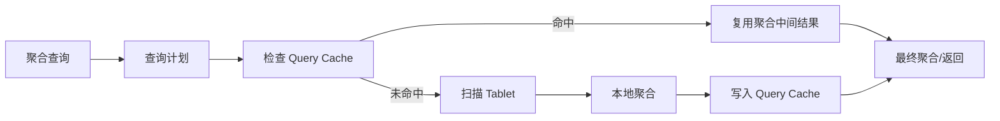

# StarRocks Query Cache 中间聚合缓存

## 原文锚点

- 本地文件：[当高并发来袭：StarRocks Query Cache 一招搞定！](<../文章/当高并发来袭：StarRocks Query Cache 一招搞定！.md>)
- 原文链接：http://mp.weixin.qq.com/s?__biz=MzI1MTYxOTkxNQ==&mid=2247490921&idx=1&sn=9fc54c02d5395e112d0021686fb1bf6c
- 关键段落：Query Cache 定位、语义等价查询、分区重合查询、多版本缓存、最佳实践、Profile 指标。
- 关键图：原文提到机制图和查询示意图，但本地 Markdown 无图。

## 图片处理

| 图片 | 类型 | 是否保留 | 理由 | 处理方式 |
|---|---|---|---|---|
| Query Cache 机制图 | 架构图/说明图 | 原图缺失 | 帮助理解缓存的是中间聚合结果而不是最终结果 | 标记原图缺失，Mermaid 重建简化链路 |

## 一句话结论

这篇文章值得精读，但要降权“一招搞定”的宣传口吻；真正要记住的是 Query Cache 缓存聚合中间结果，不是 Result Cache，适合高并发相似聚合查询。

## 用户相关性判断

| 项 | 内容 |
|---|---|
| 用户当前认知层级 | StarRocks / OLAP L2 draft |
| 认知成熟度 | draft |
| 阅读投入建议 | 精读 |
| 阅读投入理由 | 机制和适用边界清楚，有 Profile 观察点；但性能数字仍需按本地数据和版本验证 |
| 对用户的新信息 | Query Cache 可复用语义等价、分区重合和 append-only 多版本场景下的中间聚合结果 |
| 问题指纹 | StarRocks + Query Cache + 中间聚合结果/语义等价/分区重合/append-only 多版本 + 高并发聚合查询 + 命中率边界 |
| 排重判断 | 新建 |
| 置信度 | 高 |

## 认知校准点

| 校准点 | 文章观点/信息 | 与用户认知或价值观的关系 | 处理建议 |
|---|---|---|---|
| Query Cache 不是 Result Cache | 缓存本地聚合中间结果 | 纠偏：不能按最终结果缓存理解 | 写入 StarRocks index |
| 命中依赖查询模式 | 语义等价、分区重合、append-only 更容易复用 | 补充：不是所有查询都有效 | 选型时先看查询相似性 |
| 分区和分桶影响命中 | date/datetime 分区、合理分区大小、分桶数量影响 Cache 生效 | 补充：建模会影响查询缓存 | 和建模准则关联 |
| 性能数字需验证 | 厂商文章给 3-17 倍收益 | 降权：有硬件和数据集但仍非用户场景 | 标为待压测 |

## 冲突点

| 冲突类型 | 具体表现 | 影响 | 处理 |
|---|---|---|---|
| 标题降权 | “一招搞定”有营销口吻 | 容易夸大适用范围 | 只保留机制和边界 |
| 图片缺失 | 机制图和查询示意图缺失 | 影响理解 | Mermaid 重建 |
| 证据不足 | 性能数据来自特定 SSB 100GB、10 并发环境 | 不能直接迁移 | 标为待验证 |
| 适用边界 | append-only 场景更适合；更新删除会影响缓存复用 | 误用会降低命中 | 写入待吸收 |

## 待吸收点

| 分级 | 内容 | 为什么值得吸收 | 后续动作 |
|---|---|---|---|
| 理解 | Query Cache 缓存聚合中间结果 | 是和 Result Cache 的关键差异 | 写入 StarRocks index |
| 理解 | 谓词区间按分区切分后可复用重合分区结果 | 解释为什么分区设计影响缓存 | 后续补建模测试 |
| 记住 | append-only 场景可通过多版本缓存合并增量数据 | 影响实时写入下的缓存可用性 | 后续查官方文档 |
| 记住 | BE 本地缓存与副本有关，查询至少执行副本数次才能充分加载 | 影响压测和判断命中 | 实验时控制副本数 |
| 实践 | 打开 Query Cache、Profile、`/api/query_cache/stat` 检查 hit_count 和 RawRowsRead | 有明确验证动作 | 可作为后续实验 |

## 已知可跳过

| 内容 | 跳过理由 |
|---|---|
| 报表高峰期高并发 | 背景常识 |
| StarRocks 品牌和客户案例 | 营销信息 |
| Query Cache 提高性能的泛化描述 | 必须落到命中条件和 Profile 指标 |

## 实践门槛

| 门槛 | 判断 | 证据 |
|---|---|---|
| 可运行 | 部分 | 有 SQL 参数和 API |
| 可验证 | 部分 | 有 Query Cache stat 和 Profile 指标 |
| 可排障 | 部分 | 能看 hit_count、RawRowsRead，但缺失效原因清单 |
| 可迁移 | 是 | 可迁移到高并发聚合报表 |
| 结论 | 降为精读 | 可以后续升级为实践，但当前未在本地验证 |

## 归类判断

| 项 | 内容 |
|---|---|
| 技术本体 | StarRocks 是 OLAP 引擎 |
| 文章主问题 | Query Cache 如何复用聚合中间结果提升高并发查询 |
| 使用场景 | 高频相似聚合查询、宽表聚合、星型模型聚合、append-only 数据 |
| 关键词干扰 | 高并发、缓存、性能提升 |
| 最终归类 | OLAP 与数据库 / OLAP 引擎 / StarRocks |
| 归类理由 | 主问题是 StarRocks 查询执行和缓存机制，不是通用缓存或数据工程调度 |

## 纵向理解

| 维度 | 判断 |
|---|---|
| 全局架构 | Query Cache 位于 BE 查询执行链路，缓存本地聚合中间结果 |
| 本文位置 | 只讲查询缓存，不讲物化视图、Compaction 或主键更新 |
| 核心机制 | 语义等价复用、分区重合复用、多版本 append-only 复用 |
| 使用链路 | 开启 Query Cache -> 执行相似聚合查询 -> 查看 BE cache stat/Profile -> 判断命中 |
| 前置条件 | 查询模式重复、聚合查询频繁、分区设计合理、内存预算足够 |
| 边界 | 不适合高度随机查询、频繁更新删除、点查或低重复度查询 |

## Mermaid 重建

## 横向对标

| 对标技术 | 实现方式 | 优势 | 劣势 | 适合场景 |
|---|---|---|---|---|
| Query Cache | 缓存聚合中间结果 | 可复用相似查询和部分分区 | 依赖查询模式和内存 | 高频相似聚合 |
| Result Cache | 缓存最终结果 | 命中后最快 | 查询必须高度一致，数据变更失效 | 完全重复查询 |
| 物化视图 | 预计算并查询改写 | 稳定、可治理 | 维护成本和新鲜度问题 | 固定指标和报表 |
| 外部缓存 | 应用层缓存结果 | 简单可控 | 与 SQL 语义和数据版本割裂 | API 层固定查询 |

## 后续追查

- 关键词：StarRocks Query Cache、enable_query_cache、pipeline_dop、query_cache/stat、RawRowsRead、CachePopulate。
- 相关技术：物化视图、Result Cache、Doris Query Cache、ClickHouse query cache。
- 需要补读的文章：StarRocks Query Cache 官方文档、缓存失效机制、物化视图对比。
