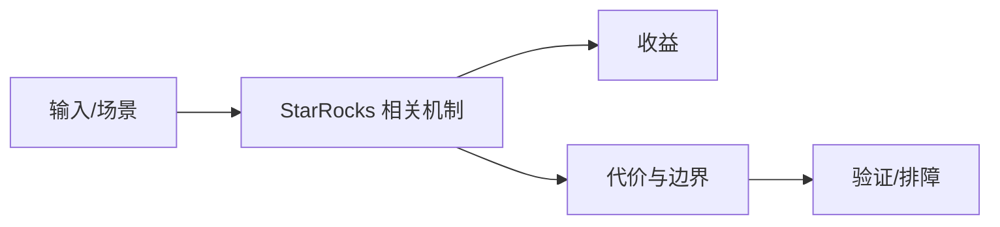

# SQL 指纹与生成列优化边界

## 来源
- [StarRocks的SQL指纹应用](<../文章/done-StarRocks的SQL指纹应用.md>)
- [StarRocks 生成列：百倍提速半结构化数据分析](<../文章/done-StarRocks 生成列：百倍提速半结构化数据分析.md>)
- [字节面试：StarRocks中如何优化大表JOIN？](<../文章/done-字节面试：StarRocks中如何优化大表JOIN？.md>)
- [玩转实时数仓必看：StarRocks四大模型深度对比！从CDC同步到即席查询，选对模型性能提升10倍！](<../文章/done-玩转实时数仓必看：StarRocks四大模型深度对比！从CDC同步到即席查询，选对模型性能提升10倍！.md>)

## 核心问题
StarRocks 查询优化既有表模型选择，也有面向查询治理的 SQL 指纹、生成列和 Join 策略。SQL 指纹用于归并同类查询和治理热点；生成列适合把半结构化字段的重复解析成本前置；大表 Join 要回到分布、Join Key、Runtime Filter 和物化视图。

## 判断准则
- 生成列适合高频稳定表达式，不适合临时探索和高变字段。
- SQL 指纹是治理工具，不直接优化单条 SQL；它帮助识别重复模式、热点和回归。
- 大表 Join 优化先看分区、分桶、统计信息和数据倾斜。

## 认知偏差
| 常见错误认知 | 正确理解 |
|---|---|
| 只要文章给了性能数字或最佳实践，就可以直接复用 | 必须确认版本、数据规模、查询/写入模式、硬件和失败场景 |
| 只按标题中的技术名归类 | 以正文主问题和技术本体归类 |
| 能跑通示例就等于生产可用 | 还要验证权限、恢复、监控、重试、成本和边界条件 |
| 面试题里的“百倍提速”不能离开数据分布和查询谓词复用频率。 | 把它记录为降权或待验证点，而不是稳定结论 |

## 架构/流程图（如有）

## 待验证缺口
- 需要用 Profile 验证生成列、物化视图和 Runtime Filter 的实际命中。
