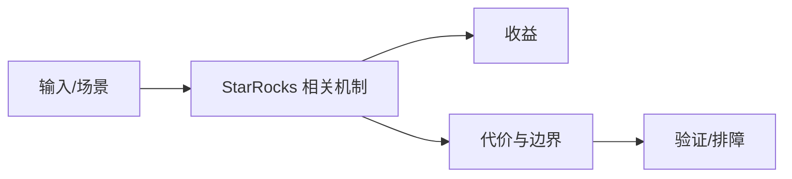

# 实时数仓与湖仓接入边界

## 来源
- [StarRocks × Apache Flink：如何构建简单强大的实时数仓架构](<../文章/done-StarRocks × Apache Flink：如何构建简单强大的实时数仓架构.md>)
- [入门 _ Apache InLong 轻松创建 MySQL -_ StarRocks 数据同步](<../文章/done-入门 _ Apache InLong 轻松创建 MySQL -_ StarRocks 数据同步.md>)
- [B 站基于 StarRocks 构建大数据元仓](<../文章/done-B 站基于 StarRocks 构建大数据元仓.md>)
- [Fresha 的实时分析进化：从 Postgres 和 Snowflake 走向 StarRocks](<../文章/done-Fresha 的实时分析进化：从 Postgres 和 Snowflake 走向 StarRocks.md>)
- [StarRocks在360的应用实践](<../文章/done-StarRocks在360的应用实践.md>)
- [欢聚集团 × StarRocks_ 灵活、统一、极速的数据分析新范式](<../文章/done-欢聚集团 × StarRocks_ 灵活、统一、极速的数据分析新范式.md>)

## 核心问题
StarRocks 在实时数仓里通常作为查询服务和更新分析层，上游由 Flink、InLong、CDC 或离线同步保证数据进入。业务案例的共性是把明细、聚合和服务化查询统一到 MPP 引擎，但写入一致性、延迟、模型选择和故障补偿仍归数据链路治理。

## 判断准则
- Flink/CDC 到 StarRocks 要明确全量初始化、增量写入、幂等键和回补策略。
- 元仓、Postgres 迁移、统一分析这类案例只在查询模式、并发和更新需求相似时可复用。

## 认知偏差
| 常见错误认知 | 正确理解 |
|---|---|
| 只要文章给了性能数字或最佳实践，就可以直接复用 | 必须确认版本、数据规模、查询/写入模式、硬件和失败场景 |
| 只按标题中的技术名归类 | 以正文主问题和技术本体归类 |
| 能跑通示例就等于生产可用 | 还要验证权限、恢复、监控、重试、成本和边界条件 |
| “实时数仓架构简单强大”容易弱化上游同步、Schema 演进和失败补偿成本。 | 把它记录为降权或待验证点，而不是稳定结论 |

## 架构/流程图（如有）

## 待验证缺口
- 需要补 Flink Connector/Stream Load 的失败重试和一致性边界。
