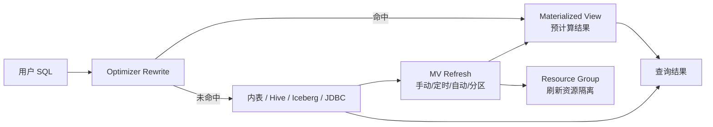

# StarRocks 物化视图建模与透明加速

## 原文锚点

- 本地文件：[重新定义物化视图，你必须拥有的极速湖仓神器！](../文章/重新定义物化视图，你必须拥有的极速湖仓神器！.md)
- 原文链接：http://mp.weixin.qq.com/s?__biz=MzI1MTYxOTkxNQ==&mid=2247490902&idx=1&sn=0bd03778216286548f5d02a2df33466a&chksm=e9f16272de86eb645470a514afb35d6618d805d5358b7afa7b57f897c81ce2902e01d446064d&mpshare=1&scene=24&srcid=1226rPwxG9V0yRiZ56mVOdG5&sharer_shareinfo=2dd478230c0877654fd665313511af16&sharer_shareinfo_first=2dd478230c0877654fd665313511af16#rd
- 官方锚点：[StarRocks Asynchronous materialized views](https://docs.starrocks.io/docs/using_starrocks/async_mv/Materialized_view/)
- 关键段落：物化视图基础能力、建模、透明加速、湖仓一体、迭代演进。
- 关键图：无技术图。

## 图片处理

| 图片 | 类型 | 是否保留 | 理由 | 处理方式 |
|---|---|---|---|---|
| 无 | 无图 | 不适用 | 原文以能力说明为主 | Mermaid 重建 |

## 一句话结论

这篇文章值得精读，但要降权“神器”表述；真正要记住的是 StarRocks 物化视图把预计算、刷新调度、透明改写和资源隔离放进同一个 OLAP 引擎里。

## 用户相关性判断

| 项 | 内容 |
|---|---|
| 用户当前认知层级 | StarRocks / OLAP L2 draft |
| 认知成熟度 | draft |
| 阅读投入建议 | 精读 |
| 阅读投入理由 | 能补 StarRocks 查询改写和建模加速主线；但文章偏厂商叙事，缺真实查询 Profile 和命中条件 |
| 对用户的新信息 | MV 不只是预计算表，还涉及分区映射、刷新策略、透明改写、资源隔离和湖仓外表 |
| 问题指纹 | StarRocks + Materialized View + 预计算/刷新/透明改写/资源隔离 + 建模与查询加速边界 |
| 排重判断 | 新建 |
| 置信度 | 高 |

## 认知校准点

| 校准点 | 文章观点/信息 | 与用户认知或价值观的关系 | 处理建议 |
|---|---|---|---|
| 物化视图不是普通缓存 | MV 物化计算结果，并可被优化器透明改写命中 | 补 OLAP 查询优化纵向模块 | 写入 StarRocks index |
| MV 同时是建模和加速手段 | 可做分层建模，也可按需透明加速 | 补横向边界 | 对比 ETL、View、Query Cache |
| 刷新策略是成本边界 | 自动、定时、手动、增量/分区刷新决定新鲜度和资源成本 | 防止只看查询加速 | 后续查官方 |
| 外表 MV 一致性要小心 | 官方文档指出外部 Catalog 场景可能不保证强一致 | 纠偏厂商文章乐观表述 | 写入冲突点 |

## 冲突点

| 冲突类型 | 具体表现 | 影响 | 处理 |
|---|---|---|---|
| 标题降权 | “神器”“极速”有宣传色彩 | 容易高估适用范围 | 只保留机制和边界 |
| 证据不足 | 缺真实查询、改写命中率、刷新资源和失败案例 | 不能直接指导选型 | 后续补 Profile |
| 边界缺失 | 对一致性、刷新失败、资源隔离代价讲得不够 | 生产风险 | 用官方文档校准 |

## 待吸收点

| 分级 | 内容 | 为什么值得吸收 | 后续动作 |
|---|---|---|---|
| 理解 | MV = 预计算结果 + 刷新机制 + 查询改写 | 区分 MV 与 View/Cache | 写入 StarRocks index |
| 理解 | 分区映射支持按分区刷新和 TTL | 影响成本和新鲜度 | 后续补实验 |
| 记住 | 透明改写的前提是优化器能证明查询可由 MV 回答 | 防止以为所有 SQL 都能命中 | 后续查改写规则 |
| 记住 | MV 刷新任务要做资源隔离，否则会影响前台查询 | 工程落地关键 | 与 Resource Group 关联 |
| 实践 | 创建 MV 后用 Explain/Profile 验证是否 rewrite、刷新耗时和前台查询影响 | 可形成 OLAP 实验 | 待实验 |

## 已知可跳过

| 内容 | 跳过理由 |
|---|---|
| 湖仓一体价值叙述 | 大方向已知，需落到机制 |
| 客户案例和社区推广 | 营销信息 |
| “不需要复杂 ETL”泛化说法 | 需要按场景判断 |

## 实践门槛

| 门槛 | 判断 | 证据 |
|---|---|---|
| 可运行 | 否 | 原文未给完整 CREATE MV 示例 |
| 可验证 | 部分 | 有能力描述，缺 explain/profile |
| 可排障 | 否 | 缺刷新失败和改写未命中排查路径 |
| 可迁移 | 是 | 可迁移到 StarRocks 查询加速判断 |
| 结论 | 降为精读 | 需官方文档和实验验证 |

## 归类判断

| 项 | 内容 |
|---|---|
| 技术本体 | StarRocks 是 OLAP 引擎 |
| 文章主问题 | StarRocks 物化视图如何用于建模、透明加速和湖仓一体 |
| 使用场景 | 报表加速、聚合上卷、Join 预计算、湖仓外表加速、分层建模 |
| 关键词干扰 | 湖仓一体、数据建模、ETL、调度 |
| 最终归类 | OLAP 与数据库 / OLAP 引擎 / StarRocks |
| 归类理由 | 主问题是 StarRocks 查询优化和预计算能力，不是离线数仓建模流程 |

## 纵向理解

| 维度 | 判断 |
|---|---|
| 全局架构 | Base Table/External Table -> MV Refresh -> MV Storage -> Optimizer Rewrite -> Query |
| 本文位置 | 讲 MV 能力总览，不讲底层改写算法 |
| 核心机制 | 物化、分区、刷新、资源组、透明查询改写、湖仓外表 |
| 使用链路 | 识别重复昂贵查询 -> 创建 MV -> 配置刷新/资源 -> 验证 rewrite -> 监控刷新与查询 |
| 前置条件 | 查询模式稳定、刷新成本可控、分区设计合理、可验证改写命中 |
| 边界 | 不适合高度随机查询、强实时一致性要求或刷新代价超过收益的场景 |

## Mermaid 重建

## 横向对标

| 对标技术 | 实现方式 | 优势 | 劣势 | 适合场景 |
|---|---|---|---|---|
| StarRocks MV | 预计算 + 刷新 + 透明改写 | 查询不改 SQL 即可加速 | 刷新成本和命中条件复杂 | 重复聚合/Join 查询 |
| View | 逻辑视图，不存结果 | 灵活表达语义 | 不降低计算成本 | 业务语义封装 |
| Query Cache | 缓存中间聚合结果 | 高频相似查询低成本 | 依赖查询模式和内存 | 高并发相似聚合 |
| 离线 ETL 宽表 | 外部任务预加工 | 稳定可治理 | 链路和调度复杂 | 固定报表和指标 |
| ClickHouse MV | 写入时触发预计算 | 写入即维护 | 语义和刷新模式不同 | 写入驱动预聚合 |

## 后续追查

- 关键词：StarRocks Materialized View、Query Rewrite、REFRESH MATERIALIZED VIEW、Resource Group、partitioned MV、external catalog MV。
- 相关技术：Query Cache、Primary Key、Compaction、Doris MV、ClickHouse MV。
- 需要补读的文章：StarRocks MV 查询改写官方文档、MV 刷新失败排查、资源组隔离实践。

