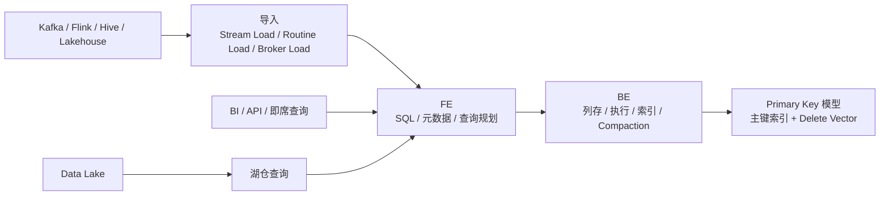

# StarRocks
## 知识点入口

- 本模块先看宏观流程，再看文章：[知识地图](040103_知识地图.md)。
- 新文章必须先归入流程节点，再判断是补充、冲突、不同层次还是降权。
- `文章/` 只保留原文锚点，长期知识必须沉淀到 `040103_核心知识点/` 下的主题文件。

## 技术定位

| 项 | 内容 |
|---|---|
| 技术名 | StarRocks |
| 一级类目 | OLAP 与数据库 |
| 二级类目 | OLAP 引擎 |
| 技术本体 | 面向实时分析、交互式查询、湖仓分析和服务化分析的 MPP 分析型数据库 |
| 全局架构位置 | 位于数仓/湖仓加工层之后，承担低延迟查询、聚合分析、实时更新分析和部分服务化查询出口 |
| 主要使用者 | OLAP 平台工程师、数据开发、分析应用工程师、DBA |
| 主要产出 | StarRocks 表、物化视图、Primary Key 表、查询服务、分析 API |

## 官方锚点

- 官网：[StarRocks](https://www.starrocks.io/)
- GitHub：[StarRocks/starrocks](https://github.com/StarRocks/starrocks)
- 官方文档：[StarRocks Documentation](https://docs.starrocks.io/)

## 架构图

## 核心模块

| 模块 | 职责 | 重点问题 |
|---|---|---|
| FE | SQL 接入、元数据、查询规划、调度 | 统计信息、查询计划、高并发规划 |
| BE/CN | 存储、执行、索引、Compaction | 列存、向量化、内存、导入、Compaction 资源和查询延迟 |
| 表模型 | Duplicate、Aggregate、Unique、Primary Key | 建模是否匹配明细、聚合、更新和查询需求 |
| Primary Key | 支持实时 Upsert、删除标记、部分列更新 | 主键索引、Delete Vector、写放大、内存占用 |
| 物化视图 | 预计算和查询改写 | 命中率、维护成本、数据新鲜度 |
| 湖仓分析 | 外表和湖格式查询 | 元数据、缓存、冷热数据、成本 |

## 上下游

| 方向 | 对象 | 关系 |
|---|---|---|
| 上游 | Kafka、Flink、Hive、Paimon/Iceberg/Hudi、对象存储 | 导入或查询外部数据 |
| 下游 | BI、报表、API、分析应用、智能问数 | 提供低延迟 SQL 查询 |
| 依赖 | FE/BE 集群、Catalog、存储、监控告警 | 决定稳定性和运维成本 |

## 横向对标

| 对标技术 | 对标点 | StarRocks 优势 | StarRocks 劣势 | 使用判断 |
|---|---|---|---|---|
| Doris | 实时 OLAP、MPP 查询、导入和更新 | StarRocks 在部分场景强调极速查询、主键更新和湖仓统一 | 生态、版本和运维能力需按场景评估 | 两者必须用真实查询、写入、Compaction、成本压测 |
| ClickHouse | 高性能列式分析 | StarRocks 更强调统一 SQL、MPP 和实时更新模型 | ClickHouse 在部分明细分析、压缩和生态上很强 | 频繁更新和统一分析评估 StarRocks，极致明细分析压测 ClickHouse |
| Elasticsearch | 检索和聚合 | StarRocks 更适合 SQL 分析和宽表聚合 | 复杂全文检索不如 ES | SQL 分析选 StarRocks，全文检索选 ES |
| OLTP 数据库 | 主键更新 | StarRocks 可承接分析型实时更新 | 不替代交易事务、行级低延迟更新 | 交易系统用 OLTP，实时分析更新用 StarRocks PK 评估 |

## 已沉淀核心知识点

| 主题 | 文件 | 问题指纹 | 解决什么问题 | 认知增量 |
|---|---|---|---|---|
| Primary Key 实时更新模型 | [StarRocksPrimaryKey实时更新模型](040103_核心知识点/StarRocksPrimaryKey实时更新模型.md) | StarRocks + Primary Key 实时更新模型 + 机制/边界/验证 | PK 模型是分析型实时更新方案，不是 OLTP 替代。 | 形成可复用判断，不保留文章池 |
| Primary Key 事务与 DelVector 读写边界 | [StarRocksPrimaryKey事务与DelVector读写边界](040103_核心知识点/StarRocksPrimaryKey事务与DelVector读写边界.md) | StarRocks + Primary Key 事务与 DelVector 读写边界 + 机制/边界/验证 | 主键索引、DelVector、Commit 和 Compaction 共同决定实时更新成本。 | 形成可复用判断，不保留文章池 |
| Query Cache 中间聚合缓存 | [StarRocksQueryCache中间聚合缓存](040103_核心知识点/StarRocksQueryCache中间聚合缓存.md) | StarRocks + Query Cache 中间聚合缓存 + 机制/边界/验证 | Query Cache 复用中间聚合结果，适合高并发相似聚合查询。 | 形成可复用判断，不保留文章池 |
| 存算分离 Compaction 机制 | [StarRocks存算分离Compaction机制](040103_核心知识点/StarRocks存算分离Compaction机制.md) | StarRocks + 存算分离 Compaction 机制 + 机制/边界/验证 | Compaction 是多版本文件、小文件治理和对象存储查询成本的平衡点。 | 形成可复用判断，不保留文章池 |
| 物化视图建模与透明加速 | [StarRocks物化视图建模与透明加速](040103_核心知识点/StarRocks物化视图建模与透明加速.md) | StarRocks + 物化视图建模与透明加速 + 机制/边界/验证 | 物化视图核心是改写命中率、新鲜度和维护成本。 | 形成可复用判断，不保留文章池 |
| FE 内存与 Tablet 排障边界 | [StarRocksFE内存与Tablet排障边界](040103_核心知识点/StarRocksFE内存与Tablet排障边界.md) | StarRocks + FE 内存与 Tablet 排障边界 + 机制/边界/验证 | StarRocks 排障不能只看 SQL 慢不慢，FE 元数据、Tablet 数量、调度状态、内存对象和查询计划都可能是瓶颈 | 形成可复用判断，不保留文章池 |
| 实时数仓与湖仓接入边界 | [StarRocks实时数仓与湖仓接入边界](040103_核心知识点/StarRocks实时数仓与湖仓接入边界.md) | StarRocks + 实时数仓与湖仓接入边界 + 机制/边界/验证 | StarRocks 在实时数仓里通常作为查询服务和更新分析层，上游由 Flink、InLong、CDC 或离线同步保证数据进入 | 形成可复用判断，不保留文章池 |
| SQL 指纹与生成列优化边界 | [StarRocksSQL指纹与生成列优化边界](040103_核心知识点/StarRocksSQL指纹与生成列优化边界.md) | StarRocks + SQL 指纹与生成列优化边界 + 机制/边界/验证 | StarRocks 查询优化既有表模型选择，也有面向查询治理的 SQL 指纹、生成列和 Join 策略 | 形成可复用判断，不保留文章池 |
## 后续追查

- 关键词：Primary Key table、Delete Vector、Persistent Index、Partial Update、Load Commit、Query Cache、Compaction、Compaction Score、Materialized View、Query Rewrite、Refresh、Lakehouse。
- 待读资料：StarRocks Query Cache、Compaction、物化视图、透明改写、存算分离、资源隔离。
- 待补实验：对比 StarRocks Primary Key 与 Doris Unique/Primary Key 在实时 Upsert、查询延迟、Compaction 压力上的表现；用相似聚合查询验证 Query Cache 命中率和 Profile 指标；用 `show proc` 和 `information_schema` 观察 Compaction Score 与任务积压；为 2-3 类聚合查询建立物化视图，验证改写命中、刷新延迟和导入开销。
