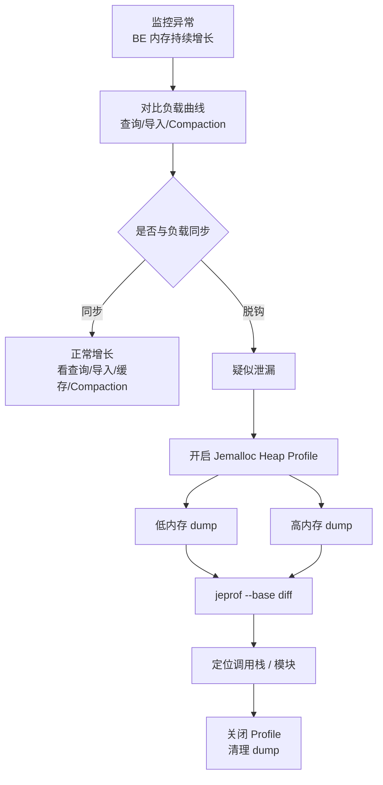

# Doris BE 内存问题 Heap Profile 排查

## 原文锚点

- 本地文件：[Apache Doris BE 内存问题深度排查：从监控异常到 Heap Profile 精准定位](../文章/Apache Doris BE 内存问题深度排查：从监控异常到 Heap Profile 精准定位.md)
- 原文链接：`https://mp.weixin.qq.com/s?__biz=MzkzMTAwMTcwOA==&mid=2247484316&idx=1&sn=6025954400eec2d26694a1aa024e336a`
- 关键段落：判断泄漏 vs 正常增长、Jemalloc 参数、Realtime Dump vs Regular Dump、`jeprof --base` diff、关闭 Profile。
- 关键图：正文提到“如下图所示”，但 Markdown 没有图片。

## 图片处理

| 图片 | 类型 | 是否保留 | 理由 | 处理方式 |
|---|---|---|---|---|
| 内存监控曲线 | 说明图 | 原图缺失 | 用于判断内存增长是否和负载脱钩 | 标记原图缺失，需要回原文查看 |
| Heap Profile 调用图 | 说明图 | 原图缺失 | 用于展示内存分配调用栈 | 用流程图重建排查链路，不重建调用图 |

## 一句话结论

这篇文章适合实践沉淀：它给出了 Doris BE 内存泄漏排查的完整动作链，关键不是单次 dump，而是低内存 baseline 和高内存 dump 的 diff。

## 用户相关性判断

| 项 | 内容 |
|---|---|
| 用户当前认知层级 | Doris / OLAP 引擎：L2 |
| 认知成熟度 | draft |
| 阅读投入建议 | 实践 |
| 阅读投入理由 | 有监控判断、配置、命令、分析方法和收尾动作，能迁移到 OLAP 排障 |
| 对用户的新信息 | Doris BE 内存排查要区分负载增长与泄漏，并用 Jemalloc Heap Profile 做增量调用栈定位 |
| 问题指纹 | Doris + BE 内存 + Jemalloc Heap Profile/jeprof diff + 泄漏定位 + 生产排障 |
| 排重判断 | 新建 |
| 置信度 | 高 |

## 认知校准点

| 校准点 | 文章观点/信息 | 与用户认知或价值观的关系 | 处理建议 |
|---|---|---|---|
| 内存高不等于泄漏 | 原文先区分查询、导入、缓存、Compaction 正常增长 | 符合用户重证据偏好 | 先看负载曲线，不直接 profile |
| Profile 要做 diff | 原文强调 lowmem 和 highmem 对比 | 这是排障关键增量 | 记住 baseline 思维 |
| Realtime 优先于 Regular | Realtime 按需 dump，Regular 持续写文件 | 工程风险更低 | 生产优先按需采集 |
| 采集后必须关闭 | 原文明确否则可能打爆磁盘 | 符合工程收尾要求 | 写入实践检查表 |
| 版本信息要核实 | 原文说 Doris 1.2.2 开始默认 Jemalloc | 可能随版本变化 | 实践前查当前集群版本和官方文档 |

## 冲突点

| 冲突类型 | 具体表现 | 影响 | 处理 |
|---|---|---|---|
| 图片缺失 | 监控曲线和调用图未保留 | 影响理解判断证据 | 标记原图缺失，保留命令和流程 |
| 证据不足 | 示例 dot 内容无法直接对应具体版本问题 | 不能泛化为所有泄漏来源 | 只沉淀排查方法 |
| 时效风险 | Jemalloc 默认版本和参数可能随 Doris 版本变化 | 生产操作风险 | 实践前核实版本 |

## 待吸收点

| 分级 | 内容 | 为什么值得吸收 | 后续动作 |
|---|---|---|---|
| 理解 | BE 内存来源包括查询、导入、Compaction、缓存 | 防止把所有增长都当泄漏 | 排障先按来源分解 |
| 记住 | 内存曲线与业务负载脱钩才高度怀疑泄漏 | 是投入 Heap Profile 的前置门槛 | 与监控 QPS、导入量、Compaction backlog 对照 |
| 理解 | Jemalloc Profile 是采样式分配调用栈，不是精确计数 | 解释采样粒度和开销 | 参数调整时看 `lg_prof_sample` |
| 记住 | `jeprof --base=lowmem.heap highmem.heap` 才能定位增量来源 | 单个 dump 容易看不出泄漏增量 | 排障 SOP 固化 baseline/diff |
| 实践 | 采集后关闭 Profile 并清理 dump | 避免二次事故 | 加入收尾清单 |

## 已知可跳过

| 内容 | 跳过理由 |
|---|---|
| Doris 是 MPP 分析型数据库 | 已在 Doris index 覆盖 |
| BE 承担计算和存储 | 基础定位已知 |
| 文章开头和结尾的产品推广 | 不进入知识点 |

## 实践门槛

| 门槛 | 判断 | 证据 |
|---|---|---|
| 可运行 | 是 | 给出 `curl /jeheap/active/true`、`/jeheap/dump`、`JEMALLOC_CONF`、`jeprof` 命令 |
| 可验证 | 是 | 可用 RSS、metrics、负载曲线、diff.dot 验证 |
| 可排障 | 是 | 有正常增长/泄漏判断、Realtime/Regular 选择、调用栈 diff |
| 可迁移 | 是 | 可迁移到 Doris BE、SelectDB 或其他 Jemalloc 服务排障 |
| 结论 | 实践 | 需要按当前版本和权限改写成内部 SOP |

## 归类判断

| 项 | 内容 |
|---|---|
| 技术本体 | Apache Doris BE |
| 文章主问题 | BE 内存异常和 Heap Profile 排查 |
| 使用场景 | Doris 集群运维、OLAP 服务稳定性 |
| 关键词干扰 | Jemalloc 也可归工程运行时，但主问题是 Doris BE |
| 最终归类 | OLAP 与数据库 / OLAP 引擎 |
| 归类理由 | 文章围绕 Doris BE 内存问题，不是通用 Linux 内存教程 |

## 技术定位

| 项 | 内容 |
|---|---|
| 技术类型 | OLAP 引擎排障实践 |
| 所属领域 | OLAP 与数据库 |
| 二级类目 | OLAP 引擎 |
| 全局架构位置 | Doris BE 存储与执行节点的内存管理和排障 |
| 涉及模块 | BE、Jemalloc、Heap Profile、jeprof、metrics、Compaction、缓存 |
| 解决问题 | 定位 BE 内存泄漏或异常增长来源 |
| 原文局限 | 图片缺失，版本信息需核实 |
| 我的结论 | 现在可用，适合整理成排障 SOP |

## 跨域判断

| 问题 | 判断 |
|---|---|
| 它本体属于哪里 | OLAP 与数据库 / OLAP 引擎 |
| 这篇文章为什么可能跨域 | 涉及 Jemalloc、Linux、Graphviz 等工程工具 |
| 当前文章主问题是否改变分类 | 不改变，排障对象是 Doris BE |
| 应避免的误归类 | 不归到工程与架构 / 可观测性 |

## 纵向理解

| 维度 | 判断 |
|---|---|
| 全局架构 | Doris FE 接入和规划，BE 执行、存储、导入、Compaction、缓存 |
| 本文位置 | BE 内存分配与泄漏排查 |
| 核心机制 | 通过 Jemalloc 采样记录分配调用栈，用 baseline diff 找增量 |
| 使用链路 | 确认异常 -> 开启 profile -> dump -> jeprof diff -> 定位模块 -> 关闭采集 |
| 前置条件 | BE Web 端口可达、权限、符号文件、磁盘空间、版本确认 |
| 边界 | Heap Profile 只能定位分配路径，根因修复还需要结合 Doris 代码和业务负载 |

## 横向对标

| 对标技术 | 实现方式 | 优势 | 劣势 | 适合场景 |
|---|---|---|---|---|
| Doris metrics | 暴露内存和运行指标 | 轻量、持续观测 | 只能看现象，难定位调用栈 | 发现异常和判断趋势 |
| Doris query/profile | 查询级执行剖析 | 能定位查询资源消耗 | 不一定能定位长期泄漏 | 查询内存异常 |
| Jemalloc Heap Profile | 采样内存分配调用栈 | 能定位模块和函数路径 | 需要配置、符号化、磁盘管理 | 进程内存持续增长 |
| top/free/ps | OS 级内存观察 | 简单直接 | 不能定位 Doris 模块 | 初步确认 RSS |
| pprof / TCMalloc profile | 类似内存剖析思路 | 生态成熟 | 取决于分配器和编译方式 | 其他 C++ 服务 |

## 后续追查

- 关键词：Doris BE memory、Jemalloc、Heap Profile、jeprof、Compaction、Page Cache、Rowset、Inverted Index。
- 相关技术：Graphviz、Doris metrics、FE/BE profile、Linux RSS。
- 需要补读的文章：Doris 官方内存管理文档、Doris Compaction 原理、Doris 查询 Profile。
