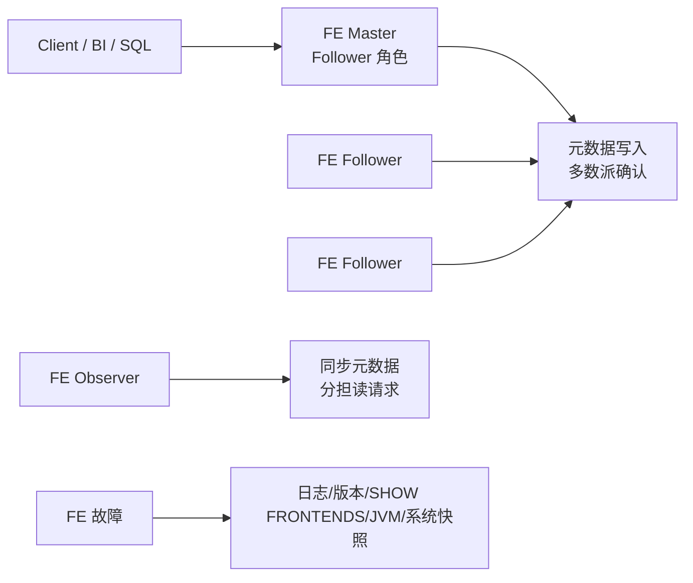

# Doris FE 运维 SOP

## 原文锚点

- 本地文件：[Doris FE 运维进阶：从“救火队员”到“系统专家”的SOP](../文章/Doris FE 运维进阶：从“救火队员”到“系统专家”的SOP.md)
- 原文链接：https://mp.weixin.qq.com/s?__biz=Mzk1NzU0MjMzOQ==&mid=2247485348&idx=1&sn=3abbe543c9c73eeb988582b0c69ed405
- 关键段落：Follower/Observer/Master、多数派、部署架构、日志、版本、`SHOW FRONTENDS`、系统快照、`jstack`/`jmap`。
- 关键图：无技术图。

## 图片处理

| 图片 | 类型 | 是否保留 | 理由 | 处理方式 |
|---|---|---|---|---|
| 无 | 无图 | 不适用 | SOP 可用表格和 Mermaid 表达 | Mermaid 重建 |

## 一句话结论

这篇文章值得精读：它把 Doris FE 故障处理前置为“角色理解 + 证据采集清单”，避免线上排障凭感觉操作。

## 用户相关性判断

| 项 | 内容 |
|---|---|
| 用户当前认知层级 | Doris / OLAP L2 draft |
| 认知成熟度 | draft |
| 阅读投入建议 | 精读 |
| 阅读投入理由 | 补 Doris 运维排障入口；但文章是 SOP 上篇，没有具体故障恢复步骤 |
| 对用户的新信息 | FE 的 Master 是 Follower 中的主角色，Observer 只同步元数据不参与投票 |
| 问题指纹 | Doris + FE 运维 + Follower/Observer/Master/多数派/日志/SHOW FRONTENDS/jstack/jmap + 故障证据采集 SOP |
| 排重判断 | 新建 |
| 置信度 | 高 |

## 认知校准点

| 校准点 | 文章观点/信息 | 与用户认知或价值观的关系 | 处理建议 |
|---|---|---|---|
| FE 角色要先辨清 | Master 是特殊 Follower，Observer 不投票 | 补 Doris 架构基础 | 写入 Doris index |
| 排障先采证再动作 | `fe.log`、audit、gc、bdb、版本、`SHOW FRONTENDS`、主机快照 | 符合用户重证据偏好 | 作为 SOP |
| 多数派决定元数据写入 | 3 Follower 至少 2 个确认 | 补高可用边界 | 与选主故障关联 |
| commit ID 很重要 | 版本精确到 commit 可避免排查跑偏 | 工程实践点 | 记住 |

## 冲突点

| 冲突类型 | 具体表现 | 影响 | 处理 |
|---|---|---|---|
| 标题略营销 | “系统专家”偏宣传 | 低影响 | 只保留 SOP |
| 实践不完整 | 下一篇才讲磁盘满、时钟不同步、无法选主 | 暂不能覆盖恢复步骤 | 后续补 P0 排障 |
| 缺官方引用 | 角色解释需官方文档复核 | 避免误用 | 标为 draft |

## 待吸收点

| 分级 | 内容 | 为什么值得吸收 | 后续动作 |
|---|---|---|---|
| 理解 | Follower 参与投票，Observer 同步元数据和分担读 | 解释 FE 高可用部署 | 写入 index |
| 理解 | `1 Follower + N Observer` 和 `3 Follower + N Observer` 对应不同可用性 | 帮助部署判断 | 后续查官方 |
| 记住 | FE 故障先收集日志、状态、版本、系统快照、JVM 快照 | 排障准则 | 写入 SOP |
| 记住 | `je.info.0` 是元数据引擎日志，时间需注意时区 | 细节容易漏 | 后续验证 |
| 实践 | 形成 Doris FE 故障采证模板 | 可落地 | 待实验 |

## 已知可跳过

| 内容 | 跳过理由 |
|---|---|
| 凌晨告警叙事 | 背景铺垫 |
| 社群推广 | 无沉淀价值 |

## 实践门槛

| 门槛 | 判断 | 证据 |
|---|---|---|
| 可运行 | 部分 | 有 `SHOW FRONTENDS`、`jstack`、`jmap` 等命令 |
| 可验证 | 部分 | 有证据清单，但无具体故障结果 |
| 可排障 | 部分 | 是排障前置 SOP |
| 可迁移 | 是 | 可迁移到 Doris FE 运维 |
| 结论 | 降为精读 | 缺具体故障恢复 |

## 归类判断

| 项 | 内容 |
|---|---|
| 技术本体 | Doris 是 OLAP 引擎 |
| 文章主问题 | Doris FE 故障前如何理解角色并采集排障证据 |
| 使用场景 | FE 卡顿、不可用、选主异常、元数据问题 |
| 关键词干扰 | SOP、运维、系统专家 |
| 最终归类 | OLAP 与数据库 / OLAP 引擎 / Doris |
| 归类理由 | 主问题是 Doris FE 元数据和运维排障，不是通用运维 |

## 技术定位

| 项 | 内容 |
|---|---|
| 技术类型 | 运维排障 SOP |
| 所属领域 | OLAP 与数据库 |
| 二级类目 | OLAP 引擎 |
| 全局架构位置 | Doris FE 层，负责 SQL、元数据、规划和选主 |
| 涉及模块 | FE Master/Follower/Observer、BDBJE、日志、JVM、主机指标 |
| 解决问题 | FE 故障时先统一角色认知和证据采集 |
| 原文局限 | 缺具体故障恢复步骤 |
| 我的结论 | 精读，作为 Doris 运维入口 |

## 纵向理解

| 维度 | 判断 |
|---|---|
| 全局架构 | Client -> FE -> BE；FE 内部 Follower 选 Master，Observer 只读同步 |
| 本文位置 | 讲 FE 故障前置采证，不讲 BE、Compaction 和查询计划 |
| 核心机制 | 多数派、角色分工、日志和系统快照采集 |
| 使用链路 | 确认角色 -> 收集日志 -> 查看版本和前端状态 -> 采 JVM/系统快照 -> 再判断恢复动作 |
| 前置条件 | 有 FE 节点访问权限、日志路径、SQL 权限和主机监控 |
| 边界 | 不直接解决磁盘满、时钟漂移、无法选主等具体恢复 |

## Mermaid 重建

## 横向对标

| 对标问题 | 实现方式 | 优势 | 劣势 | 适合场景 |
|---|---|---|---|---|
| Doris FE SOP | 角色 + 证据清单 | 防误操作 | 不直接恢复 | FE 异常初期 |
| Doris BE 内存排查 | Heap Profile diff | 定位内存调用栈 | 只覆盖 BE 内存 | BE 内存增长 |
| StarRocks FE/CN 排障 | FE/CN 指标和日志 | 类似 MPP 架构 | 命令不同 | StarRocks 集群 |
| 通用 JVM 排障 | jstack/jmap/gc log | 工具成熟 | 不理解 Doris 元数据 | Java 服务卡顿 |

## 后续追查

- 关键词：Doris FE、Master、Follower、Observer、SHOW FRONTENDS、BDBJE、fe.log、jstack、jmap。
- 相关技术：Doris BE、StarRocks FE、Raft/Paxos 类多数派、JVM 排障。
- 需要补读的文章：Doris FE 磁盘满、时钟不同步、无法选主、元数据恢复官方文档。

