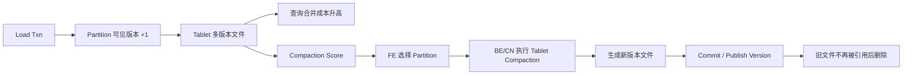

# StarRocks 存算分离 Compaction 机制

## 原文锚点

- 本地文件：[极速查询：StarRocks 存算分离 Compaction 原理 & 调优指南](../文章/极速查询：StarRocks 存算分离 Compaction 原理 & 调优指南.md)
- 原文链接：http://mp.weixin.qq.com/s?__biz=MzI1MTYxOTkxNQ==&mid=2247493628&idx=1&sn=17351e910dbddefa57a60a3efd19778a&chksm=e9f298d8de8511ce04da1cc9dce835e6382cbfc2f1b34d51b6b581bf81607dc653ac9ce33347&mpshare=1&scene=24&srcid=07121ZLnOo4yisLF6cVt660k&sharer_shareinfo=c78d880b5bf3ea3ff0ad10814bca8039&sharer_shareinfo_first=c78d880b5bf3ea3ff0ad10814bca8039#rd
- 关键段落：数据版本更新机制、Compaction 调度流程、数据文件删除、诊断与调优。
- 关键图：原文多次引用版本、调度、存储结构示意图，本地 Markdown 无图片链接。

## 图片处理

| 图片 | 类型 | 是否保留 | 理由 | 处理方式 |
|---|---|---|---|---|
| 多版本文件合并图 | 机制图 | 原图缺失 | 说明 Compaction 如何减少小文件和旧版本 | Mermaid 重建 |
| FE 调度 BE/CN 执行图 | 架构图 | 原图缺失 | 说明存算分离下 Compaction 的调度边界 | Mermaid 重建 |

## 一句话结论

这篇文章值得精读：Compaction 不是“后台清理”这么简单，而是 StarRocks 写入多版本、查询合并成本、对象存储文件治理之间的核心平衡点。

## 用户相关性判断

| 项 | 内容 |
|---|---|
| 用户当前认知层级 | StarRocks / OLAP L2 draft |
| 认知成熟度 | draft |
| 阅读投入建议 | 精读 |
| 阅读投入理由 | 能补 StarRocks 写入后台治理和查询性能的关系；但调参仍需结合版本、负载和监控 |
| 对用户的新信息 | 存算分离表的 Compaction 由 FE 按 Partition 调度，BE/CN 执行，并生成新版本走写入、commit、publish 流程 |
| 问题指纹 | StarRocks + Compaction + 多版本文件/Partition 调度/Compaction Score + 查询效率与小文件治理 |
| 排重判断 | 新建 |
| 置信度 | 高 |

## 认知校准点

| 校准点 | 文章观点/信息 | 与用户认知或价值观的关系 | 处理建议 |
|---|---|---|---|
| Compaction 影响查询而不只是写入 | 查询需要合并多个历史版本，版本堆积会拖慢扫描 | 补充 OLAP 存储纵向模块 | 写入 StarRocks index |
| 存算分离下调度边界变化 | FE 选择 Partition，BE/CN 执行 Tablet 级任务 | 补充全局架构位置 | 关注 FE 调度和 CN 资源 |
| Compaction 也走版本发布流程 | 生成新版本并 commit/publish | 纠偏：不是无事务的文件合并 | 关联写入事务理解 |
| Score 是运维入口，不是唯一目标 | `AvgCS/P50CS/MaxCS` 提示紧急度，但仍需看资源和查询影响 | 防止只追单指标 | 结合监控和负载 |

## 冲突点

| 冲突类型 | 具体表现 | 影响 | 处理 |
|---|---|---|---|
| 图片缺失 | 多处“下图/上图”无图 | 影响理解版本关系 | Mermaid 重建 |
| 标题降权 | “极速查询”有宣传口吻 | 容易把 Compaction 当万能加速 | 只保留机制和调优边界 |
| 版本/环境边界 | 存算分离表、FE/BE/CN 参数与版本强相关 | 直接照调参有风险 | 后续查官方版本文档 |

## 待吸收点

| 分级 | 内容 | 为什么值得吸收 | 后续动作 |
|---|---|---|---|
| 理解 | 每次导入产生新版本，查询需要合并可见版本 | 解释小文件和多版本对查询的影响 | 写入 StarRocks 模块 |
| 理解 | FE 按 Partition 调度 Compaction，BE/CN 执行 Tablet 任务 | 明确存算分离架构职责 | 补监控项 |
| 记住 | Compaction 生成新版本，也走写入、commit、publish version | 影响故障和事务理解 | 作为排障规则 |
| 记住 | `Compaction Score` 是发现积压的主要入口 | 影响生产巡检 | 加入后续追查 |
| 实践 | 用 `show proc` 和 `information_schema` 观察 Score、任务和资源占用 | 有明确命令入口 | 后续结合集群验证 |

## 已知可跳过

| 内容 | 跳过理由 |
|---|---|
| OLAP 查询需要减少小文件 | 已知基础 |
| StarRocks 品牌和背景 | 营销信息 |
| 无场景的参数清单 | 不能脱离版本和负载使用 |

## 实践门槛

| 门槛 | 判断 | 证据 |
|---|---|---|
| 可运行 | 部分 | 有 `show proc`、`information_schema` 和参数名 |
| 可验证 | 部分 | 可观察 Compaction Score，但缺本地负载和基线 |
| 可排障 | 部分 | 有任务查看和取消命令，但缺完整告警阈值 |
| 可迁移 | 是 | 可用于 StarRocks 运维巡检 |
| 结论 | 降为精读 | 等有真实集群后可升级为实践 |

## 归类判断

| 项 | 内容 |
|---|---|
| 技术本体 | StarRocks 是 OLAP 引擎 |
| 文章主问题 | 存算分离表如何通过 Compaction 治理多版本文件和查询成本 |
| 使用场景 | 高频导入、更新、对象存储、小文件和多版本积压 |
| 关键词干扰 | 存算分离、调优、极速查询 |
| 最终归类 | OLAP 与数据库 / OLAP 引擎 / StarRocks |
| 归类理由 | 主问题是 StarRocks 存储和查询性能治理，不是数据工程加工链路 |

## 纵向理解

| 维度 | 判断 |
|---|---|
| 全局架构 | Load 事务 -> Partition 版本 -> Tablet 文件 -> FE 调度 -> BE/CN Compaction -> 新版本发布 |
| 本文位置 | 只讲存算分离表 Compaction，不讲物化视图或 Query Cache |
| 核心机制 | 多版本合并、小文件治理、Partition 级调度、Score 选择、旧文件安全删除 |
| 使用链路 | 导入产生版本 -> Score 升高 -> FE 派发 Compaction -> CN 执行 -> 新版本发布 -> 旧文件可删除 |
| 前置条件 | 需要 StarRocks 存算分离部署、对象存储和可观测权限 |
| 边界 | 不解决 SQL 计划差、索引缺失、数据模型不合理导致的慢查询 |

## Mermaid 重建

## 横向对标

| 对标技术 | 实现方式 | 优势 | 劣势 | 适合场景 |
|---|---|---|---|---|
| StarRocks Compaction | 多版本文件后台合并，FE 调度 BE/CN 执行 | 减少小文件和查询合并成本 | 消耗写入/计算资源，参数强依赖负载 | 高频导入和更新的 OLAP 表 |
| Doris Compaction | BE 侧存储层合并 rowset/version | 生态相近，经验可对照 | 实现细节和参数不同 | Doris OLAP 表治理 |
| ClickHouse MergeTree Merge | 后台合并 Part | 存储引擎成熟 | 更新语义和调度策略不同 | 明细分析和日志场景 |
| 湖格式小文件合并 | Rewrite/Optimize 数据文件 | 与湖仓生态融合 | 查询引擎和调度外置 | Iceberg/Hudi/Paimon 表 |

## 后续追查

- 关键词：StarRocks Compaction、Compaction Score、lake_compaction、be_cloud_native_compactions、CANCEL COMPACTION。
- 相关技术：Primary Key 表、物化视图、Query Cache、Doris Compaction、ClickHouse MergeTree。
- 需要补读的文章：StarRocks 官方 Compaction 文档、存算分离运维、Compaction 与导入/查询资源隔离。

