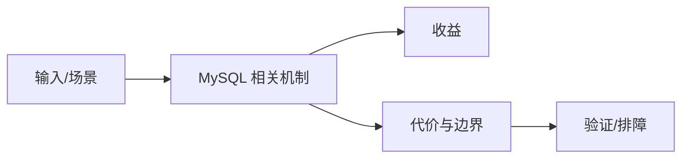

# InnoDB MVCC 与三日志边界

## 来源
- [MySQL的MVCC是什么？为什么需要MVCC？](<../文章/done-MySQL的MVCC是什么？为什么需要MVCC？.md>)
- [腾讯二面：binlog、redolog 和 undolog 三大日志的区别？](<../文章/done-腾讯二面：binlog、redolog 和 undolog 三大日志的区别？.md>)

## 核心问题
MySQL 的一致性不是一个 MVCC 概念就能解释完整：Undo Log 支撑历史版本和回滚，Redo Log 支撑崩溃恢复，Binlog 支撑复制和 CDC。MVCC 解决快照读的一致视图，当前读、锁和隔离级别仍会影响并发行为。

## 判断准则
- 读一致性问题先区分快照读和当前读，再看隔离级别、Undo 版本链和锁。
- CDC 问题先看 Binlog 格式、位点和事务边界，不要拿 Redo/Undo 解释下游同步。

## 认知偏差
| 常见错误认知 | 正确理解 |
|---|---|
| 只要文章给了性能数字或最佳实践，就可以直接复用 | 必须确认版本、数据规模、查询/写入模式、硬件和失败场景 |
| 只按标题中的技术名归类 | 以正文主问题和技术本体归类 |
| 能跑通示例就等于生产可用 | 还要验证权限、恢复、监控、重试、成本和边界条件 |
| 把三类日志混成“事务日志”会导致恢复、复制和 MVCC 边界判断错误。 | 把它记录为降权或待验证点，而不是稳定结论 |

## 架构/流程图（如有）

## 待验证缺口
- 需要用官方 InnoDB 文档校验 Read View、purge 和 binlog row 格式细节。
