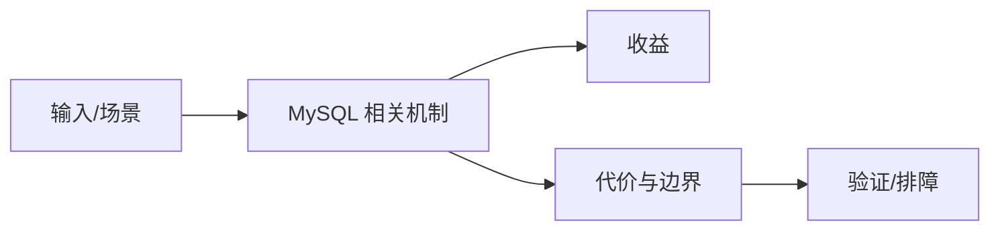

# 查询优化与分页边界

## 来源
- [一次 SQL 查询优化原理分析：900W+ 数据，从 17s 到 300ms](<../文章/done-一次 SQL 查询优化原理分析：900W+ 数据，从 17s 到 300ms.md>)
- [MySQL数据分析：计算一个值在其分组中的百分等级](<../文章/done-MySQL数据分析：计算一个值在其分组中的百分等级.md>)

## 核心问题
MySQL 查询优化的可复用部分是减少回表、避免深分页扫描、利用覆盖索引和把分析函数放在合适的数据量上。单篇案例的 17s 到 300ms 只说明延迟关联/索引路径在该数据分布下有效。

## 判断准则
- 大分页优先用主键范围、延迟关联或游标式翻页，避免 offset 深扫描。
- 窗口函数适合表达分组排名和百分位，但要评估排序、临时表和内存。

## 认知偏差
| 常见错误认知 | 正确理解 |
|---|---|
| 只要文章给了性能数字或最佳实践，就可以直接复用 | 必须确认版本、数据规模、查询/写入模式、硬件和失败场景 |
| 只按标题中的技术名归类 | 以正文主问题和技术本体归类 |
| 能跑通示例就等于生产可用 | 还要验证权限、恢复、监控、重试、成本和边界条件 |
| 性能数字不带数据量、索引、执行计划和机器配置时只能作为方向，不能作为准则。 | 把它记录为降权或待验证点，而不是稳定结论 |

## 架构/流程图（如有）

## 待验证缺口
- 需要 EXPLAIN、慢查询日志和索引统计来验证。
